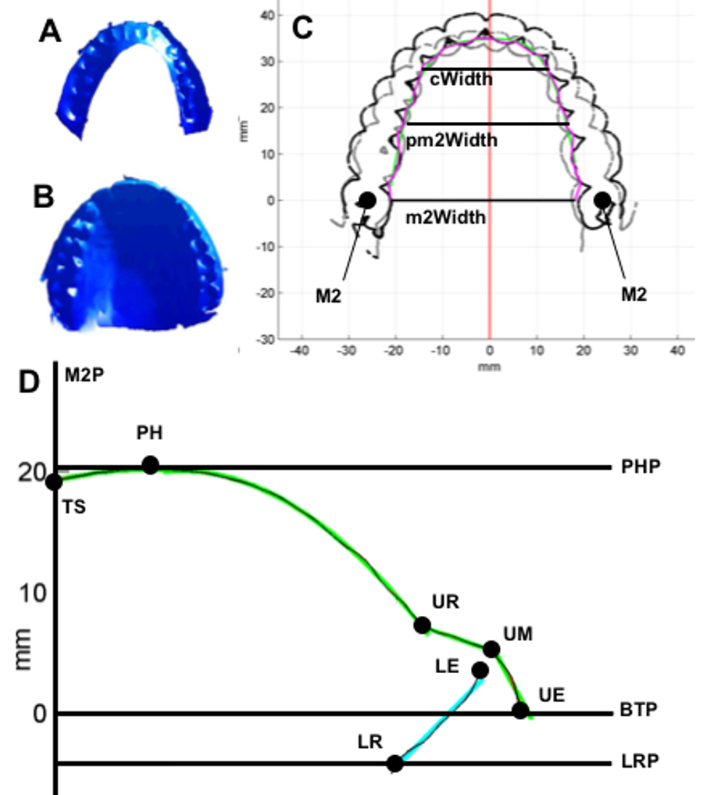

```{r setup, include=TRUE, echo=FALSE, message=FALSE, results='hide'}
# To increase figure quality, either comment the following line or change the driver ("dev") and/or the resolution ("dpi") as needed (please note that this will likely affect file size)
knitr::opts_chunk$set(warning=FALSE, cache=TRUE, dev="jpeg", dpi=72); # dev="jpeg"; when using dev="CairoJPEG", make sure to install package "Cairo"
```


```{r libraries, echo=FALSE, warning=FALSE, message=FALSE}
# Load libraries
library(ggplot2); # plotting
library(reshape2); # melt
library(factoextra); # PCA plotting
library(cluster); # clustering
library(plyr); # various data manipulation utilities
library(dplyr); # various data manipulation utilities
library(dendextend); # cluster plotting
library(shapes); # compute Procrustes distances
library(parallel); # parallel processing
library(mgcv); # GAMMs
library(itsadug); # compare GAMMs
library(TSdist); # time series
library(pander); # nice printing
library(grid); # multiplots
library(Hmisc); # rcorr
library(MASS); # robust regression
library(robustbase); # robust regression
library(sfsmisc); # p-values for robust regression
library(emuR); # conversion from Hz to Bark
library(plotrix); # plotting ellipses
library(Morpho); # Geometric morphometrics
library(geomorph); # Geometric morphometrics
library(car); # scatterplot
library(lattice); # histograms
library(randomForest); # random forests
library(rgl); # interactive 3D plotting
library(psych); # pairwise correlation plots
library(lsr); # Cohen's d
library(lmerTest); # mixed-effects models with p-values

alpha.level <- 0.05; # alpha level to use throughout

compile.start.time <- Sys.time(); # when compilation started...
```

```{r multithreading and OpenBLAS setup, echo=FALSE, warning=FALSE, message=FALSE, results='hide', eval=TRUE}
# Multithreading: in general, on Linux and macOS make use of multiple cores, while on Windows default to 1 core only (using mclapply):
# This is not much of a loss on Windows for the "normal" compilations, but it would matter for the first one when the really expensive computations happen
# so, for those only we also use parallelism in Windows as well (through foreach + dopar):
no.cores <- ifelse(.Platform$OS.type == "windows", 1, max(detectCores(logical=FALSE), 1, na.rm=TRUE)); # on Linux & macOS use all physical cores in the system; on Windows default to 1 core

# If OpenBLAS is available (mostly on Linux), try to aparallelize it (apparently Microsoft R + IntelMLK is able to do the same on Windows as well):
use_openblas_threads <- 2;
if( require("RhpcBLASctl", quietly=TRUE) ){ require(utils); (capture.output(blas_set_num_threads(use_openblas_threads))); }
Sys.setenv(OMP_NUM_THREADS=use_openblas_threads);
Sys.setenv(MKL_NUM_THREADS=use_openblas_threads);
Sys.setenv(MKL_DOMAIN_NUM_THREADS=use_openblas_threads);
```

```{r load data and compute the distances, echo=FALSE, message=FALSE, warning=FALSE} 
# Load the results for the 5 selected HP shapes with replications:
results.replicated <- read.table(xzfile("./data/HPshape-replicated-chains.csv.xz"), header=TRUE, sep="\t", quote="", stringsAsFactors=FALSE);
# convert to factors and add new info:
results.replicated$condition <- factor(results.replicated$condition, levels=c("low", "A87", "average", "A73", "high"));
results.replicated$vowel <- factor(results.replicated$vowel, levels=c("schwa", "a", "ae", "i", "u" ));
# NB. On Windows there are issues with including some of the actual IPA symbols, so we replace ə by \U0259 and ɑ by \U0251 (æ, i & u seem fine):
results.replicated$vowel <- revalue(results.replicated$vowel, c("schwa"="[\U0259]", "a"="[\U0251]", "ae"="[æ]", "i"="[i]", "u"="[u]"));

# Load the results for all the HPshapes without replications:
results.allHPshapes <- read.table(xzfile("./data/HPshape-nonreplicated-chains.csv.xz"), sep="\t", header=TRUE, stringsAsFactors=FALSE);
# convert to factors:
results.allHPshapes$condition <- factor(results.allHPshapes$condition);
results.allHPshapes$vowel <- factor(results.allHPshapes$vowel, levels=c("schwa", "a", "ae", "i", "u" ));
results.allHPshapes$vowel <- revalue(results.allHPshapes$vowel, c("schwa"="[\U0259]", "a"="[\U0251]", "ae"="[æ]", "i"="[i]", "u"="[u]"));

# Load the HP traces (from the @janssen_modelling_2018 paper):
hp.tracings <- read.table(xzfile("./data/hard-palate-tracings.tsv.xz"), head=TRUE, sep="\t", quote="", stringsAsFactors=FALSE);
hp.tracings <- hp.tracings[hp.tracings$tracing==1, c("ID", "x", "y")]; # keep only the first tracing for drawing purposes

# Load the participant info:
part.info <- read.table("./data/participant_info.csv", head=TRUE, sep="\t", quote="", stringsAsFactors=FALSE);


# Make sure the cache and figures directories exist:
if( !file.exists("./cache") ) dir.create("./cache", showWarnings=FALSE);
if( !file.exists("./figures") ) dir.create("./figures", showWarnings=FALSE);


# Compute and cache distances (these are computationally expensive, only do it if necessary and cache the results for later use):

# Inter-vowel distances for the 5 selected shapes with replications:
if( !file.exists("./cache/intervowel-distances-replicated.RData") )
{
  # Parallel processing:
  library(foreach);
  .nc <- max(detectCores(logical=FALSE), 1, na.rm=TRUE); # try to use all available *physical* cores (i.e., avoid hyperthreaded ones)
  if(.Platform$OS.type == "windows")
  {
    # On Windows, use SNOW clusters:
    library(doSNOW);
    cluster <- makeCluster(.nc, type="SOCK");
    registerDoSNOW(cluster);
  } else
  {
    # Otherwise, use multicore:
    library(doMC);
    registerDoMC(cores=.nc);
    cluster <- NULL;
  }
  
  # Per replication inter-vowel distances:
  tmp <- unique(results.replicated[,c("condition", "replication", "generation")]);
  #vowel.pairs <- expand.grid("vowel1"=as.character(unique(results.replicated$vowel)), "vowel2"=as.character(unique(results.replicated$vowel)), stringsAsFactors=FALSE); 
  v1 <- as.character(unique(results.replicated$vowel)); v2 <- as.character(unique(results.replicated$vowel));
  vowel.pairs <- expand.grid("vowel1"=1:length(v1), "vowel2"=1:length(v2), stringsAsFactors=FALSE); 
  vowel.pairs <- vowel.pairs[ vowel.pairs$vowel1 < vowel.pairs$vowel2, ]; 
  vowel.pairs <- vowel.pairs[ order(vowel.pairs$vowel1, vowel.pairs$vowel2), ];
  vowel.pairs$vowel1 <- v1[vowel.pairs$vowel1]; vowel.pairs$vowel2 <- v2[vowel.pairs$vowel2]; 
  .aux.fnc <- function(i)
  {
    s <- results.replicated[ results.replicated$condition == tmp$condition[i] & 
                               results.replicated$replication == tmp$replication[i] & 
                               results.replicated$generation == tmp$generation[i], ];
    ret.val <- data.frame(s[1, c("condition", "replication", "generation"), drop=FALSE], 
                          vowel.pairs, "vowel.pair"=paste0(vowel.pairs$vowel1,"-",vowel.pairs$vowel2),
                          do.call(rbind,lapply(1:nrow(vowel.pairs), function(j) 
                          {
                            s1 <- s[ s$vowel %in% c(vowel.pairs$vowel1[j],vowel.pairs$vowel2[j]), ];
                            return (data.frame("dist_F1tF5t"=as.numeric(dist(s1[, c("F1t", "F2t", "F3t", "F4t", "F5t")])),
                                               "dist_F1F5"  =as.numeric(dist(s1[, c("F1",  "F2",  "F3",  "F4",  "F5" )])),
                                               "dist_F1tF2t"=as.numeric(dist(s1[, c("F1t", "F2t")])),
                                               "dist_F1F2"  =as.numeric(dist(s1[, c("F1",  "F2" )]))));
                          })));
  }
  #intervowel.dists.replicated <- do.call(rbind, mclapply(1:nrow(tmp), function(i) .aux.fnc(i), mc.cores=max(1, no.cores, na.rm=TRUE)));
  intervowel.dists.replicated <- foreach(i=1:nrow(tmp), .combine='rbind') %dopar% .aux.fnc(i);
  intervowel.dists.replicated$vowel1 <- factor(intervowel.dists.replicated$vowel1, levels=levels(results.replicated$vowel));
  intervowel.dists.replicated$vowel2 <- factor(intervowel.dists.replicated$vowel2, levels=levels(results.replicated$vowel));
  
  # Procrustes distances between the elite and target vowel systems:
  .aux.fnc <- function(i)
  {
    s <-  results.replicated[ results.replicated$condition == tmp$condition[i] & 
                                results.replicated$replication == tmp$replication[i] & 
                                results.replicated$generation == tmp$generation[i], ];
    s1 <- as.matrix(s[ , c("F1t", "F2t", "F3t", "F4t", "F5t", "F1", "F2", "F3", "F4", "F5")]); rownames(s1) <- as.character(s$vowel);
    z <-  results.replicated[ results.replicated$condition == tmp$condition[i] & 
                                results.replicated$replication == tmp$replication[i] & 
                                results.replicated$generation == 0, ]; # the real (i.e., first generation) target
    z1 <- as.matrix(z[ , c("F1t", "F2t", "F3t", "F4t", "F5t", "F1", "F2", "F3", "F4", "F5")]); rownames(z1) <- as.character(z$vowel);
    ret.val <- data.frame(s[1, c("condition", "replication", "generation"), drop=FALSE], 
                          "Proc.rmsd.prevgen"=procOPA(s1[,c("F1t","F2t","F3t","F4t","F5t")], s1[,c("F1","F2","F3","F4","F5")])$rmsd,
                          "Proc.rmsd.target" =procOPA(z1[,c("F1t","F2t","F3t","F4t","F5t")], s1[,c("F1","F2","F3","F4","F5")])$rmsd);
  }
  #proc.target.elite.dists.replicated <- do.call(rbind, mclapply(1:nrow(tmp), function(i) .aux.fnc(i), mc.cores=max(1, no.cores, na.rm=TRUE)));
  proc.target.elite.dists.replicated <- foreach(i=1:nrow(tmp), .combine='rbind', .packages=c("shapes")) %dopar% .aux.fnc(i);
  
  # Save distances to file:
  save(intervowel.dists.replicated, proc.target.elite.dists.replicated, file="./cache/intervowel-distances-replicated.RData", compress="xz");
  
  # Stop parallel pocessing (if any):
  if( !is.null(cluster) ){ stopCluster(cluster); cluster <- NULL }
} else
{
  load("./cache/intervowel-distances-replicated.RData");
}

# Distances between trajectories for the 5 selected shapes with replications:
if( !file.exists("./cache/trajectories-dists-replicated.RData") )
{
  # Parallel processing:
  library(foreach);
  .nc <- max(detectCores(logical=FALSE), 1, na.rm=TRUE); # try to use all available *physical* cores (i.e., avoid hyperthreaded ones)
  if(.Platform$OS.type == "windows")
  {
    # On Windows, use SNOW clusters:
    library(doSNOW);
    cluster <- makeCluster(.nc, type="SOCK");
    registerDoSNOW(cluster);
  } else
  {
    # Otherwise, use multicore:
    library(doMC);
    registerDoMC(cores=.nc);
    cluster <- NULL;
  }
  
  trajectories.names.replicated <- expand.grid("condition"=levels(results.replicated$condition), 
                                               "vowel"=levels(results.replicated$vowel), 
                                               "replication"=sort(unique(results.replicated$replication)));
  trajectories.names.replicated <- trajectories.names.replicated[order(trajectories.names.replicated$condition, 
                                                                       trajectories.names.replicated$vowel, 
                                                                       trajectories.names.replicated$replication),];
  trajectories.names.replicated$name <- paste(as.character(trajectories.names.replicated$condition), 
                                              as.character(trajectories.names.replicated$vowel), 
                                              sprintf("%02d",trajectories.names.replicated$replication), sep="-");
  
  # Extract the individual trajectories into a list:
  .aux.fnc <- function(f)
  {
    x <- lapply(1:nrow(trajectories.names.replicated), function(i) results.replicated[results.replicated$replication==trajectories.names.replicated$replication[i] & 
                                                                                        results.replicated$condition==trajectories.names.replicated$condition[i] & 
                                                                                        results.replicated$vowel==trajectories.names.replicated$vowel[i],
                                                                                      f]);
    names(x) <- trajectories.names.replicated$name;
    x;
  }
  #trajectories.replicated <- mclapply(paste0("F",1:5), function(f) .aux.fnc(f), mc.cores=max(1, no.cores, na.rm=TRUE));
  trajectories.replicated <- foreach(f=paste0("F",1:5)) %dopar% .aux.fnc(f);
  names(trajectories.replicated) <- paste0("F",1:5);
  
  # Compute the distances between all pairs of trajectories:
  #trajectories.dists.replicated <- list("dtw"=mclapply(trajectories.replicated, function(x) TSDatabaseDistances(x, distance="dtw"), mc.cores=max(1, no.cores, na.rm=TRUE)));
  trajectories.dists.replicated <- list("dtw"=foreach(i=1:length(trajectories.replicated), .packages=c("TSdist")) %dopar% TSDatabaseDistances(trajectories.replicated[[i]], distance="dtw"));
  names(trajectories.dists.replicated$dtw) <- names(trajectories.replicated);
  
  # Save trajectoris to file:
  save(trajectories.dists.replicated, trajectories.names.replicated, trajectories.replicated, file="./cache/trajectories-dists-replicated.RData", compress="xz");
  
  # Stop parallel pocessing (if any):
  if( !is.null(cluster) ){ stopCluster(cluster); cluster <- NULL }
} else
{
  load("./cache/trajectories-dists-replicated.RData");
}

# Inter-vowel distances for all shapes:
if( !file.exists("./cache/intervowel-distances-allHPshapes.RData") )
{
  # Parallel processing:
  library(foreach);
  .nc <- max(detectCores(logical=FALSE), 1, na.rm=TRUE); # try to use all available *physical* cores (i.e., avoid hyperthreaded ones)
  if(.Platform$OS.type == "windows")
  {
    # On Windows, use SNOW clusters:
    library(doSNOW);
    cluster <- makeCluster(.nc, type="SOCK");
    registerDoSNOW(cluster);
  } else
  {
    # Otherwise, use multicore:
    library(doMC);
    registerDoMC(cores=.nc);
    cluster <- NULL;
  }
  
  # Per replication inter-vowel distances:
  tmp <- unique(results.allHPshapes[,c("condition", "replication", "generation")]);
  #vowel.pairs <- expand.grid("vowel1"=as.character(unique(results.allHPshapes$vowel)), "vowel2"=as.character(unique(results.allHPshapes$vowel)), stringsAsFactors=FALSE); 
  #vowel.pairs <- vowel.pairs[ vowel.pairs$vowel1 < vowel.pairs$vowel2, ]; 
  #vowel.pairs <- vowel.pairs[ order(vowel.pairs$vowel1, vowel.pairs$vowel2), ];
  v1 <- as.character(unique(results.allHPshapes$vowel)); v2 <- as.character(unique(results.allHPshapes$vowel));
  vowel.pairs <- expand.grid("vowel1"=1:length(v1), "vowel2"=1:length(v2), stringsAsFactors=FALSE); 
  vowel.pairs <- vowel.pairs[ vowel.pairs$vowel1 < vowel.pairs$vowel2, ]; 
  vowel.pairs <- vowel.pairs[ order(vowel.pairs$vowel1, vowel.pairs$vowel2), ];
  vowel.pairs$vowel1 <- v1[vowel.pairs$vowel1]; vowel.pairs$vowel2 <- v2[vowel.pairs$vowel2]; 
  .aux.fnc <- function(i)
  {
    s <- results.allHPshapes[ results.allHPshapes$condition == tmp$condition[i] & results.allHPshapes$generation == tmp$generation[i], ];
    ret.val <- data.frame(s[1, c("condition", "generation"), drop=FALSE], 
                          vowel.pairs, "vowel.pair"=paste0(vowel.pairs$vowel1,"-",vowel.pairs$vowel2),
                          do.call(rbind,lapply(1:nrow(vowel.pairs), function(j) 
                          {
                            s1 <- s[ s$vowel %in% c(vowel.pairs$vowel1[j],vowel.pairs$vowel2[j]), ];
                            return (data.frame("dist_F1tF5t"=as.numeric(dist(s1[, c("F1t", "F2t", "F3t", "F4t", "F5t")])),
                                               "dist_F1F5"  =as.numeric(dist(s1[, c("F1",  "F2",  "F3",  "F4",  "F5" )])),
                                               #"dist_F1tF3t"=as.numeric(dist(s1[, c("F1t", "F2t", "F3t")])),
                                               #"dist_F1F3"  =as.numeric(dist(s1[, c("F1",  "F2",  "F3" )])),
                                               "dist_F1tF2t"=as.numeric(dist(s1[, c("F1t", "F2t")])),
                                               "dist_F1F2"  =as.numeric(dist(s1[, c("F1",  "F2" )]))));
                          })));
  }
  #intervowel.dists.allHPshapes <- do.call(rbind, mclapply(1:nrow(tmp), function(i) .aux.fnc(i), mc.cores=max(1, no.cores, na.rm=TRUE)));
  intervowel.dists.allHPshapes <- foreach(i=1:nrow(tmp), .combine="rbind") %dopar% .aux.fnc(i);
  intervowel.dists.allHPshapes$vowel1 <- factor(intervowel.dists.allHPshapes$vowel1, levels=levels(results.allHPshapes$vowel));
  intervowel.dists.allHPshapes$vowel2 <- factor(intervowel.dists.allHPshapes$vowel2, levels=levels(results.allHPshapes$vowel));
  
  # Procrustes distances between the elite and target vowel systems:
  .aux.fnc <- function(i)
  {
    s <-  results.allHPshapes[ results.allHPshapes$condition == tmp$condition[i] & results.allHPshapes$generation == tmp$generation[i], ];
    s1 <- as.matrix(s[ , c("F1t", "F2t", "F3t", "F4t", "F5t", "F1", "F2", "F3", "F4", "F5")]); rownames(s1) <- as.character(s$vowel);
    z <-  results.allHPshapes[ results.allHPshapes$condition == tmp$condition[i] & results.allHPshapes$generation == 0, ]; # the real (i.e., first generation) target
    z1 <- as.matrix(z[ , c("F1t", "F2t", "F3t", "F4t", "F5t", "F1", "F2", "F3", "F4", "F5")]); rownames(z1) <- as.character(z$vowel);
    ret.val <- data.frame(s[1, c("condition", "generation"), drop=FALSE], 
                          "Proc.rmsd.prevgen"=procOPA(s1[,c("F1t","F2t","F3t","F4t","F5t")], s1[,c("F1","F2","F3","F4","F5")])$rmsd,
                          "Proc.rmsd.target" =procOPA(z1[,c("F1t","F2t","F3t","F4t","F5t")], s1[,c("F1","F2","F3","F4","F5")])$rmsd);
  }
  #proc.target.elite.dists.allHPshapes <- do.call(rbind, mclapply(1:nrow(tmp), function(i) .aux.fnc(i), mc.cores=max(1, no.cores, na.rm=TRUE)));
  proc.target.elite.dists.allHPshapes <- foreach(i=1:nrow(tmp), .combine="rbind", .packages=c("shapes")) %dopar% .aux.fnc(i);
  
  # The range of Procrustes distances on simulated data that respects the properties of the real data
  .gen.rnd.mat <- function(nrow=25, ncol=5, xmin, xmax)
  {
    vapply(1:ncol, function(i) runif(nrow, min=xmin[i], max=xmax[i]), numeric(nrow));
  }
  xmin=vapply(paste0("F",1:5), function(f) min(results.allHPshapes[,f],na.rm=TRUE), numeric(1));
  xmax=vapply(paste0("F",1:5), function(f) max(results.allHPshapes[,f],na.rm=TRUE), numeric(1));
  proc.rnd.dists.allHPshapes <- vapply(1:100000, function(i) procOPA(.gen.rnd.mat(5,5,xmin,xmax), .gen.rnd.mat(5,5,xmin,xmax))$rmsd, numeric(1));
  
  # Save distances to file:
  save(intervowel.dists.allHPshapes, proc.target.elite.dists.allHPshapes, proc.rnd.dists.allHPshapes, file="./cache/intervowel-distances-allHPshapes.RData", compress="xz");
  
  # Stop parallel pocessing (if any):
  if( !is.null(cluster) ){ stopCluster(cluster); cluster <- NULL }
} else
{
  load("./cache/intervowel-distances-allHPshapes.RData");
}

# Distances between trajectories for all shapes:
if( !file.exists("./cache/trajectories-dists-allHPshapes.RData") )
{
  # Parallel processing:
  library(foreach);
  .nc <- max(detectCores(logical=FALSE), 1, na.rm=TRUE); # try to use all available *physical* cores (i.e., avoid hyperthreaded ones)
  if(.Platform$OS.type == "windows")
  {
    # On Windows, use SNOW clusters:
    library(doSNOW);
    cluster <- makeCluster(.nc, type="SOCK");
    registerDoSNOW(cluster);
  } else
  {
    # Otherwise, use multicore:
    library(doMC);
    registerDoMC(cores=.nc);
    cluster <- NULL;
  }
  
  trajectories.names.allHPshapes <- expand.grid("condition"=levels(results.allHPshapes$condition), "vowel"=levels(results.allHPshapes$vowel));
  trajectories.names.allHPshapes <- trajectories.names.allHPshapes[order(trajectories.names.allHPshapes$condition, trajectories.names.allHPshapes$vowel),];
  trajectories.names.allHPshapes$name <- paste(as.character(trajectories.names.allHPshapes$condition), as.character(trajectories.names.allHPshapes$vowel), sep="-");
  
  # Extract the individual trajectories into a list:
  .aux.fnc <- function(f)
  {
    x <- lapply(1:nrow(trajectories.names.allHPshapes), function(i) results.allHPshapes[results.allHPshapes$condition==trajectories.names.allHPshapes$condition[i] & 
                                                                                          results.allHPshapes$vowel==trajectories.names.allHPshapes$vowel[i],
                                                                                        f]);
    names(x) <- trajectories.names.allHPshapes$name;
    x;
  }
  #trajectories.allHPshapes <- mclapply(paste0("F",1:5), function(f) .aux.fnc(f), mc.cores=max(1, no.cores, na.rm=TRUE));
  trajectories.allHPshapes <- foreach(f=paste0("F",1:5)) %dopar% .aux.fnc(f);
  names(trajectories.allHPshapes) <- paste0("F",1:5);
  
  # Compute the distances between all pairs of trajectories:
  #trajectories.dists.allHPshapes <- list("dtw"=mclapply(trajectories.allHPshapes, function(x) TSDatabaseDistances(x, distance="dtw"), mc.cores=max(1, no.cores, na.rm=TRUE)));
  trajectories.dists.allHPshapes <- list("dtw"=foreach(i=1:length(trajectories.allHPshapes), .packages=c("TSdist")) %dopar% TSDatabaseDistances(trajectories.allHPshapes[[i]], distance="dtw"));
  names(trajectories.dists.allHPshapes$dtw) <- names(trajectories.allHPshapes);
  
  # Save the trajectories:
  save(trajectories.dists.allHPshapes, trajectories.names.allHPshapes, trajectories.allHPshapes, file="./cache/trajectories-dists-allHPshapes.RData", compress="xz");
  
  # Stop parallel pocessing (if any):
  if( !is.null(cluster) ){ stopCluster(cluster); cluster <- NULL }
} else
{
  load("./cache/trajectories-dists-allHPshapes.RData");
}


# Pre-process and load the real-world vowel data:
vs <- read.table(xzfile("./data/BeckerVowelCorpus.txt.xz"), encoding="UTF-8", fileEncoding="UTF-8", header=TRUE, quote='"', sep="\t", stringsAsFactors=FALSE);
vs$ISO[ vs$Language == "Akuntsu" ] <- "aqz"; # fix missing ISO for Akuntsu
vs$Method <- factor(vs$Method, levels=c("Isolation","Wordlist","Carrier sentence", "Meaningful sentence","Running speech"));
vs$Quantity <- dplyr::recode(vs$Quantity, `0`="Uniform", Conbined="Combined", long="Long", short="Short"); # some quantity glitches
vs.long <- reshape(vs, varying=list(vowel=paste0("V",1:14,"OS"),
                                    ps=paste0("V",1:14,"PS"),
                                    f1=paste0("V",1:14,"F1"),
                                    f2=paste0("V",1:14,"F2"),
                                    f3=paste0("V",1:14,"F3"),
                                    f4=paste0("V",1:14,"F4")),
                   v.names=c("Vowel","PS","F1","F2","F3","F4"),
                   timevar="vnum",direction="long"); # long format
vs.long$Vowel[ vs.long$Vowel == " u"] <- "u"; vs.long$Vowel[ vs.long$Vowel == ""]   <- NA; # fix some vowel issues
vs.long <- vs.long[order(vs.long$ISO, vs.long$Dialect, vs.long$Quantity),]; # order by ISO, dialect and quantity
vs.long$F1 <- as.numeric(vs.long$F1); vs.long$F2 <- as.numeric(vs.long$F2); vs.long$F3 <- as.numeric(vs.long$F3); vs.long$F4 <- as.numeric(vs.long$F4); # force f1-f4 to numbers (warnings are ok)
vs.long <- vs.long[!is.na(vs.long$F1) | !is.na(vs.long$F2) | !is.na(vs.long$F3) | !is.na(vs.long$F4),]; # keep only the relevant info
vs.long <- filter(vs.long, Quantity %in% c("Short", "Long", "Uniform", "Overlong")); # keep only short, log, uniform and overlong vowels
# Construct the vowels table that we will use from now on:
becker.vowels <- dplyr::select(vs.long, ISO, Language, Dialect, Speakers, Method, Quantity, Vowel, F1, F2, F3, F4);
#.to.bark.traunmueller <- function(f) (26.81/(1 + 1960/f) - 0.53);
becker.vowels$F1 <- bark(becker.vowels$F1); becker.vowels$F2 <- bark(becker.vowels$F2); becker.vowels$F3 <- bark(becker.vowels$F3); becker.vowels$F4 <- bark(becker.vowels$F4); # convert formant values to Bark
#Use the same notation for real-world vowels as we do for simulations (i.e., [v]):
becker.vowels$Vowel <- paste0("[",becker.vowels$Vowel,"]");
# The vowels of interest (use IPA notation):
vowels <- factor(c("[\U0259]", "[\U0251]", "[æ]", "[i]", "[u]"));

# Distances and differences for the real-world vowels:
if( !file.exists("./cache/intervowel-distances-realworld.RData") )
{
  # Compute all the pairwise differences between vowels of the same type:
  # The languages that have at least one of these vowels with non-missing data for at least one formant:
  d <- becker.vowels[ (becker.vowels$Vowel %in% vowels) &
                        (!is.na(becker.vowels$F1) | !is.na(becker.vowels$F2) | !is.na(becker.vowels$F3) | !is.na(becker.vowels$F4)), ];
  d.long <- melt(d,  measure.vars=c("F1", "F2", "F3", "F4"), variable.name="Formant");
  
  tmp <- melt(as.matrix(dist(d.long$value, method="minkowski", p=1)), varnames = c("row", "col"));
  tmp <- cbind(tmp, 
               "ISO.1"=d.long$ISO[tmp$row], "Dialect.1"=d.long$Dialect[tmp$row], "Vowel.1"=d.long$Vowel[tmp$row], "Formant.1"=d.long$Formant[tmp$row], 
               "ISO.2"=d.long$ISO[tmp$col], "Dialect.2"=d.long$Dialect[tmp$col], "Vowel.2"=d.long$Vowel[tmp$col], "Formant.2"=d.long$Formant[tmp$col]);
  tmp <- tmp[tmp$Vowel.1 == tmp$Vowel.2 & tmp$Formant.1 == tmp$Formant.2, ]; 
  tmp <- tmp[,-(1:2)]; tmp$Vowel.1 <- NULL; names(tmp)[ncol(tmp)-1] <- "Vowel"; tmp$Formant.1 <- NULL; names(tmp)[ncol(tmp)] <- "Formant"; names(tmp)[1] <- "Diff";
  becker.vowels.pairwise.diffs <- tmp;
  becker.vowels.pairwise.diffs$Vowel <- factor(becker.vowels.pairwise.diffs$Vowel, levels=vowels);
  
  # Euclidean distances between vowels (in the F1-F3 space):
  d <- becker.vowels[ (becker.vowels$Vowel %in% vowels) &
                        (!is.na(becker.vowels$F1) | !is.na(becker.vowels$F2) | !is.na(becker.vowels$F3)), ];
  rownames(d) <- 1:nrow(d);
  tmp <- melt(as.matrix(dist(d[,c("F1","F2","F3")], method="euclidean")), varnames = c("row", "col"));
  tmp <- cbind(tmp, 
               "ISO.1"=d$ISO[tmp$row], "Dialect.1"=d$Dialect[tmp$row], "Vowel.1"=d$Vowel[tmp$row], 
               "ISO.2"=d$ISO[tmp$col], "Dialect.2"=d$Dialect[tmp$col], "Vowel.2"=d$Vowel[tmp$col]);
  tmp <- tmp[#as.character(tmp$Vowel.1) <= as.character(tmp$Vowel.2)& 
               as.character(tmp$ISO.1) <= as.character(tmp$ISO.2) & 
               as.character(tmp$Dialect.1) <= as.character(tmp$Dialect.2), ]; # avoid retaining duplicates such as lg1-lg2 and lg2-lg1 (but keep the vowels for plotting)
  tmp <- tmp[,-c(1,2)]; names(tmp)[1] <- "Euclid.dist.F1.F3";
  tmp$Vowel.Pair <- paste0(tmp$Vowel.1,"-",tmp$Vowel.2);
  becker.vowels.pairwise.euclid <- tmp;
  becker.vowels.pairwise.euclid$Vowel.1 <- factor(becker.vowels.pairwise.euclid$Vowel.1, levels=vowels);
  becker.vowels.pairwise.euclid$Vowel.2 <- factor(becker.vowels.pairwise.euclid$Vowel.2, levels=vowels);
  
  # Save the results:
  save(becker.vowels.pairwise.diffs, becker.vowels.pairwise.euclid, file="./cache/intervowel-distances-realworld.RData", compress="xz");
} else
{
  load("./cache/intervowel-distances-realworld.RData");
}
```


```{r auxiliary functions, echo=FALSE, warning=FALSE, message=FALSE}
# Display significance stars:
print.signif.stars <- function(p, markdown=TRUE) ifelse(p < 0.001, ifelse(markdown,"\\*\\*\\*","***"), 
                                                        ifelse(p < 0.01, ifelse(markdown,"\\*\\*","**"), 
                                                               ifelse(p < 0.05, ifelse(markdown,"\\*","*"), "")))
# Auxiliary functions for pretty printing regression coefficients:
print.lm.coeffs.as.table <- function(m, show.R2=TRUE, markdown=TRUE, as.data.frame=FALSE)
{
  # Model summaries:
  s.lm <- summary(m); s.aov <- summary(aov(m))[[1]];
  # Extract the variables and their types:
  vars <- attr(m$terms, "dataClasses"); iv <- vars[1]; dvs <- vars[-1]; 
  # and the interactions:
  ints <- setdiff(trimws(rownames(s.aov)), c(names(dvs),"Residuals")); names(ints) <- ints; 
  ints <- vapply(strsplit(ints,":",fixed=TRUE), function(x) paste0(dvs[x[1]],":",dvs[x[2]]), character(1));
  predictors <- c(dvs, ints);
  tmp <- vapply(seq_along(predictors), function(i)
  {
    x <- predictors[i]; x.name <- names(predictors)[i];
    if( x == "logical" )
    {
      p <- s.lm$coefficients[paste0(x.name,"TRUE"),"Pr(>|t|)"];
      paste0(ifelse(markdown && p < 0.05,"*",""),
             sprintf("%.2g",s.lm$coefficients[paste0(x.name,"TRUE"),"Estimate"]), " (", sprintf("%.2g",p), print.signif.stars(p, markdown), ")",
             ifelse(markdown && p < 0.05,"*",""));
    } else if( x %in% c("numeric", "numeric:numeric") )
    {
      p <- s.lm$coefficients[x.name,"Pr(>|t|)"];
      paste0(ifelse(markdown && p < 0.05,"*",""),
             sprintf("%.2g",s.lm$coefficients[x.name,"Estimate"]), " (", sprintf("%.2g",p), print.signif.stars(p, markdown), ")",
             ifelse(markdown && p < 0.05,"*",""));
    } else if( length(grep("factor",x,fixed=TRUE))==1 )
    {
      p <- s.aov[trimws(rownames(s.aov))==x.name,"Pr(>F)"];
      paste0(ifelse(markdown && p < 0.05,"*",""),
             ".", " (", sprintf("%.2g",p), print.signif.stars(p, markdown), ")",
             ifelse(markdown && p < 0.05,"*",""));
    }
  }, character(1));
  names(tmp) <- sub(")","",sub("I(","",names(predictors),fixed=TRUE),fixed=TRUE); 
  if( markdown ) names(tmp) <- paste0("**",names(tmp),"**");
  # Add R^2:
  if(show.R2)
  {
    tmp <- c(tmp, sprintf("%.1f%%",100*s.lm$adj.r.squared)); 
    if( markdown )
    {
      names(tmp)[length(tmp)] <- "***adjusted R^2^***";
      tmp[length(tmp)] <- paste0("***",tmp[length(tmp)],"***");
    } else
    {
      names(tmp)[length(tmp)] <- "adjusted R^2";
    }
  }
  # Return value:
  if( as.data.frame )
  {
    df <- matrix(tmp, nrow=1); colnames(df) <- names(tmp); return (as.data.frame(df));
  } else
  {
    return (tmp);
  }
}

# http://www.cookbook-r.com/Graphs/Multiple_graphs_on_one_page_(ggplot2)/
#
# Multiple plot function
#
# ggplot objects can be passed in ..., or to plotlist (as a list of ggplot objects)
# - cols:   Number of columns in layout
# - layout: A matrix specifying the layout. If present, 'cols' is ignored.
#
# If the layout is something like matrix(c(1,2,3,3), nrow=2, byrow=TRUE),
# then plot 1 will go in the upper left, 2 will go in the upper right, and
# 3 will go all the way across the bottom.
#
multiplot <- function(..., plotlist=NULL, file, cols=1, layout=NULL) {
  # Make a list from the ... arguments and plotlist
  plots <- c(list(...), plotlist)

  numPlots = length(plots)

  # If layout is NULL, then use 'cols' to determine layout
  if (is.null(layout)) {
    # Make the panel
    # ncol: Number of columns of plots
    # nrow: Number of rows needed, calculated from # of cols
    layout <- matrix(seq(1, cols * ceiling(numPlots/cols)),
                    ncol = cols, nrow = ceiling(numPlots/cols))
  }

 if (numPlots==1) {
    print(plots[[1]])

  } else {
    # Set up the page
    grid::grid.newpage();
    grid::pushViewport(grid::viewport(layout = grid::grid.layout(nrow(layout), ncol(layout))))

    # Make each plot, in the correct location
    for (i in 1:numPlots) {
      # Get the i,j matrix positions of the regions that contain this subplot
      matchidx <- as.data.frame(which(layout == i, arr.ind = TRUE))

      print(plots[[i]], vp = grid::viewport(layout.pos.row = matchidx$row,
                                            layout.pos.col = matchidx$col))
    }
  }
}

# From http://www.sthda.com/english/wiki/elegant-correlation-table-using-xtable-r-package
# x is a matrix containing the data
# method : correlation method. "pearson"" or "spearman"" is supported
# removeTriangle : remove upper or lower triangle
# results :  if "html" or "latex"
  # the results will be displayed in html or latex format
corstars <-function(x, method=c("pearson", "spearman"), removeTriangle=c("upper", "lower"),
                     result=c("none", "html", "latex")){
    #Compute correlation matrix
    x <- as.matrix(x)
    correlation_matrix<-rcorr(x, type=method[1])
    R <- correlation_matrix$r # Matrix of correlation coeficients
    p <- correlation_matrix$P # Matrix of p-value 
    
    ## Define notions for significance levels; spacing is important.
    #mystars <- ifelse(p < .0001, "****", ifelse(p < .001, "*** ", ifelse(p < .01, "**  ", ifelse(p < .05, "*   ", "    "))))
    mystars <- paste0(" (",sprintf("%.3f",p),")");
    
    ## trunctuate the correlation matrix to two decimal
    R <- format(round(cbind(rep(-1.11, ncol(x)), R), 2))[,-1]
    
    ## build a new matrix that includes the correlations with their apropriate stars
    Rnew <- matrix(paste(R, mystars, sep=""), ncol=ncol(x))
    diag(Rnew) <- paste(diag(R), " ", sep="")
    rownames(Rnew) <- colnames(x)
    colnames(Rnew) <- paste(colnames(x), "", sep="")
    
    ## remove upper triangle of correlation matrix
    if(removeTriangle[1]=="upper"){
      Rnew <- as.matrix(Rnew)
      Rnew[upper.tri(Rnew, diag = TRUE)] <- ""
      Rnew <- as.data.frame(Rnew)
    } else if(removeTriangle[1]=="lower"){ ## remove lower triangle of correlation matrix
      Rnew <- as.matrix(Rnew)
      Rnew[lower.tri(Rnew, diag = TRUE)] <- ""
      Rnew <- as.data.frame(Rnew)
    }
    
    ## remove last column and return the correlation matrix
    Rnew <- cbind(Rnew[1:length(Rnew)-1])
    if (result[1]=="none") return(Rnew)
    else{
      if(result[1]=="html") print(xtable::xtable(Rnew), type="html")
      else print(xtable::xtable(Rnew), type="latex") 
    }
} 


# Check normality:
check.normality <- function(d, title="", plots=TRUE, stats=TRUE)
{
  if( stats )
  {
    result <- shapiro.test(d);
  } else
  {
    result <- NULL;
  }
  
  if( plots )
  {
    #old.par <- par(no.readonly=TRUE);
    #par(mfrow=c(1,2));
    ## Histogram:
    #hist(d, freq=FALSE, col="gray95", main=paste0("Histogram of ",title), 
    #     sub=ifelse(is.null(result),"",paste0("W=",sprintf("%.2f",result$statistic),", p=",sprintf("%.4g",result$p.value)))); 
    #curve(dnorm(x, mean=mean(d,na.rm=TRUE), sd=sd(d,na.rm=TRUE)), add=TRUE, col="red");
    # QQPlot:
    qqnorm(d, col="blue", main=paste0("QQ plot of ",title), 
           sub=ifelse(is.null(result),"",paste0("W=",sprintf("%.2f",result$statistic),", p=",sprintf("%.4g",result$p.value)))); 
    qqline(d, col="red");
    #par(old.par);
  }
  
  return (result);
}

# Compute Cohen's d for one sample (if length(x2)==1) or two independent samples:
.compute.cohen.d <- function(x1, x2)
{
  #m1 <- mean(x1, na.rm=TRUE); m2 <- mean(x2, na.rm=TRUE); 
  #s1 <- sd(x1, na.rm=TRUE); s2 <- sd(x2, na.rm=TRUE); s12 <- sqrt((s1^2 + s2^2)/2);
  #return (abs(m1 - m2)/s12);
  
  if( length(x2) > 1 )
  {
    # Two independent samples:
    x <- data.frame("d"=c(x1,x2), "f"=c(rep(1,length(x1)), rep(2,length(x2))));
    res <- psych::cohen.d(x, "f");
    return (res$cohen.d);
  } else
  {
    # One sample (x2 is the value to compare to):
    x <- lsr::cohensD(x1-x2, mu=0);
    x.ci <- psych::cohen.d.ci(d=x, n1=length(x1));
    return (x.ci);
  }
}
```


## Introduction

This `Rmarkdown` script contains all the analyses and plots reported in the main paper ***Weak biases emerging from vocal tract anatomy shape the repeated transmission of vowels*** with extra details (as well as some analyses and plots not included in the paper due to space constraints).

This document is referred from the main paper as the **Supplementary Results 1**, either globally or for specific sections.

It has *three main parts*:

  - [**Part I**](#part-i-the-distribution-of----i-and-u-across-languages-and-dialects) focuses on the *distribution of the formant values of the five vowels (`r paste0(vowels, collapse=", ")`) across several languages and dialects*.
  These data come from an already published dataset [@becker_acoustic_2010], and are used for comparisons with the effects uncovered in our simulations.
  
  - [**Part II**](#part-ii-simulating-the-effects-of-mid-sagittal-hard-palate-shape-on-the-cultural-transmission-of-vowel-systems) contains the *analysis of the simulations* that aim to understand the influence of midsagittal hard palate shape (shortened to *MSHPS*) on the transmission of the same five vowels across generations.
  
  - [**Part III**](#part-iii-between-group-variation-in-oral-vocal-tract-anatomy) shows that vocal tract anatomy does contain information about the sex and broad ethnic origins of actual human participants.
  
  - the [**Appendices**](#appendices) contain various details that we felt are necessary, but would have increaded the difficulty of reading this report.

`r if(.Platform$OS.type == "windows") paste0("**Note:** Under *MS Windows*, the IPA symbols for the *central vowel 'schwa'* ",vowels[1]," and the *back unrounded vowel* ",vowels[2]," are sometimes rendered as their *UNICODE codes* [<U+0259>] and [<U+0251>], respectively (for example when summarizing a regression model with vowel as a predictor); this does not seem to occur under *Linux* and *macOS*.")`

___

## Setup

All the necessary data are included[^1] as (XZ-compressed if too large) TAB-separated CSV files (with extensions `.csv`, `.tsv` or `.txt`) in the `./data` directory.
Compiling this `Rmarkdown` script should produce (besides the self-contained `HTML` document contaning all the analyses and plots [`./SupplementaryResults1.html`](./SupplementaryResults1.html)) a number of folders:

  - `./figures` will contain some of the high-resolution figures included in the paper and in the supplementary information (as `EPS` files -- please note that, in order to reduce the size of the `HTML` document, the images included in it are low resolution `JPEG`s);
  - `./cache`: some computations are quite expensive computationally (they may take a few hours on a high-end multi-core desktop machine) and, for this reason, their results are computed only once and explicitly started here for repeated use.
  
[^1]: Except for the *ArtiVarK* 3D intra-oral scanning data, which may be used in ways that could affect the participants' privacy; see [**Part III**](#part-iii-between-group-variation-in-oral-vocal-tract-anatomy) and especially [Section **3.3.4. 3D coordinates**](#d-coordinates) for details.

Please note that, due to maximum file size constraints (<30 Mb) we have compiled here the figures with *very low resolution* (JPEGs @ 72 DPI), but this can be very easily changed (see line 29 in the corresponding `Rmarkdown` script) and recompiled.

This script and accompanying datasets are released under a [GPLv2 license](https://www.gnu.org/licenses/old-licenses/gpl-2.0.en.html).

```
This script contains the analyses discussed in the paper.
Copyright (C) 2017-2019, Dan Dediu (with contributions by Scott R. Moisik)

This program is free software; you can redistribute it and/or
modify it under the terms of the GNU General Public License
as published by the Free Software Foundation; either version 2
of the License, or (at your option) any later version.

This program is distributed in the hope that it will be useful,
but WITHOUT ANY WARRANTY; without even the implied warranty of
MERCHANTABILITY or FITNESS FOR A PARTICULAR PURPOSE.  See the
GNU General Public License for more details.

You should have received a copy of the GNU General Public License
along with this program; if not, write to the Free Software
Foundation, Inc., 51 Franklin Street, Fifth Floor, Boston, MA  02110-1301, USA.
```

___

## Part I: The distribution of the five vowels `r paste0(vowels,collapse=", ")` across languages and dialects

To be able to compare our results with real-world vowel systems, we used the vowel formant values extracted from a large cross-linguistic corpus [@becker_acoustic_2010]. 
The actual raw data (the text file file [`BeckerVowelCorpus.txt`](https://github.com/soskuthy/u-fronting/blob/master/data/raw_data/BeckerVowelCorpus.txt)) was downloaded from [Márton Soskuthy's GitHub repository](https://github.com/soskuthy/u-fronting); from the same repository we also borrowed `R` code for data cleaning (the [`create_becker_vowels.r
`](https://github.com/soskuthy/u-fronting/blob/master/data/scripts/create_becker_vowels.r) file), which we modified and expanded to fit our needs.
The raw data is contained in the `XZ`-compressed text file `./data/BeckerVowelCorpus.txt.xz`.

Briefly, for our purposes here, this dataset is structured by language (identified here by the ISO 639-3 code), with possibly one or more dialects, within which there are individual speakers producing one or more vowels; for each of these vowels there is data (possibly missing) for the first four formants, F1 -- F4.

```{r echo=FALSE, message=FALSE}
# The languages that have at least one of these vowels with non-missing data for at least one formant:
d <- becker.vowels[ (becker.vowels$Vowel %in% vowels) &
                      (!is.na(becker.vowels$F1) | !is.na(becker.vowels$F2) | !is.na(becker.vowels$F3) | !is.na(becker.vowels$F3)), ];
d.long <- melt(d,  measure.vars=c("F1", "F2", "F3", "F4"), variable.name="Formant");
```

In the data, there are `r length(unique(d$ISO))` languages (some possibly containing data from several dialects) that contain at least one of the five vowels `r paste0(vowels,collapse=", ")` with non-missing data for at least one of the first four formants.


### 1.1. Distribution of real-world vowels and of the "seed" vowels

We show here the distribution of the formant values (actual values, central tendency and variation) for these five vowels *across* all the languages (and dialectes) that contain at least one of them, compared with the "seed" vowels we used in our simulations.

```{r echo=FALSE, message=FALSE, fig.width=8, fig.height=7, fig.cap="The distribution of the five vowels *across* all languages that have such a vowel in the F1 x F2 space. As is customary for these plots, the axes are reversed and F1 is the y-axis."}
# Convex hull for ggplo2: from https://github.com/neemtreeparrot/tidbitr/
geom_chull <-
  function(mapping = NULL,
           data = NULL,
           geom = "polygon",
           position = "identity",
           show.legend = NA,
           inherit.aes = TRUE,
           alpha = 0.1,
           ...) {
    GeomChull <- ggplot2::ggproto(
      "GeomChull",
      ggplot2::Stat,
      compute_group = function(data, scales) {
        data[chull(data$x, data$y), , drop = FALSE]
      },

      required_aes = c("x", "y")
    )

        ggplot2::layer(
      stat = GeomChull,
      data = data,
      mapping = mapping,
      geom = geom,
      position = position,
      show.legend = show.legend,
      inherit.aes = inherit.aes,
      params = list(alpha = alpha, ...)
    )
  }

d1 <- d; d1$Vowel <- factor(d1$Vowel, levels=vowels); 
d1.avg <- d1 %>%
  group_by(Vowel) %>%
  summarise("F1"=mean(F1,na.rm=TRUE), "F2"=mean(F2,na.rm=TRUE), "F3"=mean(F3,na.rm=TRUE), "F4"=mean(F4,na.rm=TRUE));
d.targets <- unique(results.allHPshapes[results.allHPshapes$condition=="A01" & results.allHPshapes$replication==0 & results.allHPshapes$generation==0, c("vowel", "F1s", "F2s", "F3s", "F4s")]); 
names(d.targets) <- c("Vowel", "F1", "F2", "F3", "F4"); rownames(d.targets) <- d.targets$Vowel;
d.targets <- d.targets[as.character(vowels),]; # make sure the ordering of the vowels is the same...
d.targets$Vowel <- vowels;
p <- ggplot(d1, aes(x=F2, y=F1, shape=Vowel, fill=Vowel), color="black") + scale_y_reverse() + scale_x_reverse() +  
  xlab(expression("F"[2]~" (in Barks) reversed from right to left")) + ylab(expression("F"[1]~" (in Barks) reversed from top to bottom")) +
  geom_point(alpha=0.5, size=2.5, show.legend=TRUE) + 
  geom_chull(aes(fill=Vowel, color=Vowel), linetype="blank", alpha=0.1) + 
  #geom_point(aes(x=F2s, y=F1s, shape=vowel), data=unique(results.allHPshapes[results.allHPshapes$generation==0 & results.allHPshapes$replication==0 & results.allHPshapes$condition=="A01",]), color="red", fill="yellow", alpha=0.95, size=2.0) + 
  #geom_line(aes(group=interaction(replication, vowel))) + 
  geom_path(aes(x=F2, y=F1, group=Vowel), data=rbind(d1.avg, d.targets), color="black", linetype="solid", alpha=0.75) +
  geom_point(aes(x=F2, y=F1, shape=Vowel), data=d1.avg, fill="white", color="black", alpha=0.75, size=5, show.legend=FALSE) + 
  geom_label(aes(x=F2, y=F1, label=Vowel), data=d1.avg, hjust=1.0, vjust=0.0, color="black", alpha=0.75, fill="white", size=5) + 
  geom_point(aes(x=F2, y=F1, shape=Vowel), data=d.targets, fill="black", color="black", alpha=0.75, size=5, show.legend=FALSE) + 
  geom_label(aes(x=F2, y=F1, label=Vowel), data=d.targets, hjust=1.0, vjust=0.0, color="white", alpha=0.75, fill="black", size=5) + 
  scale_shape_manual(values=21:25) + scale_fill_manual(values=c("[\U0259]"="gray50", "[\U0251]"="red", "[æ]"="blue", "[i]"="green", "[u]"="yellow")) + 
  theme(legend.position="right");
p; # show it
ggsave("./figures/Figure-2.eps", p, device=cairo_ps, width=180, height=160, units="mm");
ggsave("./figures/Figure-2.jpg", p, device="jpeg", width=180, height=160, units="mm", dpi=300, type="cairo", quality=90);
```

There are `r nrow(d)` vowel reaslizations across `r length(unique(d$ISO))` languages and `r nrow(unique(d[,c("ISO","Dialect")]))` dialects.

```{r message=FALSE, warning=FALSE, echo=FALSE, fig.width=4*1.5, fig.height=5, fig.cap="The distribution of formant values (in Barks) for each of the five vowels *across* all languages that have such a vowel. The black x's represent the \"seed\" values."}
d.targets.long <- melt(d.targets,  measure.vars=c("F1", "F2", "F3", "F4"), variable.name="Formant");
ggplot(d.long, aes(x=Vowel, y=value, color=Vowel)) + ylab("Formant value (in Barks)") +
  geom_boxplot() + 
  geom_point(aes(x=Vowel, y=value), data=d.targets.long, shape=4, color="black", size=3) +
  facet_grid(. ~ Formant);
```

Across languages (table, summary(range) and summary(sd)):
```{r message=FALSE, warning=FALSE, echo=FALSE}
d1 <- d.long %>% 
  group_by(Vowel, Formant) %>% 
  filter(!is.na(value)) %>%
  dplyr::summarize("n"=length(value), "mean"=mean(value), "range"=ifelse(length(value) < 2, NA, max(value)-min(value)), "sd"=sd(value)) %>%
  filter(Formant != "F4");
knitr::kable(d1, digits=2,
             col.names=c("Vowel", "Formant", "# languages", "Mean", "Range", "Standard deviation"), 
             row.names=FALSE,
             caption="The number of languages with data, means, ranges and standard deviations per vowel and formant across all languages.");
pander(summary(d1$range));
pander(summary(d1$sd));
```

Within languages (summary(range) and summary(sd)):
```{r message=FALSE, warning=FALSE, echo=FALSE}
d2 <- d.long %>% 
  group_by(ISO, Vowel, Formant) %>% 
  filter(!is.na(value)) %>%
  dplyr::summarize("n"=length(value), "mean"=mean(value), "range"=ifelse(length(value) < 2, NA, max(value)-min(value)), "sd"=sd(value)) %>%
  filter(!is.na(range) & !is.na(sd) & Formant != "F4");
pander(summary(d2$range));
pander(summary(d2$sd));
```

Within dialects (summary(range) and summary(sd)):
```{r message=FALSE, warning=FALSE, echo=FALSE}
d3 <- d.long %>% 
  group_by(ISO, Dialect, Vowel, Formant) %>% 
  filter(!is.na(value)) %>%
  dplyr::summarize("n"=length(value), "mean"=mean(value), "range"=ifelse(length(value) < 2, NA, max(value)-min(value)), "sd"=sd(value)) %>%
  filter(!is.na(range) & !is.na(sd) & Formant != "F4");
pander(summary(d3$range));
pander(summary(d3$sd));
```


### 1.2. Distribution of formant values *within languages*

Zooming in, below are the distributions of the formants *within* a given such language (and across its dialects [if more than one] and individual speakers):

```{r message=FALSE, warning=FALSE, echo=FALSE, fig.width=12, fig.height=5*1.5, fig.cap="The distribution of F1 (in Barks) for each of the five vowels *within* all languages that have such a vowel."}
ggplot(d.long[d.long$Formant=="F1" & !is.na(d.long$value),], aes(x=ISO, y=value, color=Vowel)) + xlab("Language (ISO code)") + ylab("F1 (in Barks)") +
  geom_boxplot() + 
  facet_grid(Vowel ~ .) + 
  theme(axis.text.x = element_text(angle = 90, hjust = 1, vjust = 0.5));
```

```{r message=FALSE, warning=FALSE, echo=FALSE, fig.width=12, fig.height=5*1.5, fig.cap="The distribution of F2 (in Barks) for each of the five vowels *within* all languages that have such a vowel."}
ggplot(d.long[d.long$Formant=="F2" & !is.na(d.long$value),], aes(x=ISO, y=value, color=Vowel)) + xlab("Language (ISO code)") + ylab("F2 (in Barks)") +
  geom_boxplot() + 
  facet_grid(Vowel ~ .) + 
  theme(axis.text.x = element_text(angle = 90, hjust = 1, vjust = 0.5));
```

```{r message=FALSE, warning=FALSE, echo=FALSE, fig.width=12, fig.height=5*1.5, fig.cap="The distribution of F3 (in Barks) for each of the five vowels *within* all languages that have such a vowel."}
ggplot(d.long[d.long$Formant=="F3" & !is.na(d.long$value),], aes(x=ISO, y=value, color=Vowel)) + xlab("Language (ISO code)") + ylab("F3 (in Barks)") +
  geom_boxplot() + 
  facet_grid(Vowel ~ .) + 
  theme(axis.text.x = element_text(angle = 90, hjust = 1, vjust = 0.5));
```

```{r message=FALSE, warning=FALSE, echo=FALSE, fig.width=12, fig.height=5*1.5, fig.cap="The distribution of F4 (in Barks) for each of the five vowels *within* all languages that have such a vowel."}
ggplot(d.long[d.long$Formant=="F4" & !is.na(d.long$value),], aes(x=ISO, y=value, color=Vowel)) + xlab("Language (ISO code)") + ylab("F4 (in Barks)") +
  geom_boxplot() + 
  facet_grid(Vowel ~ .) + 
  theme(axis.text.x = element_text(angle = 90, hjust = 1, vjust = 0.5));
```


### 1.3. Range and standard deviation of formants *within dialects*

Within a single dialect there may be more than one speaker, and we show below the *distribution of the ranges* (= the difference between the maximum and minimum values) *and standard deviations* of the formant values within such a dialect (across individual speakers).

```{r message=FALSE, warning=FALSE, echo=FALSE}
d.var <- d.long %>% 
  group_by(ISO, Dialect, Vowel, Formant) %>% 
  dplyr::summarize("n"=sum(!is.na(value)), "mean"=mean(value), "range"=ifelse(length(value) < 2, NA, max(value)-min(value)), "sd"=sd(value));
```

```{r message=FALSE, warning=FALSE, echo=FALSE, fig.width=4*1.5, fig.height=2, fig.cap="The standard deviation of the formant values (in Barks) within each language and dialect separately (by vowel)."}
ggplot(d.var, aes(x=Vowel, y=range, color=Vowel)) + geom_boxplot() + facet_grid(. ~ Formant);
```

```{r message=FALSE, warning=FALSE, echo=FALSE, fig.width=4*1.5, fig.height=2, fig.cap="The range of the formant values (in Barks) within each language and dialect separately (by vowel)."}
ggplot(d.var, aes(x=Vowel, y=sd, color=Vowel)) + geom_boxplot() + facet_grid(. ~ Formant);
```


### 1.4. Pair-wise differences between realisation of the same vowel across languages, within languages and within dialects

```{r message=FALSE, warning=FALSE, echo=FALSE}
## Assemble all these summaries in a single table:
#d.var.lgs <- d.long %>% 
#  group_by(ISO, Vowel, Formant) %>% 
#  dplyr::summarize("n"=sum(!is.na(value)), "mean"=mean(value), "range"=ifelse(length(value) < 2, NA, max(value)-min(value)), "sd"=sd(value));
#d.var.all <- d.long %>% 
#  group_by(Vowel, Formant) %>% 
#  dplyr::summarize("n"=sum(!is.na(value)), "mean"=mean(value), "range"=ifelse(length(value) < 2, NA, max(value)-min(value)), "sd"=sd(value));
#becker.vowels.var <- rbind(data.frame("ISO"="<All>", "Dialect"="<All>", d.var.all, stringsAsFactors=FALSE), # overall
#                           data.frame("ISO"=d.var.lgs$ISO, "Dialect"="<All>", d.var.lgs[,-1], stringsAsFactors=FALSE), # within languages
#                           as.data.frame(d.var, stringsAsFactors=FALSE) # within dialects
#                          );
```

```{r message=FALSE, warning=FALSE, echo=FALSE, fig.width=4*1.5, fig.height=2, fig.cap="The pairwise differences in formant values between realisations of the same vowel **across all languages and dialects**."}
ggplot(becker.vowels.pairwise.diffs, aes(x=Vowel, y=Diff, color=Vowel)) + 
  ylab("Pairwise diff (Barks)") + 
  geom_boxplot() +
  facet_grid(. ~ Formant);
```

```{r message=FALSE, warning=FALSE, echo=FALSE, fig.width=4*1.5, fig.height=2, fig.cap="The pairwise differences in formant values between realisations of the same vowel **within the same language**."}
ggplot(becker.vowels.pairwise.diffs[becker.vowels.pairwise.diffs$ISO.1 == becker.vowels.pairwise.diffs$ISO.2,], aes(x=Vowel, y=Diff, color=Vowel)) + 
  ylab("Pairwise diff (Barks)") + 
  geom_boxplot() +
  facet_grid(. ~ Formant);
```

```{r message=FALSE, warning=FALSE, echo=FALSE, fig.width=4*1.5, fig.height=2, fig.cap="The pairwise differences in formant values between realisations of the same vowel **within the same dialect**."}
ggplot(becker.vowels.pairwise.diffs[becker.vowels.pairwise.diffs$ISO.1 == becker.vowels.pairwise.diffs$ISO.2 & becker.vowels.pairwise.diffs$Dialect.1 == becker.vowels.pairwise.diffs$Dialect.2,], aes(x=Vowel, y=Diff, color=Vowel)) + 
  ylab("Pairwise diff (Barks)") + 
  geom_boxplot() +
  facet_grid(. ~ Formant);
```


### 1.5. Pair-wise Euclidean distances (in F1--F3) between vowels

```{r message=FALSE, warning=FALSE, echo=FALSE, fig.width=5*1.5, fig.height=2, fig.cap="The distribution of th Euclidean distances (in the F1--F3 space) between all pairs of vowels **across all languages**."}
d <- becker.vowels.pairwise.euclid;

# Across languages:
ggplot(d, aes(x=Vowel.1, y=Euclid.dist.F1.F3, color=Vowel.1)) + xlab("Vowel") + ylab("Euclidean dist") +
  geom_boxplot() + labs(color = "Vowel") + 
  facet_grid(. ~ Vowel.2, scales="free");
```

```{r message=FALSE, warning=FALSE, echo=FALSE, fig.width=5*1.5, fig.height=2, fig.cap="The distribution of th Euclidean distances (in the F1--F3 space) between all pairs of vowels **within languages**."}
# Within language:
ggplot(d[d$ISO.1 == d$ISO.2,], aes(x=Vowel.1, y=Euclid.dist.F1.F3, color=Vowel.1)) + xlab("Vowel") + ylab("Euclidean dist") +
  geom_boxplot() + labs(color = "Vowel") + 
  facet_grid(. ~ Vowel.2, scales="free");
```

```{r message=FALSE, warning=FALSE, echo=FALSE, fig.width=5*1.5, fig.height=2, fig.cap="The distribution of th Euclidean distances (in the F1--F3 space) between all pairs of vowels **within dialects**."}
# Within dialect:
ggplot(d[d$ISO.1 == d$ISO.2 & d$Dialect.1 == d$Dialect.2,], aes(x=Vowel.1, y=Euclid.dist.F1.F3, color=Vowel.1)) + xlab("Vowel") + ylab("Euclidean dist") +
  geom_boxplot() + labs(color = "Vowel") + 
  facet_grid(. ~ Vowel.2, scales="free");
```


___

## Part II: Simulating the effects of mid-sagittal hard palate shape on the cultural transmission of vowel systems

We will use throughout the abbreviation **MSHPS** to stand for **M**id**S**agittal **H**ard **P**alate **S**hape (please note that in the code we may use this intercheangeably with *condition* or *HP shape*).

### 2.1. Data description

The primary data used here is contained in 3 TAB-separated `CSV` (`ZX`-compressed) files in the `./data` directory:

  + `HPshape-replicated-chains.csv.xz` contains the 70 replications of each of 5 selected hard palate shapes for each of the 5 vowels (`r paste0(vowels,collapse=", ")`), for each giving the *seed* vowel, the *target* vowel and the actually *produced* vowel (for all these, in the form of the first five formant values), the values of the 11 free articulatory parameters (see below), and the acoustic *error* between productiond and seed (for each of the five formants);
  + `HPshape-nonreplicated-chains.csv.xz` contains 107 hard palate shapes (1 replication for each) for each of the 5 vowels (`r paste0(vowels,collapse=", ")`), for each giving the *seed* vowel, the *target* vowel and the actually *produced* vowel (for all these, in the form of the first five formant values), the values of the 11 free articulatory parameters (see below), the acoustic *error* between productiond and seed (for each of the five formants), and the four Bézier parameter values (see below) describing the hard palate's midsagittal shape;
  + `hard-palate-tracings.tsv.xz` contains the 2D manual tracings of the midsagittal hard palate shapes, used here only for plotting purposes (we use ony the first tracing out of the three independent tracings; see @janssen_modelling_2018).
  
The `hard-palate-tracings.tsv.xz` and the four Bézier parameter values in `HPshape-nonreplicated-chains.csv.xz` come from @janssen_modelling_2018 (see the GitHub repository [https://github.com/ddediu/bezier-hard-palate](https://github.com/ddediu/bezier-hard-palate) for details), where we introduce a method that can describe human MSHPSs using four-parameter Bézier curves.

For these participants, we also have information about their *sex* (male or female) and *group* of origin.
The groups are very broad ethno-linguistic categories with fluid boundaries, based on geography and native language; currently, for ArtiVarK we use four such groups: "Caucasian" (shortened to *Ca*, basically Europeans and North Americans of European descent speaking Indo-European languages), "North Indian" (*NI*, speaking Indo-Aryan languages), "South Indian" (*SI*, speaking Dravidian languages) and "Chinese" (*C*, speaking Sino-Tibetan languages), while the data derived from @tiede_new_2004 was placed in a *US* category (which allows us to analyze it either separately, exclude it, or combined it with the ArtiVarK *Ca* category, as needed).

Each produced sound is characterized by its first five *formants* *F1* -- *F5* and the values of the 11 *articulatory parameters* used to produce it:

  * *HX*, *HY*: **hyoid** position (horizontal and vertical),
  * *JA*: **jaw angle**,
  * *LP*: **lid protrusion**,
  * *LD*: **lip distance**,
  * *TCX*, *TCY*: **tongue body** position (horizontal and vertical),
  * *TTX*, *TTY*: **tongue tip** position (horizontal and vertical),
  * *TBX*, *TBY*: **tongue blade** position (horizontal and vertical).

There are two main components to the analysis reported in this **Part II**:

  1. the analysis of the *5 selected hard palate shapes with independent replications* (where we are mostly interested in the consistency of the results across replications), and
  2. the analysis of *all `r length(unique(results.allHPshapes$condition))` the hard palate shapes* with only one replication. 
  
The distribution of the human participants whose MSHPSs were used here, in what concerns *group*, *sex* and *age*, is given below:

```{r echo=FALSE, message=FALSE}
d <- part.info[ part.info$ID %in% results.allHPshapes$condition, ];
#pander(addmargins(table(d$sex, d$group)));
knitr::kable(d %>% 
               group_by(sex) %>% 
               summarise(n=length(age), prec=length(age)/nrow(d)*100,
                         min=min(age,na.rm=TRUE), mean=mean(age,na.rm=TRUE), median=median(age,na.rm=TRUE), max=max(age,na.rm=TRUE), sd=sd(age,na.rm=TRUE)),
             col.names=c("Sex", "# ppts","% ppts", "Min(age)", "Mean(age)", "Median(age)", "Max(age)", "SD(age)"), digits=1,
             caption="Distribution of participants by sex");
knitr::kable(d %>% 
               group_by(group) %>% 
               summarise(n=length(age), prec=length(age)/nrow(d)*100,
                         min=min(age,na.rm=TRUE), mean=mean(age,na.rm=TRUE), median=median(age,na.rm=TRUE), max=max(age,na.rm=TRUE), sd=sd(age,na.rm=TRUE)),
             col.names=c("Group", "# ppts","% ppts", "Min(age)", "Mean(age)", "Median(age)", "Max(age)", "SD(age)"), digits=1,
             caption="Distribution of participants by group.");
knitr::kable(d %>% 
               group_by(group, sex) %>% 
               summarise(n=length(age), prec=length(age)/nrow(d)*100,
                         min=min(age,na.rm=TRUE), mean=mean(age,na.rm=TRUE), median=median(age,na.rm=TRUE), max=max(age,na.rm=TRUE), sd=sd(age,na.rm=TRUE)),
             col.names=c("Group", "Sex", "# ppts","% ppts", "Min(age)", "Mean(age)", "Median(age)", "Max(age)", "SD(age)"), digits=1,
             caption="Distribution of participants by group and sex.");
```


### 2.2. The five select hard palate shapes with 70 independent replications each

Here we analyze the consistency between independent replications of the transmission chains (to make sure that our findings are not a statistical fluke).
However, due to the very high computational costs of these simulations, we ran independent replications only for 5 selected MSHPSs (one extremely "low" and one extremely "high" artifical shapes, two taken from the real participants in the *ArtiVarK* study "A87" and "A73", and the "average" of the participants in @tiede_new_2004).
For each of these 5 configurations and for each of the 5 vowels, we ran 70 independent replications of the whole chain transmission process, and we look here at the *consistency* of the results across these replications.

#### 2.2.1. Individual formants

Here we look at each formant separately.

##### 2.2.1.1. Formants across replications and generations

The evolution of formant values by generation for each vowel and hard palate shape separately. 

```{r echo=FALSE, message=FALSE}
d <- results.replicated; # cache the results
#d$vowel <- revalue(d$vowel, c("schwa"="[\U0259]", "a"="[\U0251]", "ae"="[æ]", "i"="[i]", "u"="[u]"));
```


```{r F1 by vowel, MSHPS and generation, echo=FALSE, message=FALSE, fig.width=length(levels(d$condition))*2.0, fig.height=length(levels(d$vowel))*2.0+1.0, fig.cap="F1 by generation, MSHPS and vowel across replications with LOESS regressions and 'seed' target values. The y-axes differ by vowel (rows), zooming-in on the region where the actual values are."}
p <- ggplot(d, aes(x=generation, y=F1, color=replication)) + 
  ylab(expression("F"[1]~"(in Barks)")) + xlab("Generation") +
  #geom_point(alpha=0.25, size=1.5) + 
  geom_line(aes(group=replication), alpha=0.5) + 
  geom_smooth(method="loess", span=0.5, color="yellow") +
  facet_grid(vowel ~ condition, scales="free_y") +
  geom_hline(aes(yintercept=F1s), data=unique(d[d$generation==0 & d$replication==0,]), color="black", linetype="dashed", size=1.0) + 
  theme(legend.position="top") #+ ggtitle("F1 by generation, MSHPS and vowel across replications with LOESS regressions and 'seed' target values.");
p; # show
ggsave("./figures/Figure-S4.eps", p, device=cairo_ps, width=length(levels(d$condition))*1.25, height=length(levels(d$vowel))*1.25+1.0, units="in");
ggsave("./figures/Figure-S4.jpg", p, device="jpeg", width=length(levels(d$condition))*1.25, height=length(levels(d$vowel))*1.25+1.0, units="in", dpi=300, type="cairo", quality=90);
```

```{r F2 by vowel, MSHPS and generation, echo=FALSE, message=FALSE, fig.width=length(levels(d$condition))*2.0, fig.height=length(levels(d$vowel))*2.0+1.0, fig.cap="F2 by generation, MSHPS and vowel across replications with LOESS regressions and 'seed' target values. The y-axes differ by vowel (rows), zooming-in on the region where the actual values are."}
ggplot(d, aes(x=generation, y=F2, color=replication)) + 
  #geom_point(alpha=0.25, size=1.5) + 
  geom_line(aes(group=replication), alpha=0.5) + 
  geom_smooth(method="loess", span=0.5, color="yellow") +
  facet_grid(vowel ~ condition, scales="free_y") +
  geom_hline(aes(yintercept=F2s), data=unique(d[d$generation==0 & d$replication==0,]), color="black", linetype="dashed", size=1.0) + 
  theme(legend.position="top");
```

```{r F3 by vowel, MSHPS and generation, echo=FALSE, message=FALSE, fig.width=length(levels(d$condition))*2.0, fig.height=length(levels(d$vowel))*2.0+1.0, fig.cap="F3 by generation, MSHPS and vowel across replications with LOESS regressions and 'seed' target values. The y-axes differ by vowel (rows), zooming-in on the region where the actual values are."}
ggplot(d, aes(x=generation, y=F3, color=replication)) + 
  #geom_point(alpha=0.25, size=1.5) + 
  geom_line(aes(group=replication), alpha=0.5) + 
  geom_smooth(method="loess", span=0.5, color="yellow") +
  facet_grid(vowel ~ condition, scales="free_y") +
  geom_hline(aes(yintercept=F3s), data=unique(d[d$generation==0 & d$replication==0,]), color="black", linetype="dashed", size=1.0) + 
  theme(legend.position="top");
```

```{r F4 by vowel, MSHPS and generation, echo=FALSE, message=FALSE, fig.width=length(levels(d$condition))*2.0, fig.height=length(levels(d$vowel))*2.0+1.0, fig.cap="F4 by generation, MSHPS and vowel across replications with LOESS regressions and 'seed' target values. The y-axes differ by vowel (rows), zooming-in on the region where the actual values are."}
ggplot(d, aes(x=generation, y=F4, color=replication)) + 
  #geom_point(alpha=0.25, size=1.5) + 
  geom_line(aes(group=replication), alpha=0.5) + 
  geom_smooth(method="loess", span=0.5, color="yellow") +
  facet_grid(vowel ~ condition, scales="free_y") +
  geom_hline(aes(yintercept=F4s), data=unique(d[d$generation==0 & d$replication==0,]), color="black", linetype="dashed", size=1.0) + 
  theme(legend.position="top");
```

```{r F5 by vowel, MSHPS and generation, echo=FALSE, message=FALSE, fig.width=length(levels(d$condition))*2.0, fig.height=length(levels(d$vowel))*2.0+1.0, fig.cap="F5 by generation, MSHPS and vowel across replications with LOESS regressions and 'seed' target values. The y-axes differ by vowel (rows), zooming-in on the region where the actual values are."}
ggplot(d, aes(x=generation, y=F5, color=replication)) + 
  #geom_point(alpha=0.25, size=1.5) + 
  geom_line(aes(group=replication), alpha=0.5) + 
  geom_smooth(method="loess", span=0.5, color="yellow") +
  facet_grid(vowel ~ condition, scales="free_y") +
  geom_hline(aes(yintercept=F5s), data=unique(d[d$generation==0 & d$replication==0,]), color="black", linetype="dashed", size=1.0) + 
  theme(legend.position="top");
```


```{r all formants by generation and condition, echo=FALSE, message=FALSE, fig.width=length(levels(results.replicated$condition))*2.0, fig.height=length(levels(results.replicated$vowel))*2.0+1.0, fig.cap="All formants by generation, MSHPS and vowel with LOESS regressions across replications. The y-axis is fixed across vowels (rows) and include 0."}
d.melted <- melt(d, id.vars=c("replication", "generation", "condition", "vowel"), measure.vars=c("F1", "F2", "F3", "F4", "F5"), variable.name="formant");
ggplot(d.melted, aes(x=generation, y=value, color=formant, group=formant)) + 
  geom_point(alpha=0.25, size=0.25) + 
  geom_smooth(method="loess", span=0.5, color="black", size=0.5, alpha=0.5, se=FALSE) +
  facet_grid(vowel ~ condition) +
  theme(legend.position="top");
```


##### 2.2.1.2. Vowels in the F1 x F2 space

The vowels in the F1 x F2 space across generations and replications.

```{r F1 x F2 scatterplots by generation, echo=FALSE, message=FALSE, fig.width=length(levels(results.replicated$condition))*2.0, fig.height=2.0+1.5, fig.cap="F1 x F2 scatterplots by generation (all replications are collapsed). As is customary for these plots, the axes are reversed and F1 is the y-axis."}
# F1 x F2:
ggplot(d, aes(x=F2, y=F1, shape=vowel, fill=generation, color=generation)) + scale_y_reverse() + scale_x_reverse() +  
  geom_point(alpha=0.25, size=0.5) + 
  geom_point(aes(x=F2s, y=F1s, shape=vowel), data=unique(d[d$generation==0 & d$replication==0,]), color="red", fill="yellow", alpha=0.95, size=2.0) + 
  #geom_line(aes(group=interaction(replication, vowel))) + 
  scale_shape_manual(values=21:25) +  
  facet_grid(. ~ as.factor(condition)) +  
  theme(legend.position="top");
```

```{r F1 x F2 scatterplots by replication, echo=FALSE, message=FALSE, fig.width=length(levels(results.replicated$condition))*2.0, fig.height=2.0+1.5, fig.cap="F1 x F2 scatterplots for the last generation by replication. As is customary for these plots, the axes are reversed and F1 is the y-axis."}
# F1 x F2:
p <- ggplot(d[d$generation==49,], aes(x=F2, y=F1, shape=vowel, fill=replication, color=replication)) + scale_y_reverse() + scale_x_reverse() +  
  xlab(expression("F"[2]~"(in Barks)")) + ylab(expression("F"[1]~"(in Barks)")) + 
  geom_point(alpha=0.25, size=0.5) + 
  geom_point(aes(x=F2s, y=F1s, shape=vowel), data=unique(d[d$generation==0 & d$replication==0,]), color="red", fill="yellow", alpha=0.95, size=2.0) + 
  #geom_line(aes(group=interaction(replication, vowel))) + 
  scale_shape_manual(values=21:25) +  
  facet_grid(. ~ as.factor(condition)) +  
  theme(legend.position="top");
p; # show
ggsave("./figures/Figure-3.eps", p, device=cairo_ps, width=180, height=70, units="mm");
ggsave("./figures/Figure-3.jpg", p, device="jpeg", width=180, height=70, units="mm", dpi=300, type="cairo", quality=90);
```


##### 2.2.1.3. Histograms, means, standard deviations and coefficients of variation across replications

The distribution of formant values across replications per vowel and hard palate shape.

```{r histograms of formants by replication in the last generation, echo=FALSE, message=FALSE, fig.width=length(levels(results.replicated$condition))*1.5, fig.height=length(levels(results.replicated$vowel))*1.5+1.5, fig.cap="Histograms of formants in the last generation across replications."}
d.long <- melt(d[d$generation==49,], measure.vars=c("F1","F2","F3","F4","F5"), variable.name="formant", value.name="F.vals");
d.long.seeds <- unique(d.long[d.long$replication==0, c("condition", "vowel", "F1s", "F2s", "F3s", "F4s", "F5s")]);
names(d.long.seeds) <- c("condition", "vowel", "F1", "F2", "F3", "F4", "F5");
d.long.seeds <- melt(d.long.seeds, measure.vars=c("F1","F2","F3","F4","F5"), variable.name="formant", value.name="F.vals");
ggplot(d.long, aes(F.vals, color=condition, fill=condition)) +
  geom_density(aes(y=..scaled..), alpha=0.25) + 
  geom_vline(aes(xintercept=F.vals), data=d.long.seeds, color="black", alpha=0.75, linetype="dashed") + 
  facet_grid(as.factor(vowel) ~ formant, scales="free") +  
  theme(legend.position="top") + xlab("Formant value (in Barks)") + ylab("Density (scaled between 0.0 and 1.0)") + 
  ggtitle("Histograms of formants in the last generation across replications");
```

The means, standard deviations and coefficient of variation across replications are:
```{r vowel stats, echo=FALSE, message=FALSE, warning=FALSE}
summaries.replications <- aggregate(d.long$F.vals, by=list(d.long$condition, d.long$vowel, d.long$formant), FUN=median);
summaries.replications <- data.frame("condition"=summaries.replications[,1], 
                                     "vowel"=summaries.replications[,2], 
                                     "formant"=summaries.replications[,3], 
                                     "median"=summaries.replications[,4], 
                                     "mean"=aggregate(d.long$F.vals, by=list(d.long$formant, d.long$vowel, d.long$condition), FUN=mean)[,4],
                                     "sd"=aggregate(d.long$F.vals, by=list(d.long$formant, d.long$vowel, d.long$condition), FUN=sd)[,4],
                                     "CV"=aggregate(d.long$F.vals, by=list(d.long$formant, d.long$vowel, d.long$condition), FUN=function(x) sd(x)/mean(x))[,4]);
summaries.replications <- summaries.replications[order(summaries.replications$condition, summaries.replications$formant, summaries.replications$formant),];
knitr::kable(summaries.replications, 
             digits=c(NA, NA, NA, 1, 1, 2, 3), row.names=FALSE,
             col.names=c("MSHPS", "Vowel", "Formant", "Median", "Mean", "SD", "CV"),
             caption="Median, mean, standard deviation and coefficient of variation (CV=sd/mean) of the formant values in the last generation across replications.");
```

**Standard deviation:** `r tmp <- summary(summaries.replications$sd); paste0(names(tmp)," = ",format(tmp,2),collapse=", ")`

**Coefficient of variation:** `r tmp <- summary(summaries.replications$CV); paste0(names(tmp)," = ",format(tmp,2),collapse=", ")`


##### 2.2.1.4. Inter-replication variation vs. real-world differences between vowel realisations

How do the differences between the replications of the same MSHPS (in the last generation) compare with the differences between actual realisations of these vowels in real languages?
We compare here (the absolute values of) these inter-replication differences to the pairwise differences between the realisations of the same vowel across all languages, within the same language, and within the same dialect (see **Part I** for the description of these data).

```{r echo=FALSE, warning=FALSE, fig.width=5*1.5, fig.height=4*2.0, fig.cap="The distribution of inter-vowel differences (absolute values) by vowel and formant, in the real-world data (first three cases) and our replications (last five cases)."}
# Differences in the first three formants in the last generation between replications of the same vowel:
d1 <- results.replicated[ results.replicated$generation == 49, c("replication", "condition", "vowel", "F1", "F2", "F3", "F4") ];
tmp <- unique(d1[,c("condition", "vowel")]);
diff.replications <- do.call(rbind, lapply(1:nrow(tmp), function(i)
{
  rbind(data.frame("Case"=tmp$condition[i],
             "Vowel"=tmp$vowel[i],
             "Formant"="F1",
             "Diff"=as.numeric(dist(d1$F1[d1$condition == tmp$condition[i] & d1$vowel == tmp$vowel[i] ], method="minkowski", p=1)),
             stringsAsFactors=FALSE),
        data.frame("Case"=tmp$condition[i],
             "Vowel"=tmp$vowel[i],
             "Formant"="F2",
             "Diff"=as.numeric(dist(d1$F2[d1$condition == tmp$condition[i] & d1$vowel == tmp$vowel[i] ], method="minkowski", p=1)),
             stringsAsFactors=FALSE),
        data.frame("Case"=tmp$condition[i],
             "Vowel"=tmp$vowel[i],
             "Formant"="F3",
             "Diff"=as.numeric(dist(d1$F3[d1$condition == tmp$condition[i] & d1$vowel == tmp$vowel[i] ], method="minkowski", p=1)),
             stringsAsFactors=FALSE),
        data.frame("Case"=tmp$condition[i],
             "Vowel"=tmp$vowel[i],
             "Formant"="F4",
             "Diff"=as.numeric(dist(d1$F4[d1$condition == tmp$condition[i] & d1$vowel == tmp$vowel[i] ], method="minkowski", p=1)),
             stringsAsFactors=FALSE));
}))

# Plotting the real-world differences and simulated "drift" next to each other:
d.all.diffs <- rbind(data.frame("Case"="Across languages",  
                                "Vowel"=becker.vowels.pairwise.diffs$Vowel, 
                                becker.vowels.pairwise.diffs[,c("Formant", "Diff")], 
                                stringsAsFactors=FALSE),
                     data.frame("Case"="Within language",  
                                "Vowel"=becker.vowels.pairwise.diffs$Vowel[becker.vowels.pairwise.diffs$ISO.1 == becker.vowels.pairwise.diffs$ISO.2],
                                becker.vowels.pairwise.diffs[becker.vowels.pairwise.diffs$ISO.1 == becker.vowels.pairwise.diffs$ISO.2,c("Formant", "Diff")],
                                stringsAsFactors=FALSE),
                     data.frame("Case"="Within dialect", 
                                "Vowel"=becker.vowels.pairwise.diffs$Vowel[becker.vowels.pairwise.diffs$ISO.1 == becker.vowels.pairwise.diffs$ISO.2 & becker.vowels.pairwise.diffs$Dialect.1 == becker.vowels.pairwise.diffs$Dialect.2], 
                                becker.vowels.pairwise.diffs[becker.vowels.pairwise.diffs$ISO.1 == becker.vowels.pairwise.diffs$ISO.2 & becker.vowels.pairwise.diffs$Dialect.1 == becker.vowels.pairwise.diffs$Dialect.2,c("Formant", "Diff")],
                                stringsAsFactors=FALSE),
                     diff.replications);
d.all.diffs <- d.all.diffs[ d.all.diffs$Formant != "F5",];
d.all.diffs$Case <- factor(d.all.diffs$Case, levels=c("Across languages", "Within language", "Within dialect", "low", "A87", "average", "A73", "high"));
d.all.diffs$Vowel <- factor(d.all.diffs$Vowel, levels=vowels);

ggplot(d.all.diffs, aes(x=Case, y=abs(Diff), color=Case)) + xlab("") + ylab("Inter-vowel distance (absolute value; in Bark)") +
  geom_boxplot() + 
  scale_color_manual(name="", values=c("Across languages"="gray60", "Within language"="gray30", "Within dialect"="gray0", "low"="blue", "A87"="lightblue", "average"="yellow", "A73"="orange", "high"="red")) + 
  facet_grid(Formant ~ Vowel, scales="free") + 
  theme(legend.position="top", axis.text.x = element_text(angle = 45, hjust = 1));
```

```{r echo=FALSE, warning=FALSE}
# Inter-replication differences compared to pairwise diffs in the real-world data:
#pander(TukeyHSD(aov(Diff ~ Case, data=d.all.diffs))$Case);
tmp <- TukeyHSD(aov(Diff ~ Case, data=d.all.diffs))$Case;
# Reformat and add the t-tests:
res <- do.call(rbind, mclapply(1:nrow(tmp), function(i)
{
  cases <- strsplit(rownames(tmp)[i], "-", fixed=TRUE)[[1]];
  res <- t.test(d.all.diffs$Diff[ d.all.diffs$Case == cases[1] ], d.all.diffs$Diff[ d.all.diffs$Case == cases[2] ]); 
  coh <- .compute.cohen.d(d.all.diffs$Diff[ d.all.diffs$Case == cases[1] ], d.all.diffs$Diff[ d.all.diffs$Case == cases[2] ]); 
  return (data.frame("case1"=cases[1], "case2"=cases[2],
                     "mean1"=sprintf("%.2f",res$estimate[1]), "mean2"=sprintf("%.2f",res$estimate[2]),
                     "diff"=sprintf("%.2f",tmp[i,"diff"]), 
                     "diff.95CI"=paste0("(", sprintf("%.2f",tmp[i,"lwr"]), ", ", sprintf("%.2f",tmp[i,"upr"]), ")"),
                     "t.df"=paste0("t(",sprintf("%.1f",res$parameter),")=",sprintf("%.2f",res$statistic)), "t.p"=sprintf("%.4g",res$p.value),
                     "cohen.d"=sprintf("%.2f",coh[1,"effect"]), "cohen.95CI"=paste0("(", sprintf("%.2f",coh[1,"lower"]), ", ", sprintf("%.2f",coh[1,"upper"]), ")"),
                     "p.adj"=sprintf("%.4g",tmp[i,"p adj"])));
}, mc.cores=max(1, no.cores, na.rm=TRUE)));
knitr::kable(res, row.names=FALSE, 
             col.names=c("Case 1", "Case 2", "Mean 1", "Mean 2", "Mean diff", "95% CI diff", "t(df)", "p", "Cohen's d", "95% CI Cohen's d",  "p (Tukey HSD)"),
             caption="The (absolute values of) inter-replication differences can be compared with the pairwise differences between real-world vowels: we show Tukey's HSD post-hoc pairwise differences (with corrected *p*-values) for the simplest ANOVA model `Diff ~ Case` across vowels and formants, as well as the corresponding independent samples t-test and the effect size Chohen's d.");
```
It can be seen that, across all vowels and formants, the between-replcation differences (in absolute value) for all MSHPSs are significantly smaller than the across-languages and within-language differences, as well as than within-dialect differences (except for the extremely *low* and extremely *high* MSHPSs, which are of about same order of magnitude).


##### 2.2.1.5. "Drift" in formant values between replications

We define *"drift"* as the deviation of the produced vowel from the "seed" one, and we look in particular at drift after the first chain generation (which quantifies the "bias" affecting the first-generation learners) and after the last chain generation (which quantifies how much this bias was "amplified" by the repeated transmission of language in the chain).

```{r echo=FALSE, warning=FALSE}
# Cache these data:
d <- results.replicated; # cache the results
#d$vowel <- revalue(d$vowel, c("schwa"="[\U0259]", "a"="[\U0251]", "ae"="[æ]", "i"="[i]", "u"="[u]"));

# Per condition and vowel, the differences:
tmp <- unique(d[,c("condition", "vowel", "replication")]);
d.diffs <- do.call(rbind, mclapply(1:nrow(tmp), function(i)
{
  s <- d[d$condition == tmp$condition[i] & d$vowel == tmp$vowel[i] ,];
  first.gen <- which.min(s$generation); last.gen <- which.max(s$generation);
  data.frame("condition"=tmp$condition[i], "vowel"=tmp$vowel[i], "formant"=c("F1", "F2", "F3", "F4", "F5"), "replication"=tmp$replication[i],
             "seed.first"=c(s$F1[first.gen] - s$F1s[first.gen], 
                            s$F2[first.gen] - s$F2s[first.gen], 
                            s$F3[first.gen] - s$F3s[first.gen], 
                            s$F4[first.gen] - s$F4s[first.gen], 
                            s$F5[first.gen] - s$F5s[first.gen]),
             "seed.last" =c(s$F1[last.gen] - s$F1s[first.gen], 
                            s$F2[last.gen] - s$F2s[first.gen], 
                            s$F3[last.gen] - s$F3s[first.gen], 
                            s$F4[last.gen] - s$F4s[first.gen], 
                            s$F5[last.gen] - s$F5s[first.gen]));
}, mc.cores=max(1, no.cores, na.rm=TRUE)));
d.diffs$perc.increase <- d.diffs$seed.last / d.diffs$seed.first;
```


We regressed the "drift" after the last generation on the "drift" after the first generation, controlling for vowel, formant, and their interction, with MSHPS as random effect and with the slope of the "drift" after first generation varying by MSHPSs:
    
```{r echo=FALSE, warning=FALSE}
m0 <- lmerTest::lmer(seed.last ~ seed.first + vowel * formant + (seed.first | condition), data=d.diffs, control=lmerControl(optimizer="Nelder_Mead"), REML=FALSE);
#m1 <- update(m0, . ~ . - (vowel : formant)); anova(m0, m1); # p < 2.2e-16
#m2 <- lmerTest::lmer(seed.last ~ seed.first + vowel * formant + (1 | condition), data=d.diffs); anova(m0, m2); # p < 2.2e-16
m1 <- update(m0, . ~ . - (vowel : formant)); print(anova(m0, m1));
m2 <- update(m1, . ~ . - vowel); print(anova(m0, m2));
m3 <- update(m1, . ~ . - formant); print(anova(m0, m3));

m4 <- lmerTest::lmer(seed.last ~ seed.first + vowel * formant + (1 | condition), data=d.diffs, control=lmerControl(optimizer="Nelder_Mead"), REML=FALSE); print(anova(m0, m4));

summary(m0);
sjstats::icc(m4);
pander(confint(m0, c("seed.first")));
```

We found that:

  - the ICC suggests clustering within MSHPSs, and the slope of the random effect is significant,
  - vowel, formant and their interaction are significant,
  - the slope of "drift" in first generation is significant and positive, and
  - the standard deviation across MSHPSs for the intercept is very small (0.046) but much larger for slope (0.64).

All these show that the "drift" is consistenlty amplified aross replications, but differently across MSHPSs, and that the final "drift" is depedent on the initial one.


#### 2.2.2. Distances between trajectories across replications

Here we look at the *Dynamic Time Warping (DTW) distances* between the trajectories of formant values across generations.
We show the histograms, the multidimensional scaling projections in 2D, and the hierarchical clustering across vowels and for each vowel separately.

```{r distances between trajectories, echo=FALSE, message=FALSE, warning=FALSE}
# Plots and stats for a given formant:
plot.trajectories.for.formant <- function(formant="F1", dists=trajectories.dists.replicated, traj.names=trajectories.names.replicated)
{
  par(mfrow=c(2,2));
  
  # cache the distances:
  dst <- dists$dtw[[formant]];
  
  # Histogram of distances:
  hist(dst, main=paste0("Histogram of inter-trajectory distances (DTW) for ",formant), col="gray90");
  
  # MDS:
  mds <- cmdscale(dst, eig=TRUE, k=2);
  mds.data <- data.frame("condition"=vapply(strsplit(rownames(mds$points),"-",fixed=TRUE), function(s) s[1], character(1)),
                         "vowel"=vapply(strsplit(rownames(mds$points),"-",fixed=TRUE), function(s) s[2], character(1)),
                         "replication"=vapply(strsplit(rownames(mds$points),"-",fixed=TRUE), function(s) as.numeric(s[3]), numeric(1)),
                         "dim1"=mds$points[,1], "dim2"=mds$points[,2]);
  mds.data$condition <- factor(mds.data$condition, levels=c("low", "A87", "average", "A73", "high"));
  mds.data$vowel <- factor(mds.data$vowel, levels=c("[\U0259]", "[\U0251]", "[æ]", "[i]", "[u]"));
  plot(mds.data$dim1, mds.data$dim2, 
       main=paste0("MDS for ",formant," across all vowels and conditions"), 
       sub=paste0("GOF=(",paste0(round(mds$GOF,digits=2),collapse=", "),")"),
       xlab=expression("Dim"[1]), ylab=expression("Dim"[2]),
       cex=0.75,
       pch=c("[\U0259]"=1, "[\U0251]"=0, "[æ]"=4, "[i]"=2, "[u]"=7)[mds.data$vowel],
       col=c("low"="darkblue", "A87"="blue", "average"="yellow", "A73"="red", "high"="darkred")[mds.data$condition]);
  legend("top", bg=scales::alpha("gray95",0.75),
         legend=c("[\U0259]", "[\U0251]", "[æ]", "[i]", "[u]"), 
         pch=c("[\U0259]"=1, "[\U0251]"=0, "[æ]"=4, "[i]"=2, "[u]"=7),
         col="black", title="vowel");
  legend("bottom", bg=scales::alpha("gray95",0.75),
         legend=c("low", "A87", "average", "A73", "high"), 
         col=c("low"="darkblue", "A87"="blue", "average"="yellow", "A73"="red", "high"="darkred"),
         pch=15, title="condition");

  # Hierarchical clustering overall:
  clst <- hclust(dst);
  
  # Colour by vowel:
  labelCol <- function(x) {
    if (is.leaf(x)) {
      ## fetch label
      label <- attr(x, "label") 
      ## set label color to red for A and B, to blue otherwise
      attr(x, "nodePar") <- list(col=switch(strsplit(label,"-",fixed=TRUE)[[1]][2],
                                                "[\U0259]"="yellow",
                                                "[\U0251]"="red",
                                                "[æ]"="magenta",
                                                "[i]"="blue",
                                                "[u]"="green"));
      attr(x, "label") <- ""; # remove the actual label
    }
    return(x)
  }
  dend <- dendrapply(as.dendrogram(clst), labelCol);
  par(cex=0.5); plot(dend, main=paste0("Hierarchical clustering of ",formant), cex.main=2.5); par(cex=1.0);
  legend("topright", bg="white",
         legend=c("[\U0259]", "[\U0251]", "[æ]", "[i]", "[u]"), 
         col=c("[\U0259]"="yellow", "[\U0251]"="red", "[æ]"="magenta", "[i]"="blue", "[u]"="green"),
         pch=19, title="vowel");
  
  # # Hierarchical clusyering per vowel separately:
  # labelCol <- function(x) {
  #   if (is.leaf(x)) {
  #     ## fetch label
  #     label <- attr(x, "label") 
  #     ## set label color to red for A and B, to blue otherwise
  #     attr(x, "nodePar") <- list(col=switch(strsplit(label,"-",fixed=TRUE)[[1]][1],
  #                                           "low"="darkblue",
  #                                           "A87"="blue",
  #                                           "average"="yellow",
  #                                           "A73"="red",
  #                                           "high"="darkred"));
  #     attr(x, "label") <- ""; # remove the actual label
  #   }
  #   return(x)
  # }
  # for( v in levels(traj.names$vowel) )
  # {
  #   clst.v <- hclust(as.dist(as.matrix(dst)[traj.names$name[traj.names$vowel==v], traj.names$name[traj.names$vowel==v]]));
  #   dend <- dendrapply(as.dendrogram(clst.v), labelCol);
  #   par(cex=0.5); plot(dend, main=paste0("Hierarchical clustering of ",formant," for ",v), cex.main=2.5); par(cex=1.0);
  #   legend("topright", bg="white",
  #          legend=c("low", "A87", "average", "A73", "high"), 
  #          col=c("low"="darkblue", "A87"="blue", "average"="yellow", "A73"="red", "high"="darkred"),
  #          pch=19, title="condition");
  # }
  
  par(mfrow=c(1,1));
}
```


**F1**

```{r echo=FALSE, message=FALSE, warning=FALSE, fig.width=5*2, fig.height=5*2, fig.cap="Distances between trajectories (DTW) for F1: histogram, multidimensional scaling and hierarchical clustering across vowels."}
plot.trajectories.for.formant("F1");
```


**F2**

```{r echo=FALSE, message=FALSE, warning=FALSE, fig.width=5*2, fig.height=5*2, fig.cap="Distances between trajectories (DTW) for F2: histogram, multidimensional scaling and hierarchical clustering across vowels."}
plot.trajectories.for.formant("F2");
```


**F3**

```{r echo=FALSE, message=FALSE, warning=FALSE, fig.width=5*2, fig.height=5*2, fig.cap="Distances between trajectories (DTW) for F3: histogram, multidimensional scaling and hierarchical clustering across vowels."}
plot.trajectories.for.formant("F3");
```


**F4**

```{r echo=FALSE, message=FALSE, warning=FALSE, fig.width=5*2, fig.height=5*2, fig.cap="Distances between trajectories (DTW) for F4: histogram, multidimensional scaling and hierarchical clustering across vowels."}
plot.trajectories.for.formant("F4");
```


**F5**

```{r echo=FALSE, message=FALSE, warning=FALSE, fig.width=5*2, fig.height=5*2, fig.cap="Distances between trajectories (DTW) for F5: histogram, multidimensional scaling and hierarchical clustering across vowels."}
plot.trajectories.for.formant("F5");
```


#### 2.2.3. Formants (their values and errors) predicted by MSHPS, vowel, chain generation and replication

We regressed each of *F1* -- *F5* (their values as well as their error relative to the corresponding target values) on *MSHPS*, *vowel*, *generation*, their interactions, and *replication*.
We give here only the summary table, but the full details can be found in [**Appendix II**](#appendix-ii-full-details-of-the-regression-of-the-formants-for-the-five-hard-palate-shapes-with-replications).

```{r echo=FALSE, message=FALSE, warning=FALSE}
d <- results.replicated; # cache the results

# F1:
f1.lm <- lm(F1 ~ condition + vowel + (condition : vowel) + replication + generation + I(generation^2) + 
              (condition : vowel) + 
              (generation : vowel) + (I(generation^2) : vowel) + 
              (generation : condition) + (I(generation^2) : condition), 
            data=d); 
#summary(aov(f1.lm)); TukeyHSD(aov(f1.lm), which=c("vowel","condition")); summary(f1.lm); 

f1e.lm <- lm(F1e ~ condition + vowel + (condition : vowel) + replication + generation + I(generation^2) + 
               (condition : vowel) + 
               (generation : vowel) + (I(generation^2) : vowel) + 
               (generation : condition) + (I(generation^2) : condition), 
             data=d); 
#summary(aov(f1e.lm)); TukeyHSD(aov(f1e.lm), which=c("vowel","condition")); summary(f1e.lm); 

# F2:
f2.lm <- lm(F2 ~ condition + vowel + (condition : vowel) + replication + generation + I(generation^2) + 
              (condition : vowel) + 
              (generation : vowel) + (I(generation^2) : vowel) + 
              (generation : condition) + (I(generation^2) : condition), 
            data=d); 
#summary(aov(f2.lm)); TukeyHSD(aov(f2.lm), which=c("vowel","condition")); summary(f2.lm); 

f2e.lm <- lm(F2e ~ condition + vowel + (condition : vowel) + replication + generation + I(generation^2) + 
               (condition : vowel) + 
               (generation : vowel) + (I(generation^2) : vowel) + 
               (generation : condition) + (I(generation^2) : condition), 
             data=d); 
#summary(aov(f2e.lm)); TukeyHSD(aov(f2e.lm), which=c("vowel","condition")); summary(f2e.lm); 

# F3:
f3.lm <- lm(F3 ~ condition + vowel + (condition : vowel) + replication + generation + I(generation^2) + 
              (condition : vowel) + 
              (generation : vowel) + (I(generation^2) : vowel) + 
              (generation : condition) + (I(generation^2) : condition), 
            data=d); 
#summary(aov(f3.lm)); TukeyHSD(aov(f3.lm), which=c("vowel","condition")); summary(f3.lm); 

f3e.lm <- lm(F3e ~ condition + vowel + (condition : vowel) + replication + generation + I(generation^2) + 
               (condition : vowel) + 
               (generation : vowel) + (I(generation^2) : vowel) + 
               (generation : condition) + (I(generation^2) : condition), 
             data=d); 
#summary(aov(f3e.lm)); TukeyHSD(aov(f3e.lm), which=c("vowel","condition")); summary(f3e.lm); 

# F4:
f4.lm <- lm(F4 ~ condition + vowel + (condition : vowel) + replication + generation + I(generation^2) + 
              (condition : vowel) + 
              (generation : vowel) + (I(generation^2) : vowel) + 
              (generation : condition) + (I(generation^2) : condition), 
            data=d); 
#summary(aov(f4.lm)); TukeyHSD(aov(f4.lm), which=c("vowel","condition")); summary(f4.lm); 

f4e.lm <- lm(F4e ~ condition + vowel + (condition : vowel) + replication + generation + I(generation^2) + 
               (condition : vowel) + 
               (generation : vowel) + (I(generation^2) : vowel) + 
               (generation : condition) + (I(generation^2) : condition), 
             data=d); 
#summary(aov(f4e.lm)); TukeyHSD(aov(f4e.lm), which=c("vowel","condition")); summary(f4e.lm); 

# F5:
f5.lm <- lm(F5 ~ condition + vowel + (condition : vowel) + replication + generation + I(generation^2) + 
              (condition : vowel) + 
              (generation : vowel) + (I(generation^2) : vowel) + 
              (generation : condition) + (I(generation^2) : condition), 
            data=d); 
#summary(aov(f5.lm)); TukeyHSD(aov(f5.lm), which=c("vowel","condition")); summary(f5.lm); 

f5e.lm <- lm(F5e ~ condition + vowel + (condition : vowel) + replication + generation + I(generation^2) + 
               (condition : vowel) + 
               (generation : vowel) + (I(generation^2) : vowel) + 
               (generation : condition) + (I(generation^2) : condition), 
             data=d); 
#summary(aov(f5e.lm)); TukeyHSD(aov(f5e.lm), which=c("vowel","condition")); summary(f5e.lm); 

# The summary table:
tmp <- t(do.call(rbind, 
                 lapply(list("F1"=f1.lm, "F1 error"=f1e.lm, 
                             "F2"=f2.lm, "F2 error"=f2e.lm, 
                             "F3"=f3.lm, "F3 error"=f3e.lm, 
                             "F4"=f4.lm, "F4 error"=f4e.lm, 
                             "F5"=f5.lm, "F5 error"=f5e.lm), 
                        function(m) print.lm.coeffs.as.table(m) )));
tmp <- cbind("DVs, interactions & R^2^"=rownames(tmp), tmp);
knitr::kable(tmp, row.names=FALSE, align="r", caption="Summary of F1--F5 regressions with betas (for non-factor DVs and '.' for factors), *p*-values, and adjusted R^2^. Interactions are denoted by ':'.");
```


#### 2.2.4. PCA of acoustics and articulatory parameters

We conducted PCA on all formants and parameters (*F1*, *F2*, *F3*, *F4*, *F5*, *HX*, *HY*, *JA*, *LP*, *LD*, *TCX*, *TCY*, *TTX*, *TTY*, *TBX*, *TBY*) including the generation.

```{r echo=FALSE, message=FALSE}
d <- results.replicated; # cache the results
```

```{r PCs, echo=FALSE, warning=FALSE, fig.width=10, fig.height=10, fig.cap="PCA of acoustic and articulatory parameters + generation."}
PCs <- prcomp( ~ F1 + F2 + F3 + F4 + F5 + HX + HY + JA + LP + LD + TCX + TCY + TTX + TTY + TBX + TBY + generation, data=d, scale=TRUE);
pander(summary(PCs)); 

multiplot(plotlist=list(fviz_screeplot(PCs, main="Screeplot of the PCs"), 
                        fviz_contrib(PCs, choice = "var", axes = 2,
                                     fill=c("steelblue","lightsalmon")[as.numeric(PCs$rotation[order(abs(PCs$rotation[,"PC2"]),decreasing=TRUE),"PC2"] < 0)+1]) + 
                          ggtitle("Variable contributions on PC2"),
                        fviz_contrib(PCs, choice = "var", axes = 1,
                                     fill=c("steelblue","lightsalmon")[as.numeric(PCs$rotation[order(abs(PCs$rotation[,"PC1"]),decreasing=TRUE),"PC1"] < 0)+1]) + 
                          ggtitle("Variable contributions on PC1"),
                        fviz_pca_var(PCs, axes=c(1,2), col.var="contrib", title="Variable contributions on PC1 & PC2")), 
          cols=2);
```


#### 2.2.5. Generalized Additive Models (GAMs)

Here we apply GAMs to the various acoustic distances. 

##### 2.2.5.1. Procrustes distances to "seed" target

These are the Procrustes distances between the produced vowels and their original ("seed") targets, quantifying the change relative to the "seed" vowel system as a whole.

```{r echo=FALSE, warning=FALSE}
# The data:
d <- proc.target.elite.dists.replicated; # cache the results
d$replication <- as.factor(d$replication); # replications are really the chains and must be trasformed to factor

# Model without differences between conditions:
b0 <- bam(Proc.rmsd.target ~ s(generation, k=5) + 
            s(generation, replication, bs='fs', k=5, m=1), 
          data=d, method='fREML'); 
# Model with differences between conditions:
b1 <- bam(Proc.rmsd.target ~ s(generation, by=condition, k=5) + condition + 
            s(generation, replication, bs='fs', k=5, m=1), 
          data=d, method='fREML'); 
compareML(b0, b1); # b1 is better!
summary(b1);
```

```{r echo=FALSE, fig.width=5, fig.height=5, warning=FALSE, fig.cap="Effect of generation by MSHPS on the Procrustes distance between the produced vowels and their 'seed' targets."}
# Plot effect of generation by condition:
plot_smooth(b1, 'generation', rm.ranef=TRUE, 
            plot_all='condition', main='Effect of generation by condition', legend_plot_all="bottomright", ylab="Procrustes distance to 'seed' target", print.summary=FALSE)
```

```{r include=FALSE, echo=FALSE, fig.width=12, fig.height=12, warning=FALSE, fig.cap="Pairwise differences between hard palate shapes in the effect of generation on the Procrustes distance between the produced vowels and their 'seed' targets."}
# Compare pairs of conditions:
conds <- levels(d$condition);
par(mfrow=c(length(conds)-1,length(conds)-1));
for( i in 1:(length(conds)-1) )
{
  for( j in 2:length(conds) )
  {
    if( i < j )
    {
      plot_diff(b1, 'generation', rm.ranef=TRUE, comp=list(condition=c(conds[i], conds[j])), col="blue", print.summary=FALSE, hide.label=TRUE, ylab=quote(Delta("Procrustes distance")))
    } else
    {
      plot.new();
    }
  }
}
par(mfrow=c(1,1))
```


##### 2.2.5.2. Procrustes distances to previous generation

These are the Procrustes distances to previous generation (i.e., between generation *n* and generation *n* - 1), quantifying the change across generations in the vowel system as a whole.

```{r echo=FALSE, warning=FALSE}
# The data:
d <- proc.target.elite.dists.replicated; # cache the results
d$replication <- as.factor(d$replication); # replications are really the chains and must be trasformed to factor

# Model without differences between conditions:
b0 <- bam(Proc.rmsd.prevgen ~ s(generation, k=5) + 
            s(generation, replication, bs='fs', k=5, m=1), 
          data=d, method='fREML'); 
# Model with differences between conditions:
b1 <- bam(Proc.rmsd.prevgen ~ s(generation, by=condition, k=5) + condition + 
            s(generation, replication, bs='fs', k=5, m=1), 
          data=d, method='fREML'); 
compareML(b0, b1); # b1 is better!
summary(b1);
```

```{r echo=FALSE, fig.width=5, fig.height=5, warning=FALSE, fig.cap="Effect of generation by MSHPS on the Procrustes distance to previous generation."}
# Plot effect of generation by condition:
plot_smooth(b1, 'generation', rm.ranef=TRUE, 
            plot_all='condition', main='Effect of generation by condition', legend_plot_all="topright", ylab="Procrustes distance to previous generation", print.summary=FALSE)
```

```{r include=FALSE, echo=FALSE, fig.width=12, fig.height=12, warning=FALSE, fig.cap="Pairwise differences between hard palate shapes in the effect of generation on the Procrustes distance to previous generation."}
# Compare pairs of conditions:
conds <- levels(d$condition);
par(mfrow=c(length(conds)-1,length(conds)-1));
for( i in 1:(length(conds)-1) )
{
  for( j in 2:length(conds) )
  {
    if( i < j )
    {
      plot_diff(b1, 'generation', rm.ranef=TRUE, comp=list(condition=c(conds[i], conds[j])), col="blue", print.summary=FALSE, hide.label=TRUE, ylab=quote(Delta("Procrustes distance")))
    } else
    {
      plot.new();
    }
  }
}
par(mfrow=c(1,1))
```


##### 2.2.5.3. Euclidean distances between pairs of vowels in the F1-F5 space

These are the Euclidean distances between pairs of vowels, quantifying how the vowels change across generations relative to each other.

```{r echo=FALSE, warning=FALSE}
# The data:
d <- intervowel.dists.replicated; # cache the results
d$replication <- as.factor(d$replication); # replications are really the chains and must be trasformed to factor

# Model without differences between conditions:
d.0 <- bam(dist_F1F5 ~ s(generation, k=5) + 
              s(generation, replication, bs='fs', k=5, m=1), 
            data=d, method='fREML'); 
# Model with differences between conditions:
d.1 <- bam(dist_F1F5 ~ s(generation, by=condition, k=5) + condition + s(generation, by=vowel.pair, k=5) + vowel.pair + 
              s(generation, replication, bs='fs', k=5, m=1), 
            data=d, method='fREML'); 
compareML(d.0, d.1); # d.1 is better!
summary(d.1);
```

```{r echo=FALSE, fig.width=3*3, fig.height=3*4, warning=FALSE, fig.cap="Effect of generation by MSHPS on the Euclidean distances between pairs of vowels."}
# Plot effect of generation by condition:
par(mfrow=c(ceiling(sqrt(length(levels(d$vowel.pair)))), floor(sqrt(length(levels(d$vowel.pair))))));
for( i in levels(d$vowel.pair) )
{
  plot_smooth(d.1, 'generation', cond=list(vowel.pair=i), rm.ranef=TRUE, print.summary=FALSE,
              plot_all=c('condition'), main=paste0('Effect of generation by condition for ',i), legend_plot_all="topright", ylab="Euclidean distance between pairs of vowels");
}
par(mfrow=c(1,1));
```

```{r include=FALSE, echo=FALSE, fig.width=12, fig.height=12, warning=FALSE, fig.cap="Pairwise differences between hard palate shapes in the effect of generation on the Euclidean distances between pairs of vowels."}
# Compare pairs of conditions:
conds <- levels(d$condition);
par(mfrow=c(length(conds)-1,length(conds)-1));
for( i in 1:(length(conds)-1) )
{
  for( j in 2:length(conds) )
  {
    if( i < j )
    {
      plot_diff(d.1, 'generation', rm.ranef=TRUE, comp=list(condition=c(conds[i], conds[j])), col="blue", print.summary=FALSE, hide.label=TRUE, ylab=quote(Delta("Euclidean distance")))
    } else
    {
      plot.new();
    }
  }
}
par(mfrow=c(1,1))
```


### 2.3. All 107 hard palate shapes (with a single replication each)

Here we look at the full set of 107 hard palate shapes, but, due to computational constraints, each of these has only 1 replication of the chain transmission process (*NB.* A87 and A73 are included in both sets, so they have in total 71 independent replications of the transmission processes, but we do not make any use of this very small overlap).

As described in @janssen_modelling_2018, we fit to each of these 107 mid-sagittal hard palate shapes (derived from the MRI scans of actual human participants) a Bézier curve described by the four continuous (but not independent) parameters *weight*, *fronting*, *concavity* and *angle* (see the cited paper for details).
We analyse here the chain transmission results function of these parameters describing the MSHPS.

#### 2.3.1. PCA on the Bézier parameters

We conducted a PCA on the four Bézier parameters, and we found that the first two PCs explain most of the variance and represent the (*weight* & *fronting*) and (*concavity* & *angle*) respectively:

```{r PCA on the Bézier parameters, echo=FALSE, warning=FALSE}
#PCA:
d.bezier <- unique(results.allHPshapes[,c("condition", "fronting", "concavity", "angle", "weight")]);
PCs.bezier <- prcomp( ~ fronting + concavity + angle + weight, data=d.bezier, scale=TRUE);
pander(summary(PCs.bezier)); 
```

```{r echo=FALSE, warning=FALSE, fig.width=4, fig.height=4, fig.cap="PCA on the Bézier parameters: screeplot."}
fviz_screeplot(PCs.bezier, main="Screeplot of the PCs");
```

```{r echo=FALSE, warning=FALSE, fig.width=8, fig.height=8, fig.cap="PCA on the Bézier parameters: the individual PCs."}
multiplot(plotlist=list(fviz_contrib(PCs.bezier, choice = "var", axes = 1,
                                     fill=c("steelblue","lightsalmon")[as.numeric(PCs.bezier$rotation[order(abs(PCs.bezier$rotation[,"PC1"]),decreasing=TRUE),"PC1"] < 0)+1]) + 
                          ggtitle("Variable contributions on PC1"),
                        fviz_contrib(PCs.bezier, choice = "var", axes = 2,
                                     fill=c("steelblue","lightsalmon")[as.numeric(PCs.bezier$rotation[order(abs(PCs.bezier$rotation[,"PC2"]),decreasing=TRUE),"PC2"] < 0)+1]) + 
                          ggtitle("Variable contributions on PC2"),
                        fviz_contrib(PCs.bezier, choice = "var", axes = 3,
                                     fill=c("steelblue","lightsalmon")[as.numeric(PCs.bezier$rotation[order(abs(PCs.bezier$rotation[,"PC3"]),decreasing=TRUE),"PC3"] < 0)+1]) + 
                          ggtitle("Variable contributions on PC3"),
                        fviz_contrib(PCs.bezier, choice = "var", axes = 4,
                                     fill=c("steelblue","lightsalmon")[as.numeric(PCs.bezier$rotation[order(abs(PCs.bezier$rotation[,"PC4"]),decreasing=TRUE),"PC4"] < 0)+1]) + 
                          ggtitle("Variable contributions on PC4")),
          cols=2);
```

```{r echo=FALSE, warning=FALSE, fig.width=8, fig.height=4, fig.cap="PCA on the Bézier parameters: variables' contributions to the PCs."}
multiplot(plotlist=list(fviz_pca_var(PCs.bezier, axes=c(1,2), col.var="contrib", title="Variable contributions on PC1 & PC2"),
                        fviz_pca_var(PCs.bezier, axes=c(3,4), col.var="contrib", title="Variable contributions on PC3 & PC4")), 
          cols=2);
```

```{r echo=FALSE, warning=FALSE}
# Looks like we can safely project it in 2D (PC1 x PC2): add PC1 and PC2 to the data:
d.bezier <- cbind(d.bezier, PCs.bezier$x);
results.allHPshapes <- merge(results.allHPshapes, d.bezier[,c("condition", "PC1", "PC2")], by=c("condition"));
hp.tracings <- merge(hp.tracings, unique(results.allHPshapes[, c("condition", "fronting", "concavity", "angle", "weight", "PC1", "PC2")]), by.x=c("ID"), by.y=c("condition"));
hp.tracings <- hp.tracings[order(hp.tracings$ID, hp.tracings$x, hp.tracings$y),];
```


##### 2.3.1.1. The hard palate shapes in the Bézier parameters space and in the Bézier PC space

We plot the actual mid-sagittal traces in the space formed by the original four Bézier parameters (a 4D space represented here by two 2D projections), as well as in the 2D space formed by the first two PCs of the Bézier parameters.

```{r echo=FALSE, message=FALSE}
.plotting.range <- function(x, to.add=0.10) range(x) + c(-1,+1)*to.add*(max(x,na.rm=TRUE) - min(x,na.rm=TRUE));
.plotting.scale <- function(x, y) (max(x,na.rm=TRUE) - min(x,na.rm=TRUE)) / (max(y,na.rm=TRUE) - min(y,na.rm=TRUE))
```

```{r echo=FALSE, message=FALSE, fig.width=10, fig.height=7, fig.cap="Hard palate shape by Bézier parameters fronting and concavity."}
scale.hp <- 0.1; scale.x <- .plotting.scale(hp.tracings$fronting, hp.tracings$concavity);
ggplot(hp.tracings, aes(x=fronting+x*scale.hp*scale.x, y=concavity+y*scale.hp, group=ID, color=ID)) + 
  xlim(.plotting.range(hp.tracings$fronting)) + ylim(.plotting.range(hp.tracings$concavity)) +
  geom_path(alpha=1.00) + theme_bw() + 
  xlab("fronting") + ylab("concavity") #+ ggtitle("Hard palate shape by Bézier parameters fronting and concavity") + theme_bw();
```

```{r echo=FALSE, message=FALSE, fig.width=10, fig.height=7, fig.cap="Hard palate shape by Bézier parameters angle and weight."}
scale.hp <- 0.1; scale.x <- .plotting.scale(hp.tracings$angle, hp.tracings$weight);
ggplot(hp.tracings, aes(x=angle+x*scale.hp*scale.x, y=weight+y*scale.hp, group=ID, color=ID)) + 
  xlim(.plotting.range(hp.tracings$angle)) + ylim(.plotting.range(hp.tracings$weight)) +
  geom_path(alpha=1.00) + theme_bw() + 
  xlab("angle") + ylab("weight") #+ ggtitle("Hard palate shape by Bézier parameters angle and weight") + theme_bw();
```


```{r echo=FALSE, message=FALSE, fig.width=10, fig.height=7, fig.cap="Hard palate shape by Bézier PC1 and PC2."}
scale.hp <- 0.5; scale.x <- .plotting.scale(hp.tracings$PC1, hp.tracings$PC2);
ggplot(hp.tracings, aes(x=PC1+x*scale.hp*scale.x, y=PC2+y*scale.hp, group=ID, color=ID)) + 
  xlim(.plotting.range(hp.tracings$PC1)) + ylim(.plotting.range(hp.tracings$PC2)) +
  geom_path(alpha=1.00) + 
  #geom_label(aes(x=PC1, y=PC2, label=ID), data=hp.tracings, nudge_x=0.5*scale.hp, nudge_y=0.1*scale.hp, label.size=0, alpha=0.0) + 
  xlab("PC1 (≈ weight & fronting)") + ylab("PC2 (≈ concavity & angle)") + theme_bw() #+ ggtitle("Hard palate shape by Bézier PC1 and PC2");

# Figure for paper:
# p <- ggplot(hp.tracings, aes(x=PC1+x*scale.hp*scale.x, y=PC2+y*scale.hp, group=ID, color=ID)) + 
#   xlim(.plotting.range(hp.tracings$PC1)) + ylim(.plotting.range(hp.tracings$PC2)) +
#   geom_path(alpha=1.00) + 
#   #geom_label(aes(x=PC1, y=PC2, label=ID), data=hp.tracings, nudge_x=0.5*scale.hp, nudge_y=0.1*scale.hp, label.size=0, alpha=0.0) + 
#   xlab("shape PC1 (≈ weight & fronting)") + ylab("shape PC2 (≈ concavity & angle)") + 
#   theme_bw() + theme(legend.position="none")# + ggtitle("Hard palate shape by Bézier PC1 and PC2");
tmp <- merge(hp.tracings, part.info, by="ID");
p <- ggplot(tmp, aes(x=PC1+x*scale.hp*scale.x, y=PC2+y*scale.hp, group=ID, color=group)) + 
  xlim(.plotting.range(hp.tracings$PC1)) + ylim(.plotting.range(hp.tracings$PC2)) +
  geom_path(aes(size=sex), alpha=0.75) + 
  #geom_label(aes(x=PC1, y=PC2, label=ID), data=hp.tracings, nudge_x=0.5*scale.hp, nudge_y=0.1*scale.hp, label.size=0, alpha=0.0) + 
  xlab("shape PC1 (≈ weight & fronting)") + ylab("shape PC2 (≈ concavity & angle)") + 
  scale_colour_manual(values=c("Ca"="black", "SI"="magenta", "NI"="red", "C"="blue", "US"="grey30")) + 
  scale_size_manual(values=c("F"=1.75, "M"=1.00)) + 
  theme_bw() + theme(legend.position="right")# + ggtitle("Hard palate shape by Bézier PC1 and PC2");
ggsave("./figures/Figure-S2.eps", p, device=cairo_ps, width=7, height=6, units="in");
ggsave("./figures/Figure-S2.jpg", p, device="jpeg", width=7, height=6, units="in", dpi=300, type="cairo", quality=90);
```


#### 2.3.2. The formants in the final generation

Here we look at the formant values in the last generation of the transmission chains.

##### 2.3.2.1. By Bézier parameter values and PCs

Here we plot the actual formant values in the last chain generation function of the value of each of the four Bézier parameters and their two first PCs, separately for each vowel and formant.

```{r echo=FALSE, message=FALSE}
# Cache these data:
d <- results.allHPshapes; # cache the results
#d$vowel <- revalue(d$vowel, c("schwa"="[\U0259]", "a"="[\U0251]", "ae"="[æ]", "i"="[i]", "u"="[u]"));
```

**F1**
```{r echo=FALSE, message=FALSE, fig.width=8, fig.height=12, fig.cap="F1 in the last generation by Bézier parameters and PCs for each vowel separately. The y-axes do not include 0 to better zoom-in on the changes."}
multiplot(plotlist=list(ggplot(d[d$generation==49,], aes(x=weight, y=F1, color=vowel, group=vowel)) + geom_point(alpha=0.75, size=1.5) + geom_smooth(method="loess", span=0.5),
                        ggplot(d[d$generation==49,], aes(x=concavity, y=F1, color=vowel, group=vowel)) + geom_point(alpha=0.75, size=1.5) + geom_smooth(method="loess", span=0.5),
                        ggplot(d[d$generation==49,], aes(x=PC1, y=F1, color=vowel, group=vowel)) + geom_point(alpha=0.75, size=1.5) + geom_smooth(method="loess", span=0.5),
                        ggplot(d[d$generation==49,], aes(x=fronting, y=F1, color=vowel, group=vowel)) + geom_point(alpha=0.75, size=1.5) + geom_smooth(method="loess", span=0.5),
                        ggplot(d[d$generation==49,], aes(x=angle, y=F1, color=vowel, group=vowel)) + geom_point(alpha=0.75, size=1.5) + geom_smooth(method="loess", span=0.5),
                        ggplot(d[d$generation==49,], aes(x=PC2, y=F1, color=vowel, group=vowel)) + geom_point(alpha=0.75, size=1.5) + geom_smooth(method="loess", span=0.5)), 
          cols=2);
```

**F2**
```{r echo=FALSE, message=FALSE, fig.width=8, fig.height=12, fig.cap="F2 in the last generation by Bézier parameters and PCs for each vowel separately. The y-axes do not include 0 to better zoom-in on the changes."}
multiplot(plotlist=list(ggplot(d[d$generation==49,], aes(x=weight, y=F2, color=vowel, group=vowel)) + geom_point(alpha=0.75, size=1.5) + geom_smooth(method="loess", span=0.5),
                        ggplot(d[d$generation==49,], aes(x=concavity, y=F2, color=vowel, group=vowel)) + geom_point(alpha=0.75, size=1.5) + geom_smooth(method="loess", span=0.5),
                        ggplot(d[d$generation==49,], aes(x=PC1, y=F2, color=vowel, group=vowel)) + geom_point(alpha=0.75, size=1.5) + geom_smooth(method="loess", span=0.5),
                        ggplot(d[d$generation==49,], aes(x=fronting, y=F2, color=vowel, group=vowel)) + geom_point(alpha=0.75, size=1.5) + geom_smooth(method="loess", span=0.5),
                        ggplot(d[d$generation==49,], aes(x=angle, y=F2, color=vowel, group=vowel)) + geom_point(alpha=0.75, size=1.5) + geom_smooth(method="loess", span=0.5),
                        ggplot(d[d$generation==49,], aes(x=PC2, y=F2, color=vowel, group=vowel)) + geom_point(alpha=0.75, size=1.5) + geom_smooth(method="loess", span=0.5)), 
          cols=2);
```

**F3**
```{r echo=FALSE, message=FALSE, fig.width=8, fig.height=12, fig.cap="F3 in the last generation by Bézier parameters and PCs for each vowel separately. The y-axes do not include 0 to better zoom-in on the changes."}
multiplot(plotlist=list(ggplot(d[d$generation==49,], aes(x=weight, y=F3, color=vowel, group=vowel)) + geom_point(alpha=0.75, size=1.5) + geom_smooth(method="loess", span=0.5),
                        ggplot(d[d$generation==49,], aes(x=concavity, y=F3, color=vowel, group=vowel)) + geom_point(alpha=0.75, size=1.5) + geom_smooth(method="loess", span=0.5),
                        ggplot(d[d$generation==49,], aes(x=PC1, y=F3, color=vowel, group=vowel)) + geom_point(alpha=0.75, size=1.5) + geom_smooth(method="loess", span=0.5),
                        ggplot(d[d$generation==49,], aes(x=fronting, y=F3, color=vowel, group=vowel)) + geom_point(alpha=0.75, size=1.5) + geom_smooth(method="loess", span=0.5),
                        ggplot(d[d$generation==49,], aes(x=angle, y=F3, color=vowel, group=vowel)) + geom_point(alpha=0.75, size=1.5) + geom_smooth(method="loess", span=0.5),
                        ggplot(d[d$generation==49,], aes(x=PC2, y=F3, color=vowel, group=vowel)) + geom_point(alpha=0.75, size=1.5) + geom_smooth(method="loess", span=0.5)), 
          cols=2);
```

**F4**
```{r echo=FALSE, message=FALSE, fig.width=8, fig.height=12, fig.cap="F4 in the last generation by Bézier parameters and PCs for each vowel separately. The y-axes do not include 0 to better zoom-in on the changes."}
multiplot(plotlist=list(ggplot(d[d$generation==49,], aes(x=weight, y=F4, color=vowel, group=vowel)) + geom_point(alpha=0.75, size=1.5) + geom_smooth(method="loess", span=0.5),
                        ggplot(d[d$generation==49,], aes(x=concavity, y=F4, color=vowel, group=vowel)) + geom_point(alpha=0.75, size=1.5) + geom_smooth(method="loess", span=0.5),
                        ggplot(d[d$generation==49,], aes(x=PC1, y=F4, color=vowel, group=vowel)) + geom_point(alpha=0.75, size=1.5) + geom_smooth(method="loess", span=0.5),
                        ggplot(d[d$generation==49,], aes(x=fronting, y=F4, color=vowel, group=vowel)) + geom_point(alpha=0.75, size=1.5) + geom_smooth(method="loess", span=0.5),
                        ggplot(d[d$generation==49,], aes(x=angle, y=F4, color=vowel, group=vowel)) + geom_point(alpha=0.75, size=1.5) + geom_smooth(method="loess", span=0.5),
                        ggplot(d[d$generation==49,], aes(x=PC2, y=F4, color=vowel, group=vowel)) + geom_point(alpha=0.75, size=1.5) + geom_smooth(method="loess", span=0.5)), 
          cols=2);
```

**F5**
```{r echo=FALSE, message=FALSE, fig.width=8, fig.height=12, fig.cap="F5 in the last generation by Bézier parameters and PCs for each vowel separately. The y-axes do not include 0 to better zoom-in on the changes."}
multiplot(plotlist=list(ggplot(d[d$generation==49,], aes(x=weight, y=F5, color=vowel, group=vowel)) + geom_point(alpha=0.75, size=1.5) + geom_smooth(method="loess", span=0.5),
                        ggplot(d[d$generation==49,], aes(x=concavity, y=F5, color=vowel, group=vowel)) + geom_point(alpha=0.75, size=1.5) + geom_smooth(method="loess", span=0.5),
                        ggplot(d[d$generation==49,], aes(x=PC1, y=F5, color=vowel, group=vowel)) + geom_point(alpha=0.75, size=1.5) + geom_smooth(method="loess", span=0.5),
                        ggplot(d[d$generation==49,], aes(x=fronting, y=F5, color=vowel, group=vowel)) + geom_point(alpha=0.75, size=1.5) + geom_smooth(method="loess", span=0.5),
                        ggplot(d[d$generation==49,], aes(x=angle, y=F5, color=vowel, group=vowel)) + geom_point(alpha=0.75, size=1.5) + geom_smooth(method="loess", span=0.5),
                        ggplot(d[d$generation==49,], aes(x=PC2, y=F5, color=vowel, group=vowel)) + geom_point(alpha=0.75, size=1.5) + geom_smooth(method="loess", span=0.5)), 
          cols=2);
```


##### 2.3.2.1. By Bézier parameter PCs

Here we show on the same plot the actual formant values (for all five formants) in the last chain generation function of the value of each of the two first Bézier parameters PCs, separately for each vowel and formant.

```{r echo=FALSE, message=FALSE, fig.width=6*2.0, fig.height=2*3.0, fig.cap="All formants by vowel and Bézier PCs for the last chain generation. The left column shows the affect of PC1, while the right column the effect of PC2. Each row shows one formant. Vowels are represented by colors."}
d.last.long <- melt(d[d$generation==49,], measure.vars=c("F1","F2","F3","F4","F5"), variable.name="formant", value.name="formant.val");
d.last.long <- melt(d.last.long, measure.vars=c("fronting", "concavity", "angle", "weight", "PC1", "PC2"), variable.name="shape", value.name="shape.val");
tmp <- d.last.long[d.last.long$shape %in% c("PC1","PC2"),];
levels(tmp$shape) <- c("fronting", "concavity", "angle", "weight", "shape PC1", "shape PC2");
# ggplot(tmp, aes(x=shape.val, y=formant.val, color=vowel, group=vowel)) + 
#   geom_point(alpha=0.75, size=1.5) + geom_smooth(method="loess") + 
#   xlab("Shape PC values") + ylab("Formant values") +  
#   facet_grid(formant ~ shape, scales="free_y");
#ggsave("./Figure-formants-by-PCs.eps", device=cairo_ps, width=3*2+0.5, height=2*4, units="in");

#ggplot(tmp, aes(x=shape.val, y=formant.val, color=vowel, group=vowel)) + 
#  geom_point(alpha=0.75, size=1.0) + 
#  geom_smooth(method="loess", span=0.5, se=TRUE, alpha=0.5) + 
#  #geom_smooth(method="lm", formula=y ~ poly(x, 10), alpha=0.5) + 
#  xlab("Shape PC values") + ylab("Formant values") +  
#  facet_wrap(shape ~ formant, scales="free", ncol=5) + theme(legend.position="top");
#ggsave("./figures/Figure-3.eps", device=cairo_ps, width=5*1.4+0.0, height=2*2.2+0.5, units="in");

## v2:
#p <- ggplot(tmp, aes(x=shape.val, y=formant.val, color=vowel, group=vowel)) + 
#  geom_point(alpha=0.5, size=0.5) + 
#  geom_smooth(method="loess", span=0.5, se=TRUE, alpha=0.5) + 
#  #geom_smooth(method="lm", formula=y ~ poly(x, 10), alpha=0.5) + 
#  xlab("Shape PC values") + ylab("Formant values") +  
#  facet_grid(formant ~ shape, scales="free_y") + theme(legend.position="right");
#p; # show
#ggsave("./figures/Figure-3.eps", p, device=cairo_ps, width=2*1.5+0.5, height=5*2.2, units="in");
#ggsave("./figures/Figure-3.jpg", p, device="jpeg", width=2*1.5+0.5, height=5*2.2, units="in", dpi=300, type="cairo", quality=90);

# v3:
p <- list();
for(f in levels(tmp$formant))
{
  p[[length(p)+1]] <- ggplot(tmp[tmp$formant == f,], aes(x=shape.val, y=formant.val, color=vowel, group=vowel)) + 
    #expand_limits(y=0) + 
    geom_point(alpha=0.5, size=0.5) + 
    geom_smooth(method="loess", span=0.5, se=TRUE, alpha=0.5) + 
    #geom_smooth(method="lm", formula=y ~ poly(x, 10), alpha=0.5) + 
    xlab("Shape PC values") + ylab(substitute("F"[f]~"(in Barks)",list(f=substring(as.character(f),2,2)))) +  
    facet_grid(. ~ shape, scales="free_y") + theme(legend.position="none");
}
p.tmp <- ggplot(tmp[tmp$formant == "F1",], aes(x=shape.val, y=formant.val, color=vowel)) + 
  geom_point(alpha=0.5, size=3.0) + 
  geom_smooth(method="loess", span=0.5, se=TRUE, alpha=0.5) + 
  scale_color_discrete(name="Vowel") +
  theme(legend.position="right");
gglegend <- function(x) # from https://gist.github.com/crsh/be88be19233f1df4542aca900501f0fb
{ 
  tmp <- ggplot_gtable(ggplot_build(x)) 
  leg <- which(sapply(tmp$grobs, function(y) y$name) == "guide-box") 
  tmp$grobs[[leg]]
}
p[[length(p)+1]] <- gglegend(p.tmp);

gridExtra::grid.arrange(p[[1]], p[[2]], p[[3]], p[[4]], p[[5]], p[[6]], ncol=3);
```

```{r echo=FALSE, message=FALSE, results='hide'}
p <- list();
for(f in levels(tmp$formant))
{
  p[[length(p)+1]] <- ggplot(tmp[tmp$formant == f,], aes(x=shape.val, y=formant.val, color=vowel, group=vowel)) + 
    expand_limits(y=0) + 
    geom_point(alpha=0.5, size=0.5) + 
    geom_smooth(method="loess", span=0.5, se=TRUE, alpha=0.5) + 
    #geom_smooth(method="lm", formula=y ~ poly(x, 10), alpha=0.5) + 
    xlab("Shape PC values") + ylab(substitute("F"[f]~"(in Barks)",list(f=substring(as.character(f),2,2)))) +  
    facet_grid(. ~ shape, scales="free_y") + theme(legend.position="none");
}
p.tmp <- ggplot(tmp[tmp$formant == "F1",], aes(x=shape.val, y=formant.val, color=vowel)) + 
  geom_point(alpha=0.5, size=3.0) + 
  geom_smooth(method="loess", span=0.5, se=TRUE, alpha=0.5) + 
  scale_color_discrete(name="Vowel") +
  theme(legend.position="right");
gglegend <- function(x) # from https://gist.github.com/crsh/be88be19233f1df4542aca900501f0fb
{ 
  tmp <- ggplot_gtable(ggplot_build(x)) 
  leg <- which(sapply(tmp$grobs, function(y) y$name) == "guide-box") 
  tmp$grobs[[leg]]
}
p[[length(p)+1]] <- gglegend(p.tmp);

cairo_ps("./figures/Figure-4.eps", width=180/25.4, height=100/25.4, onefile=TRUE); # convert mm to inches
gridExtra::grid.arrange(p[[1]], p[[2]], p[[3]], p[[4]], p[[5]], p[[6]], ncol=3);
dev.off();

jpeg("./figures/Figure-4.jpg", width=180, height=100, units="mm", res=300, type="cairo", quality=90);
gridExtra::grid.arrange(p[[1]], p[[2]], p[[3]], p[[4]], p[[5]], p[[6]], ncol=3);
dev.off();
```

Here we show on the same plot the actual formant values (for the first two formants only) in the last chain generation function of the value of each of the two first Bézier parameters PCs, separately for each vowel and formant.

```{r F1 x F2 scatterplots by shape, echo=FALSE, message=FALSE, fig.width=2*5, fig.height=4.5, fig.cap="F1 x F2 scatterplots for the last generation by for each vowel function of the two first PCs (represented by color intensity)."}
# F1 x F2:
multiplot(plotlist=list(
  ggplot(d[d$generation==49,], aes(x=F2, y=F1, shape=vowel, fill=PC1)) + scale_y_reverse() + scale_x_reverse() +  
    geom_point(size=1.5, color="black") + 
    geom_point(aes(x=F2s, y=F1s, shape=vowel), data=unique(d[d$generation==0 & d$replication==0 & d$condition=="A01",]), color="black", fill="yellow", alpha=0.95, size=2.5) + 
    scale_shape_manual(values=21:25) + scale_fill_gradient(low = "white", high = "darkred") + #scale_fill_gradient2() + 
    theme(legend.position="right"),
  ggplot(d[d$generation==49,], aes(x=F2, y=F1, shape=vowel, fill=PC2)) + scale_y_reverse() + scale_x_reverse() +  
    geom_point(size=1.5, color="black") + 
    geom_point(aes(x=F2s, y=F1s, shape=vowel), data=unique(d[d$generation==0 & d$replication==0 & d$condition=="A01",]), color="black", fill="yellow", alpha=0.95, size=2.5) + 
    scale_shape_manual(values=21:25) + scale_fill_gradient(low = "white", high = "darkblue") + #scale_fill_gradient2() + 
    theme(legend.position="right")
  ), cols=2);
```

```{r echo=FALSE, message=FALSE, results='hide'}
# Save to file for paper:
.figure.S5.for.article <- function()
{
  multiplot(plotlist=list(
    ggplot(d[d$generation==49,], aes(x=F2, y=F1, shape=vowel, fill=PC1)) + scale_y_reverse() + scale_x_reverse() +  
      ylab(expression("F"[1]~"(in Barks)")) + xlab(expression("F"[2]~"(in Barks)")) + 
      geom_point(size=1.5, color="black") + 
      geom_point(aes(x=F2s, y=F1s, shape=vowel), data=unique(d[d$generation==0 & d$replication==0 & d$condition=="A01",]), color="black", fill="yellow", alpha=0.95, size=2.5) + 
      scale_shape_manual(values=21:25) + scale_fill_gradient(low = "white", high = "darkred", name="sPC1") + #scale_fill_gradient2() + 
      guides(shape=guide_legend(order=1, title=NULL, nrow=2), fill=guide_colorbar(order=0)) +
      labs(subtitle="a") +
      theme(legend.position="top", plot.subtitle=element_text(size=16, face="bold", color="black")),
    ggplot(d[d$generation==49,], aes(x=F2, y=F1, shape=vowel, fill=PC2)) + scale_y_reverse() + scale_x_reverse() +  
      ylab(expression("F"[1]~"(in Barks)")) + xlab(expression("F"[2]~"(in Barks)")) + 
      geom_point(size=1.5, color="black") + 
      geom_point(aes(x=F2s, y=F1s, shape=vowel), data=unique(d[d$generation==0 & d$replication==0 & d$condition=="A01",]), color="black", fill="yellow", alpha=0.95, size=2.5) + 
      scale_shape_manual(values=21:25, guide=FALSE) + scale_fill_gradient(low = "white", high = "darkblue", name="sPC2") + #scale_fill_gradient2() + 
      guides(fill=guide_colorbar(order=0)) +
      labs(subtitle="b") +
      theme(legend.position="top", plot.subtitle=element_text(size=16, face="bold", color="black"))
  ), cols=2);
}

cairo_ps("./figures/Figure-S5.eps", width=2*4, height=4, onefile=TRUE);
.figure.S5.for.article();
dev.off();

jpeg("./figures/Figure-S5.jpg", width=2*4, height=4, units="in", res=300, type="cairo", quality=90);
.figure.S5.for.article();
dev.off();
```


##### 2.3.2.1. Linear regression of last generation formants on "seed" formants and hard palate shape

Here we perform the linear regression of the last generation formant values (separately per formant) on the Bézier parameters and, separately, on their first two PCs (we show here only the summary tables but the full output is given in [**Appendix III*](#appendix-iii-full-details-of-the-regression-of-the-last-generation-formants-on-the-bezier-parameters-and-pcs)*).

```{r echo=FALSE, message=FALSE}
d.last <- d[d$generation==49,]; # just the last generation

f1.b.m <- lm(F1 ~ F1s + 
               fronting + concavity + angle + weight + 
               F1s:fronting + F1s:concavity + F1s:angle + F1s:weight, 
             data=d.last); 
#f1.b.m <- step(f1.b.m, trace=0); 

f1.p.m <- lm(F1 ~ F1s + PC1 + PC2 +
               F1s:PC1 + F1s:PC2, data=d.last); 
#f1.p.m <- step(f1.p.m, trace=0); 

f2.b.m <- lm(F2 ~ F2s + 
               fronting + concavity + angle + weight + 
               F2s:fronting + F2s:concavity + F2s:angle + F2s:weight, 
             data=d.last); 
#f2.b.m <- step(f2.b.m, trace=0); 

f2.p.m <- lm(F2 ~ F2s + PC1 + PC2 +
               F2s:PC1 + F2s:PC2, data=d.last); 
#f2.p.m <- step(f2.p.m, trace=0); 

f3.b.m <- lm(F3 ~ F3s + 
               fronting + concavity + angle + weight + 
               F3s:fronting + F3s:concavity + F3s:angle + F3s:weight, 
             data=d.last); 
#f3.b.m <- step(f3.b.m, trace=0); 

f3.p.m <- lm(F3 ~ F3s + PC1 + PC2 +
               F3s:PC1 + F3s:PC2, data=d.last); 
#f3.p.m <- step(f3.p.m, trace=0); 

f4.b.m <- lm(F4 ~ F4s + 
               fronting + concavity + angle + weight + 
               F4s:fronting + F4s:concavity + F4s:angle + F4s:weight, 
             data=d.last); 
#f4.b.m <- step(f4.b.m, trace=0); 

f4.p.m <- lm(F4 ~ F4s + PC1 + PC2 +
               F4s:PC1 + F4s:PC2, data=d.last); 
#f4.p.m <- step(f4.p.m, trace=0); 

f5.b.m <- lm(F5 ~ F5s + 
               fronting + concavity + angle + weight + 
               F5s:fronting + F5s:concavity + F5s:angle + F5s:weight, 
             data=d.last); 
#f5.b.m <- step(f5.b.m, trace=0); 

f5.p.m <- lm(F5 ~ F5s + PC1 + PC2 +
               F5s:PC1 + F5s:PC2, data=d.last); 
#f5.p.m <- step(f5.p.m, trace=0); 
```

**Using the actual Bézier parameters:**
```{r echo=FALSE, message=FALSE}
# The summary table:
tmp <- t(do.call(rbind, 
                 lapply(list("F1"=f1.b.m,
                             "F2"=f2.b.m,
                             "F3"=f3.b.m, 
                             "F4"=f4.b.m,
                             "F5"=f5.b.m), 
                        function(m) print.lm.coeffs.as.table(m) )));
tmp <- cbind("DVs, interactions & R^2^"=gsub("F1","Fi",rownames(tmp),fixed=TRUE), tmp);
knitr::kable(tmp, row.names=FALSE, align="r", caption="Summary of the linear regressions of F1--F5 (in the last generation) on the actual Bézier parameters with betas, *p*-values, and adjusted R^2^. Interactions are denoted by ':'. *Fis* stands for the actual 'seed' formant (e.g., for F1, Fis is F1s).");
```

**Using the first two PCs of the Bézier parameters:**
```{r echo=FALSE, message=FALSE}
# The summary table:
tmp <- t(do.call(rbind, 
                 lapply(list("F1"=f1.p.m,
                             "F2"=f2.p.m,
                             "F3"=f3.p.m, 
                             "F4"=f4.p.m,
                             "F5"=f5.p.m), 
                        function(m) print.lm.coeffs.as.table(m) )));
tmp <- cbind("DVs, interactions & R^2^"=gsub("F1","Fi",rownames(tmp),fixed=TRUE), tmp);
knitr::kable(tmp, row.names=FALSE, align="r", caption="Summary of the linear regressions of F1--F5 (in the last generation) on the first two PCs of the Bézier parameters with betas, *p*-values, and adjusted R^2^. Interactions are denoted by ':'. *Fis* stands for the actual 'seed' formant (e.g., for F1, Fis is F1s).");
```

**Using the first two PCs of the Bézier parameters but separately per vowel:**
(*NB* in this case the "seed" formant values are superfluous as they are implicit in the vowel category.)
```{r echo=FALSE, message=FALSE}
tmp <- expand.grid("formant"=paste0("F",1:5), "vowel"=as.character(levels(d.last$vowel)));
tmp <- tmp[order(tmp$formant, tmp$vowel),];
m <- do.call(rbind, lapply(1:nrow(tmp), function(i)
{
  f <- tmp$formant[i]; v <- tmp$vowel[i];
  m <- lm(formula(paste0(f," ~ PC1 * PC2")), data=d.last[d.last$vowel == tmp$vowel[i],]); #m <- step(m, trace=0); #cat(f," for ",v,":\n"); print(summary(m));
  m.s <- summary(m);
  data.frame("formant"=f, "vowel"=v, 
             "R2"=round(m.s$r.squared*100,1),
             "intercept"=round(m.s$coefficients["(Intercept)","Estimate"],2),
             "PC1"=paste0(round(m.s$coefficients["PC1","Estimate"],3)," (",sprintf("%0.03f",m.s$coefficients["PC1","Pr(>|t|)"]),")"),
             "PC2"=paste0(round(m.s$coefficients["PC2","Estimate"],3)," (",sprintf("%0.03f",m.s$coefficients["PC2","Pr(>|t|)"]),")"),
             "PC1:PC2"=paste0(round(m.s$coefficients["PC1:PC2","Estimate"],3)," (",sprintf("%0.03f",m.s$coefficients["PC1:PC2","Pr(>|t|)"]),")"))
}));
rownames(m) <- NULL;
knitr::kable(m, align=c("l","l","r","r","r","r"), 
             col.names=c("Formant", "Vowel", "R^2^", "intercept", "beta^PC1^", "beta^PC2^", "beta^PC1:PC2^"),
             caption="Linear regressions of the formants (in the last generation) on PC1 and PC2 per vowel with betas, *p*-values, and adjusted R^2^. Interactions are denoted by ':'. ");
#knitr::kable(m, align=c("l","l","r","r","r","r"), format="latex");
```


#### 2.3.3. The formants across generations

Here we look at the formant values across the generations of the transmission chains.


##### 2.3.3.1. Generalized Additive Models (GAMs)

Here we apply GAMs to the formant values. 

**F1**

*Actual Bézier parameters:*
```{r echo=FALSE, warning=FALSE, fig.width=9, fig.height=6, fig.cap="Effect on F1 of (in order) *fronting*, *concavity*, *angle*, *weight* and *generation*."}
# Using the Bezier parameters:
b0 <- bam(F1 ~ s(generation, k=5) + s(F1s, k=5) + s(fronting, k=5) + s(concavity, k=5) + s(angle, k=5) + s(weight, k=5),
          data=d, method='fREML'); 
b1 <- bam(F1 ~ s(generation, by=vowel, k=5) + s(F1s, k=5) + s(fronting, by=vowel, k=5) + s(concavity, by=vowel, k=5) + s(angle, by=vowel, k=5) + s(weight, by=vowel, k=5),
          data=d, method='fREML'); 
compareML(b0, b1); # b1 is better!
#summary(b0);
summary(b1);

# Plot effects:
par(mfrow=c(2,3));
plot_smooth(b1, 'fronting', plot_all='vowel', main='Effect of fronting on F1', legend_plot_all="bottomright", print.summary=FALSE);
plot_smooth(b1, 'concavity', plot_all='vowel', main='Effect of concavity on F1', legend_plot_all="bottomright", print.summary=FALSE);
plot_smooth(b1, 'angle', plot_all='vowel', main='Effect of angle on F1', legend_plot_all="bottomright", print.summary=FALSE);
plot_smooth(b1, 'weight', plot_all='vowel', main='Effect of weight on F1', legend_plot_all="bottomright", print.summary=FALSE);
plot_smooth(b1, 'generation', plot_all='vowel', main='Effect of generation on F1', legend_plot_all="bottomright", print.summary=FALSE);
par(mfrow=c(1,1));
```

*First two shape PCs:*
```{r echo=FALSE, warning=FALSE, fig.width=9, fig.height=3, fig.cap="Effect on F1 of (in order) *PC1*, *PC2* and *generation*."}
# Using the Bezier PCs:
p0 <- bam(F1 ~ s(generation, k=5) + s(F1s, k=5) + s(PC1, k=5) + s(PC2, k=5), data=d, method='fREML'); 
p1 <- bam(F1 ~ s(generation, by=vowel, k=5) + s(F1s, k=5) + s(PC1, by=vowel, k=5) + s(PC2, by=vowel, k=5), data=d, method='fREML'); 
compareML(p0, p1); # p1 is better!
#summary(p0);
summary(p1);

# Plot effects:
par(mfrow=c(1,3));
plot_smooth(p1, 'PC1', plot_all='vowel', main='Effect of PC1 on F1', legend_plot_all="bottomright", print.summary=FALSE);
plot_smooth(p1, 'PC2', plot_all='vowel', main='Effect of PC2 on F1', legend_plot_all="bottomright", print.summary=FALSE);
plot_smooth(p1, 'generation', plot_all='vowel', main='Effect of generation on F1', legend_plot_all="bottomright", print.summary=FALSE);
par(mfrow=c(1,1));
```

**F2**

*Actual Bézier parameters:*
```{r echo=FALSE, warning=FALSE, fig.width=9, fig.height=6, fig.cap="Effect on F2 of (in order) *fronting*, *concavity*, *angle*, *weight* and *generation*."}
# Using the Bezier parameters:
b0 <- bam(F2 ~ s(generation, k=5) + s(F2s, k=5) + s(fronting, k=5) + s(concavity, k=5) + s(angle, k=5) + s(weight, k=5),
          data=d, method='fREML'); 
b1 <- bam(F2 ~ s(generation, by=vowel, k=5) + s(F2s, k=5) + s(fronting, by=vowel, k=5) + s(concavity, by=vowel, k=5) + s(angle, by=vowel, k=5) + s(weight, by=vowel, k=5),
          data=d, method='fREML'); 
compareML(b0, b1); # b1 is better!
#summary(b0);
summary(b1);

# Plot effects:
par(mfrow=c(2,3));
plot_smooth(b1, 'fronting', plot_all='vowel', main='Effect of fronting on F2', legend_plot_all="bottomright", print.summary=FALSE);
plot_smooth(b1, 'concavity', plot_all='vowel', main='Effect of concavity on F2', legend_plot_all="bottomright", print.summary=FALSE);
plot_smooth(b1, 'angle', plot_all='vowel', main='Effect of angle on F2', legend_plot_all="bottomright", print.summary=FALSE);
plot_smooth(b1, 'weight', plot_all='vowel', main='Effect of weight on F2', legend_plot_all="bottomright", print.summary=FALSE);
plot_smooth(b1, 'generation', plot_all='vowel', main='Effect of generation on F2', legend_plot_all="bottomright", print.summary=FALSE);
par(mfrow=c(1,1));
```

*First two shape PCs:*
```{r echo=FALSE, warning=FALSE, fig.width=9, fig.height=3, fig.cap="Effect on F2 of (in order) *PC1*, *PC2* and *generation*."}
# Using the Bezier PCs:
p0 <- bam(F2 ~ s(generation, k=5) + s(F2s, k=5) + s(PC1, k=5) + s(PC2, k=5), data=d, method='fREML'); 
p1 <- bam(F2 ~ s(generation, by=vowel, k=5) + s(F2s, k=5) + s(PC1, by=vowel, k=5) + s(PC2, by=vowel, k=5), data=d, method='fREML'); 
compareML(p0, p1); # p1 is better!
#summary(p0);
summary(p1);

# Plot effects:
par(mfrow=c(1,3));
plot_smooth(p1, 'PC1', plot_all='vowel', main='Effect of PC1 on F2', legend_plot_all="bottomright", print.summary=FALSE);
plot_smooth(p1, 'PC2', plot_all='vowel', main='Effect of PC2 on F2', legend_plot_all="bottomright", print.summary=FALSE);
plot_smooth(p1, 'generation', plot_all='vowel', main='Effect of generation on F2', legend_plot_all="bottomright", print.summary=FALSE);
par(mfrow=c(1,1));
```

**F3**

*Actual Bézier parameters:*
```{r echo=FALSE, warning=FALSE, fig.width=9, fig.height=6, fig.cap="Effect on F3 of (in order) *fronting*, *concavity*, *angle*, *weight* and *generation*."}
# Using the Bezier parameters:
b0 <- bam(F3 ~ s(generation, k=5) + s(F3s, k=5) + s(fronting, k=5) + s(concavity, k=5) + s(angle, k=5) + s(weight, k=5),
          data=d, method='fREML'); 
b1 <- bam(F3 ~ s(generation, by=vowel, k=5) + s(F3s, k=5) + s(fronting, by=vowel, k=5) + s(concavity, by=vowel, k=5) + s(angle, by=vowel, k=5) + s(weight, by=vowel, k=5),
          data=d, method='fREML'); 
compareML(b0, b1); # b1 is better!
#summary(b0);
summary(b1);

# Plot effects:
par(mfrow=c(2,3));
plot_smooth(b1, 'fronting', plot_all='vowel', main='Effect of fronting on F3', legend_plot_all="bottomright", print.summary=FALSE);
plot_smooth(b1, 'concavity', plot_all='vowel', main='Effect of concavity on F3', legend_plot_all="bottomright", print.summary=FALSE);
plot_smooth(b1, 'angle', plot_all='vowel', main='Effect of angle on F3', legend_plot_all="bottomright", print.summary=FALSE);
plot_smooth(b1, 'weight', plot_all='vowel', main='Effect of weight on F3', legend_plot_all="bottomright", print.summary=FALSE);
plot_smooth(b1, 'generation', plot_all='vowel', main='Effect of generation on F3', legend_plot_all="bottomright", print.summary=FALSE);
par(mfrow=c(1,1));
```

*First two shape PCs:*
```{r echo=FALSE, warning=FALSE, fig.width=9, fig.height=3, fig.cap="Effect on F3 of (in order) *PC1*, *PC2* and *generation*."}
# Using the Bezier PCs:
p0 <- bam(F3 ~ s(generation, k=5) + s(F3s, k=5) + s(PC1, k=5) + s(PC2, k=5), data=d, method='fREML'); 
p1 <- bam(F3 ~ s(generation, by=vowel, k=5) + s(F3s, k=5) + s(PC1, by=vowel, k=5) + s(PC2, by=vowel, k=5), data=d, method='fREML'); 
compareML(p0, p1); # p1 is better!
#summary(p0);
summary(p1);

# Plot effects:
par(mfrow=c(1,3));
plot_smooth(p1, 'PC1', plot_all='vowel', main='Effect of PC1 on F3', legend_plot_all="bottomright", print.summary=FALSE);
plot_smooth(p1, 'PC2', plot_all='vowel', main='Effect of PC2 on F3', legend_plot_all="bottomright", print.summary=FALSE);
plot_smooth(p1, 'generation', plot_all='vowel', main='Effect of generation on F3', legend_plot_all="bottomright", print.summary=FALSE);
par(mfrow=c(1,1));
```

**F4**

*Actual Bézier parameters:*
```{r echo=FALSE, warning=FALSE, fig.width=9, fig.height=6, fig.cap="Effect on F4 of (in order) *fronting*, *concavity*, *angle*, *weight* and *generation*."}
# Using the Bezier parameters:
b0 <- bam(F4 ~ s(generation, k=5) + s(F4s, k=5) + s(fronting, k=5) + s(concavity, k=5) + s(angle, k=5) + s(weight, k=5),
          data=d, method='fREML'); 
b1 <- bam(F4 ~ s(generation, by=vowel, k=5) + s(F4s, k=5) + s(fronting, by=vowel, k=5) + s(concavity, by=vowel, k=5) + s(angle, by=vowel, k=5) + s(weight, by=vowel, k=5),
          data=d, method='fREML'); 
compareML(b0, b1); # b1 is better!
#summary(b0);
summary(b1);

# Plot effects:
par(mfrow=c(2,3));
plot_smooth(b1, 'fronting', plot_all='vowel', main='Effect of fronting on F4', legend_plot_all="bottomright", print.summary=FALSE);
plot_smooth(b1, 'concavity', plot_all='vowel', main='Effect of concavity on F4', legend_plot_all="bottomright", print.summary=FALSE);
plot_smooth(b1, 'angle', plot_all='vowel', main='Effect of angle on F4', legend_plot_all="bottomright", print.summary=FALSE);
plot_smooth(b1, 'weight', plot_all='vowel', main='Effect of weight on F4', legend_plot_all="bottomright", print.summary=FALSE);
plot_smooth(b1, 'generation', plot_all='vowel', main='Effect of generation on F4', legend_plot_all="bottomright", print.summary=FALSE);
par(mfrow=c(1,1));
```

*First two shape PCs:*
```{r echo=FALSE, warning=FALSE, fig.width=9, fig.height=3, fig.cap="Effect on F4 of (in order) *PC1*, *PC2* and *generation*."}
# Using the Bezier PCs:
p0 <- bam(F4 ~ s(generation, k=5) + s(F4s, k=5) + s(PC1, k=5) + s(PC2, k=5), data=d, method='fREML'); 
p1 <- bam(F4 ~ s(generation, by=vowel, k=5) + s(F4s, k=5) + s(PC1, by=vowel, k=5) + s(PC2, by=vowel, k=5), data=d, method='fREML'); 
compareML(p0, p1); # p1 is better!
#summary(p0);
summary(p1);

# Plot effects:
par(mfrow=c(1,3));
plot_smooth(p1, 'PC1', plot_all='vowel', main='Effect of PC1 on F4', legend_plot_all="bottomright", print.summary=FALSE);
plot_smooth(p1, 'PC2', plot_all='vowel', main='Effect of PC2 on F4', legend_plot_all="bottomright", print.summary=FALSE);
plot_smooth(p1, 'generation', plot_all='vowel', main='Effect of generation on F4', legend_plot_all="bottomright", print.summary=FALSE);
par(mfrow=c(1,1));
```

**F5**

*Actual Bézier parameters:*
```{r echo=FALSE, warning=FALSE, fig.width=9, fig.height=6, fig.cap="Effect on F5 of (in order) *fronting*, *concavity*, *angle*, *weight* and *generation*."}
# Using the Bezier parameters:
b0 <- bam(F5 ~ s(generation, k=5) + s(F5s, k=5) + s(fronting, k=5) + s(concavity, k=5) + s(angle, k=5) + s(weight, k=5),
          data=d, method='fREML'); 
b1 <- bam(F5 ~ s(generation, by=vowel, k=5) + s(F5s, k=5) + s(fronting, by=vowel, k=5) + s(concavity, by=vowel, k=5) + s(angle, by=vowel, k=5) + s(weight, by=vowel, k=5),
          data=d, method='fREML'); 
compareML(b0, b1); # b1 is better!
#summary(b0);
summary(b1);

# Plot effects:
par(mfrow=c(2,3));
plot_smooth(b1, 'fronting', plot_all='vowel', main='Effect of fronting on F5', legend_plot_all="bottomright", print.summary=FALSE);
plot_smooth(b1, 'concavity', plot_all='vowel', main='Effect of concavity on F5', legend_plot_all="bottomright", print.summary=FALSE);
plot_smooth(b1, 'angle', plot_all='vowel', main='Effect of angle on F5', legend_plot_all="bottomright", print.summary=FALSE);
plot_smooth(b1, 'weight', plot_all='vowel', main='Effect of weight on F5', legend_plot_all="bottomright", print.summary=FALSE);
plot_smooth(b1, 'generation', plot_all='vowel', main='Effect of generation on F5', legend_plot_all="bottomright", print.summary=FALSE);
par(mfrow=c(1,1));
```

*First two shape PCs:*
```{r echo=FALSE, warning=FALSE, fig.width=9, fig.height=3, fig.cap="Effect on F5 of (in order) *PC1*, *PC2* and *generation*."}
# Using the Bezier PCs:
p0 <- bam(F5 ~ s(generation, k=5) + s(F5s, k=5) + s(PC1, k=5) + s(PC2, k=5), data=d, method='fREML'); 
p1 <- bam(F5 ~ s(generation, by=vowel, k=5) + s(F5s, k=5) + s(PC1, by=vowel, k=5) + s(PC2, by=vowel, k=5), data=d, method='fREML'); 
compareML(p0, p1); # p1 is better!
#summary(p0);
summary(p1);

# Plot effects:
par(mfrow=c(1,3));
plot_smooth(p1, 'PC1', plot_all='vowel', main='Effect of PC1 on F5', legend_plot_all="bottomright", print.summary=FALSE);
plot_smooth(p1, 'PC2', plot_all='vowel', main='Effect of PC2 on F5', legend_plot_all="bottomright", print.summary=FALSE);
plot_smooth(p1, 'generation', plot_all='vowel', main='Effect of generation on F5', legend_plot_all="bottomright", print.summary=FALSE);
par(mfrow=c(1,1));
```


#### 2.3.4. Distances between trajectories

Here we look at the distances between the trajectories of formant values across generations.
We show the histograms, the multidimensional scaling projections in 2D, and the hierarchical clustering across vowels and for each vowel separately.

```{r echo=FALSE, message=FALSE, warning=FALSE}
# Plots and stats for a given formant:
plot.trajectories.for.formant.all <- function(formant="F1", dists=trajectories.dists.allHPshapes, traj.names=trajectories.names.allHPshapes)
{
  par(mfrow=c(2,2));
  
  # cache the distances:
  dst <- dists$dtw[[formant]];
  
  # Histogram of distances:
  hist(dst, main=paste0("Histogram of inter-trajectory distances (DTW) for ",formant), col="gray90");
  
  # MDS:
  mds <- cmdscale(dst, eig=TRUE, k=2);
  mds.data <- data.frame("condition"=vapply(strsplit(rownames(mds$points),"-",fixed=TRUE), function(s) s[1], character(1)),
                         "vowel"=vapply(strsplit(rownames(mds$points),"-",fixed=TRUE), function(s) s[2], character(1)),
                         "dim1"=mds$points[,1], "dim2"=mds$points[,2]);
  mds.data$vowel <- factor(mds.data$vowel, levels=c("[\U0259]", "[\U0251]", "[æ]", "[i]", "[u]"));
  plot(mds.data$dim1, mds.data$dim2, 
       main=paste0("MDS for ",formant," across all vowels (conditions as color)"), 
       sub=paste0("GOF=(",paste0(round(mds$GOF,digits=2),collapse=", "),")"),
       xlab=expression("Dim"[1]), ylab=expression("Dim"[2]),
       cex=0.75,
       pch=c("[\U0259]"=1, "[\U0251]"=0, "[æ]"=4, "[i]"=2, "[u]"=7)[mds.data$vowel],
       col=ifelse(substring(as.character(mds.data$condition),1,1)=="A","red","blue")
       );
  legend("top", bg=scales::alpha("gray95",0.75),
         legend=c("[\U0259]", "[\U0251]", "[æ]", "[i]", "[u]"), 
         pch=c("[\U0259]"=1, "[\U0251]"=0, "[æ]"=4, "[i]"=2, "[u]"=7),
         col="black", title="vowel");
  legend("bottom", bg=scales::alpha("gray95",0.75),
         legend=c("ArtiVarK","Tiede et al."), 
         col=c("red","blue"),
         pch=15, title="dataset");

  # Hierarchical clustering overall:
  clst <- hclust(dst);
  
  # Colour by vowel:
  labelCol <- function(x) {
    if (is.leaf(x)) {
      ## fetch label
      label <- attr(x, "label") 
      ## set label color to red for A and B, to blue otherwise
      attr(x, "nodePar") <- list(col=switch(strsplit(label,"-",fixed=TRUE)[[1]][2],
                                                "[\U0259]"="yellow",
                                                "[\U0251]"="red",
                                                "[æ]"="magenta",
                                                "[i]"="blue",
                                                "[u]"="green"));
      attr(x, "label") <- ""; # remove the actual label
    }
    return(x)
  }
  dend <- dendrapply(as.dendrogram(clst), labelCol);
  par(cex=0.5); plot(dend, main=paste0("Hierarchical clustering of ",formant), cex.main=2.5); par(cex=1.0);
  legend("topright", bg="white",
         legend=c("[\U0259]", "[\U0251]", "[æ]", "[i]", "[u]"), 
         col=c("[\U0259]"="yellow", "[\U0251]"="red", "[æ]"="magenta", "[i]"="blue", "[u]"="green"),
         pch=19, title="vowel");
  
  # # Hierarchical clusyering per vowel separately:
  # labelCol <- function(x) {
  #   if (is.leaf(x)) {
  #     ## fetch label
  #     label <- attr(x, "label") 
  #     ## set label color to red for A and B, to blue otherwise
  #     attr(x, "nodePar") <- list(col=ifelse(substring(as.character(label),1,1)=="A","red","blue"), pch=16);
  #     # labels:
  #     #s <- unique(results.allHPshapes[results.allHPshapes$condition == substring(label,1,3), c("PC1","PC2")]);
  #     #attr(x, "label") <- paste0(round(s$PC1,2),", ",round(s$PC2,2)); 
  #     attr(x, "label") <- substring(label,1,3)
  #   }
  #   return(x)
  # }
  # for( v in levels(traj.names$vowel) )
  # {
  #   clst.v <- hclust(as.dist(as.matrix(dst)[traj.names$name[traj.names$vowel==v], traj.names$name[traj.names$vowel==v]]));
  #   dend <- dendrapply(as.dendrogram(clst.v), labelCol);
  #   par(cex=0.75); plot(dend, main=paste0("Hierarchical clustering of ",formant," for ",v), cex.main=2.0); par(cex=1.0);
  #   legend("topright", bg="white",
  #          legend=c("ArtiVarK","Tiede et al."), 
  #          col=c("red","blue"),
  #          pch=19, title="dataset");
  # }
  
  par(mfrow=c(1,1));
}
```

**F1**

```{r echo=FALSE, message=FALSE, warning=FALSE, fig.width=4*2, fig.height=4*2, fig.cap="Distances between trajectories (DTW) for F1: histogram, multidimensional scaling and hierarchical clustering across vowels."}
plot.trajectories.for.formant.all("F1");
```

**F2**

```{r echo=FALSE, message=FALSE, warning=FALSE, fig.width=4*2, fig.height=4*2, fig.cap="Distances between trajectories (DTW) for F2: histogram, multidimensional scaling and hierarchical clustering across vowels."}
plot.trajectories.for.formant.all("F2");
```

**F3**

```{r echo=FALSE, message=FALSE, warning=FALSE, fig.width=4*2, fig.height=4*2, fig.cap="Distances between trajectories (DTW) for F3: histogram, multidimensional scaling and hierarchical clustering across vowels."}
plot.trajectories.for.formant.all("F3");
```

**F4**

```{r echo=FALSE, message=FALSE, warning=FALSE, fig.width=4*2, fig.height=4*2, fig.cap="Distances between trajectories (DTW) for F4: histogram, multidimensional scaling and hierarchical clustering across vowels."}
plot.trajectories.for.formant.all("F4");
```

**F5**

```{r echo=FALSE, message=FALSE, warning=FALSE, fig.width=4*2, fig.height=4*2, fig.cap="Distances between trajectories (DTW) for F5: histogram, multidimensional scaling and hierarchical clustering across vowels."}
plot.trajectories.for.formant.all("F5");
```


#### 2.3.5. Pair-wise inter-vowel distances

Here we look at the Euclidean distances between pairs of vowels (in the F1--F5 and F1--F2 spaces); please note that a smaller distance between two vowels represents a greater acoustic similarity between these two vowels.

```{r echo=FALSE, message=FALSE}
d <- intervowel.dists.allHPshapes[ order(intervowel.dists.allHPshapes$condition, 
                                         intervowel.dists.allHPshapes$vowel1, 
                                         intervowel.dists.allHPshapes$vowel2, 
                                         intervowel.dists.allHPshapes$generation), ]; # cache the results
```


```{r Euclidean distance by vowel pair, MSHPS and generation (F1-f5), echo=FALSE, message=FALSE, fig.width=4*2.0+1.5, fig.height=2*2.0+1.0, fig.cap="Euclidean distance in the F1-F5 space between pairs of vowels by vowel pair, hard palate shape and generation across replications with LOESS regressions."}
ggplot(d, aes(x=generation, y=dist_F1F5, color=condition)) + ylab("Euclidean distance (F1-F5)") + 
  #geom_point(alpha=0.25, size=1.5) + 
  geom_line(aes(group=condition), alpha=0.5) + 
  geom_smooth(method="loess", span=0.5, color="yellow") +
  facet_wrap("vowel.pair", scales="free_y") + 
  #facet_grid(vowel1 ~ vowel2) + 
  theme(legend.position="right") #+ 
  #ggtitle("Euclidean distance (F1-F5) by vowel pair, MSHPS and generation across replications with LOESS regressions.");

# For paper:
p <- ggplot(d, aes(x=generation, y=dist_F1F5, color=condition)) + ylab("Pairwise Euclidean distance between vowels") + xlab("Generation") + ylim(0,max(d$dist_F1F5)) + 
  geom_line(aes(group=condition), alpha=0.5) + 
  geom_smooth(method="loess", span=0.5, color="yellow") +
  facet_wrap("vowel.pair") + 
  theme(legend.position="none");
ggsave("./figures/Figure-S7.eps", p, device=cairo_ps, width=4*1.8+0.0, height=3*1.8, units="in");
ggsave("./figures/Figure-S7.jpg", p, device="jpeg", width=4*1.8+0.0, height=3*1.8, units="in", dpi=300, type="cairo", quality=90);
```

```{r Euclidean distance by vowel pair, MSHPS and generation (F1-F2), echo=FALSE, message=FALSE, fig.width=4*2.0+1.5, fig.height=2*2.0+1.0, fig.cap="Euclidean distance in the F1 x F2 space between pairs of vowels by vowel pair, hard palate shape and generation across replications with LOESS regressions."}
ggplot(d, aes(x=generation, y=dist_F1F2, color=condition)) + ylab("Euclidean distance (F1-F2)") + #ylim(0,max(d$dist_F1F2)) + 
  #geom_point(alpha=0.25, size=1.5) + 
  geom_line(aes(group=condition), alpha=0.5) + 
  geom_smooth(method="loess", span=0.5, color="yellow") +
  facet_wrap("vowel.pair", scales="free_y") + 
  #facet_grid(vowel1 ~ vowel2) + 
  theme(legend.position="right") #+ 
  #ggtitle("Euclidean distance (F1-F2) by vowel pair, MSHPS and generation across replications with LOESS regressions.");
```


##### 2.3.5.1. Quadratic regressions of the pairwise Euclidean distance on *generation* and *generation*^2^

```{r echo=FALSE, warning=FALSE}
# Euclidean distances by generation:
tmp <- do.call(rbind, lapply(levels(d$vowel.pair), function(v)
{
  m <- lm(dist_F1F5 ~ generation + I(generation^2), data=d[d$vowel.pair==v,]); 
  m.s <- summary(m); 
  data.frame("vowel.pair"=v,
             "R2"=round(m.s$r.squared*100,digits=1),
             "intercept"=round(m.s$coefficients["(Intercept)", "Estimate"], digits=2),
             "generation"=paste0(sprintf("%0.03f",m.s$coefficients["generation", "Estimate"]), " (",sprintf("%.3g",m.s$coefficients["generation", "Pr(>|t|)"]),")"),
             "generation2"=paste0(sprintf("%0.05f",m.s$coefficients["I(generation^2)", "Estimate"]), " (",sprintf("%.3g",m.s$coefficients["I(generation^2)", "Pr(>|t|)"]),")"))
}));

knitr::kable(tmp, 
             col.names=c("Vowel pair", "R^2^", "intercept", "generation", "generation^2^"),
             caption="Quadratic regression of the pairwise Euclidean distances between vowels by *generation* and *generation*^2^ separately by vowel pair (for these we give the beta and the *p*-value in the parantheses).");
#knitr::kable(tmp, format="latex");
```


#### 2.3.6. Procrustes distances between vowel systems

We look here at the *ordinary Procrustes distances* in the F1--F5 space, capturing differences between the whole 5-vowel system (as opposed to individual vowels or vowel pairs; lower distance means higher similarity):

  - the distance between the current generation's produced and target vowels (i.e., between the current and previous generation), and
  - the distance between the current generation's produced and the original target (i.e., "seed") vowels.

##### 2.3.6.1. What is the expected Procrustes distance?

To judge how "special" the Procrustes distances between our vowel systems are, we generated `r length(proc.rnd.dists.allHPshapes)` Procrustes distances between random five-vowel systems that are similar to the real ones (in the F1--F5 space).
As shown below, it is clear that our observed Procrustes distances are much smaller that the randomly generated ones:

**Random:**
```{r echo=FALSE, message=FALSE}
pander(summary(proc.rnd.dists.allHPshapes));
```

**To previous generation:**
```{r echo=FALSE, message=FALSE}
pander(summary(proc.target.elite.dists.allHPshapes$Proc.rmsd.prevgen));
```

**To "seed":**
```{r echo=FALSE, message=FALSE}
pander(summary(proc.target.elite.dists.allHPshapes$Proc.rmsd.target));
```

**Graphically:**
```{r echo=FALSE, message=FALSE, fig.width=5, fig.height=5, fig.cap="Histograms (showing actual counts) of Procrustes distances between random 5-vowel systems (red), to previous generation (green) and to original \"seed\" (blue)."}
d.hist <- rbind(data.frame("case"="random", "dist"=proc.rnd.dists.allHPshapes),
                data.frame("case"="to previous generation", "dist"=proc.target.elite.dists.allHPshapes$Proc.rmsd.prevgen),
                data.frame("case"="to \"seed\"", "dist"=proc.target.elite.dists.allHPshapes$Proc.rmsd.target));
ggplot(d.hist, aes(dist, fill=case, color=case)) + xlab("Procrustes distance") +
  #geom_density(alpha = 0.2) +
  geom_histogram(alpha = 0.25, position = 'identity', bins=50) +
  #geom_freqpoly(alpha = 0.25) +
  #geom_area(aes(y = ..count..), stat = "bin", alpha=0.0) +
  #geom_vline(xintercept=range(proc.rnd.dists.allHPshapes), linetype="dashed", color="red") +
  #geom_vline(xintercept=range(proc.target.elite.dists.allHPshapes$Proc.rmsd.prevgen), linetype="dashed", color="green") +
  #geom_vline(xintercept=range(proc.target.elite.dists.allHPshapes$Proc.rmsd.target), linetype="dashed", color="blue") +
  theme_bw() + theme(legend.position="top") + scale_fill_discrete(name = "") + scale_color_discrete(name = "") +
  NULL;
```


**Independent samples _t_-tests and overlap versus the random ones:**

*To previous*: *t*(`r tmp <- t.test(proc.target.elite.dists.allHPshapes$Proc.rmsd.prevgen, proc.rnd.dists.allHPshapes); sprintf("%.1f",tmp$parameter)`) = `r sprintf("%.1f",tmp$statistic)`, *p* = `r tmp$p.value`, *mean diff.* = `r round(tmp$estimate[1] - tmp$estimate[2],3)`, 95%CI = (`r round(tmp$conf.int[1],3)`, `r round(tmp$conf.int[2],3)`); overlap `r round(100*sum(proc.target.elite.dists.allHPshapes$Proc.rmsd.prevgen > min(proc.rnd.dists.allHPshapes)) / length(proc.target.elite.dists.allHPshapes$Proc.rmsd.prevgen),1)`%;

*To "seed"*: *t*(`r tmp <- t.test(proc.target.elite.dists.allHPshapes$Proc.rmsd.target, proc.rnd.dists.allHPshapes); sprintf("%.1f",tmp$parameter)`) = `r sprintf("%.1f",tmp$statistic)`, *p* = `r tmp$p.value`, *mean diff.* = `r round(tmp$estimate[1] - tmp$estimate[2],3)`, 95%CI = (`r round(tmp$conf.int[1],3)`, `r round(tmp$conf.int[2],3)`); overlap `r round(100*sum(proc.target.elite.dists.allHPshapes$Proc.rmsd.target > min(proc.rnd.dists.allHPshapes)) / length(proc.target.elite.dists.allHPshapes$Proc.rmsd.target),1)`%.


##### 2.3.6.2. Procrustes distances versus generation

```{r echo=FALSE, message=FALSE}
d <- proc.target.elite.dists.allHPshapes; # cache the results
```

```{r Procrustes distance to previous generation by generation, echo=FALSE, message=FALSE, fig.width=8+1.5, fig.height=6, fig.cap="Procrustes distance to previous generation by generation with LOESS regression."}
ggplot(d, aes(x=generation, y=Proc.rmsd.prevgen, color=condition)) + ylab("Procrustes distance between successive generations") + 
  #geom_point(alpha=0.25, size=1.5) + 
  #geom_smooth(aes(group=replication), method="loess", alpha=0.5, se=FALSE) + 
  geom_line(aes(group=condition), alpha=0.5) + 
  geom_smooth(method="loess", span=0.5, color="yellow") +
  #facet_grid(. ~ condition, scales="free_y") + #expand_limits(y=0.0) + 
  theme(legend.position="right");
```

```{r Procrustes distance to seed by generation, echo=FALSE, message=FALSE, fig.width=8+1.5, fig.height=6, fig.cap="Procrustes distance to \"seed\" with LOESS regression (yellow curve) and minimum value of the Procrustes distances between randomy generated vowels systems (black dotted horizontal line)."}
ggplot(d, aes(x=generation, y=Proc.rmsd.target, color=condition)) + ylab("Procrustes distance to seed") + 
  #geom_point(alpha=0.25, size=1.5) + 
  #geom_smooth(aes(group=replication), method="loess", alpha=0.5, se=FALSE) + 
  geom_line(aes(group=condition), alpha=0.5) + 
  geom_smooth(method="loess", span=0.5, color="yellow") +
  #facet_grid(. ~ condition, scales="free_y") + #expand_limits(y=0.0) + 
  geom_hline(yintercept=min(proc.rnd.dists.allHPshapes), color="black", linetype="dashed") + 
  geom_label(x=0, y=min(proc.rnd.dists.allHPshapes), label=round(min(proc.rnd.dists.allHPshapes),2), vjust=-0.5, color="black") +
  #annotate("rect", xmin=0, ymin=min(proc.rnd.dists.allHPshapes), xmax=50, ymax=Inf, alpha=0.5, fill="blue") +
  theme(legend.position="right");
```
```{r echo=FALSE, message=FALSE, results='hide'}
# For paper:
p.hist <- ggplot(d.hist, aes(dist, fill=case, color=case)) + xlab("Procrustes distance") + ylab("Counts") +
  #geom_density(alpha = 0.2) +
  geom_histogram(alpha = 0.25, position = 'identity', bins=50) +
  #geom_freqpoly(alpha = 0.25) +
  #geom_area(aes(y = ..count..), stat = "bin", alpha=0.0) +
  #geom_vline(xintercept=range(proc.rnd.dists.allHPshapes), linetype="dashed", color="red") +
  #geom_vline(xintercept=range(proc.target.elite.dists.allHPshapes$Proc.rmsd.prevgen), linetype="dashed", color="green") +
  #geom_vline(xintercept=range(proc.target.elite.dists.allHPshapes$Proc.rmsd.target), linetype="dashed", color="blue") +
  labs(subtitle="b") +
  theme_bw() + theme(legend.position="top", plot.subtitle=element_text(size=16, face="bold", color="black")) + scale_fill_discrete(name = "") + scale_color_discrete(name = "") +
  NULL;
p <- ggplot(d, aes(x=generation, y=Proc.rmsd.target, color=condition)) + xlab("Generation") + ylab("Procrustes distance to seed") + 
  geom_line(aes(group=condition), alpha=0.5) + 
  geom_smooth(method="loess", span=0.5, color="yellow") +
  geom_hline(yintercept=min(proc.rnd.dists.allHPshapes), color="black", linetype="dashed") + 
  annotate("text", x=0, y=min(proc.rnd.dists.allHPshapes), label=round(min(proc.rnd.dists.allHPshapes),2), vjust=-0.5, color="black") +
  labs(subtitle="a") +
  theme(legend.position="none", plot.subtitle=element_text(size=16, face="bold", color="black"));
#ggsave("./figures/Figure-S6.eps", p, device=cairo_ps, width=5.0, height=4.0, units="in");
#ggsave("./figures/Figure-S6.jpg", p, device="jpeg", width=5.0, height=4.0, units="in", dpi=300, type="cairo", quality=90);
cairo_ps("./figures/Figure-S6.eps", width=8.0, height=4.0, onefile=TRUE);
multiplot(plotlist=list(p, p.hist), cols=2);
dev.off();
jpeg("./figures/Figure-S6.jpg", width=8.0, height=4.0, units="in", res=300, type="cairo", quality=90);
multiplot(plotlist=list(p, p.hist), cols=2);
dev.off();
```

**The linear regression of Procrustes distances on *generation* and *generation*^2^:**

*To previous:*
```{r echo=FALSE, warning=FALSE}
# Procrustes distance by generation:
m0 <- lm(Proc.rmsd.prevgen ~ generation + I(generation^2), data=d); 
pander(summary(m0));
confint(m0);
```

*To "seed":*
```{r echo=FALSE, warning=FALSE}
# Procrustes distance by generation:
m0 <- lm(Proc.rmsd.target ~ generation + I(generation^2), data=d); 
pander(summary(m0));
confint(m0);
```


#### 2.3.7. "Drift" in formant values

We define *"drift"* as the deviation of the produced vowels from the "seed" ones, and we look in particular at drift after the first chain generation (which quantifies the "bias" affecting the first learners) and after the last chain generation (which quantifies how much this bias was "amplified" by the repeated transmission of language).

```{r echo=FALSE, warning=FALSE}
# Cache these data:
d <- results.allHPshapes; # cache the results
#d$vowel <- revalue(d$vowel, c("schwa"="[\U0259]", "a"="[\U0251]", "ae"="[æ]", "i"="[i]", "u"="[u]"));
```

##### 2.3.7.1. "Drift" between successive generations and to the seed

Here we look at the relationship between the drift to the successive generation and generation number, on the one hand, and between the drift to the seed after each generation and the generation number, on the other.

```{r echo=FALSE, warning=FALSE}
# Per condition, replication, vowel, formant and generation, compute the two drifts:
d.seeds <- melt(unique(d[d$generation==0, c("vowel", "F1s", "F2s", "F3s", "F4s", "F5s")]), 
                id.vars="vowel", measure.vars=c("F1s", "F2s", "F3s", "F4s", "F5s"), variable.name="formant", value.name="value"); 
d.seeds$formant <- dplyr::recode(d.seeds$formant, "F1s"="F1", "F2s"="F2", "F3s"="F3", "F4s"="F4", "F5s"="F5");
d.seeds$vowel <- as.character(d.seeds$vowel); d.seeds$formant <- as.character(d.seeds$formant); 

d.drifts.all <- melt(d, id.vars=c("condition", "vowel", "generation"), measure.vars=c("F1", "F2", "F3", "F4", "F5"), variable.name="formant", value.name="value") %>%
  group_by(condition, vowel, formant) %>%
  dplyr::mutate("drift2prev"=(value - lag(value, 1, d.seeds$value[d.seeds$vowel == vowel[1] & d.seeds$formant == formant[1]])),
                "drift2seed"=(value - vapply(1:length(vowel), function(i) d.seeds$value[d.seeds$vowel == vowel[i] & d.seeds$formant == formant[i]], numeric(1))));
d.drifts.all <- melt(d.drifts.all, measure.vars=c("drift2prev", "drift2seed"), variable.name="drift2", value.name="drift");
```

```{r echo=FALSE, warning=FALSE, fig.width=5*1.5, fig.height=5*1.5, fig.cap="Drift to seed generation (gray curves) + LOESS smoothers for drift to seed (blue) and to previous generation (yellow) on the same y-scale."}
p <- ggplot(d.drifts.all, aes(x=generation, y=drift)) + 
  xlab("Generation") + ylab("Drift (in Barks)") + 
  #geom_point(alpha=0.5) + 
  geom_path(aes(group=condition), color="gray50", size=0.10) + 
  geom_smooth(aes(color=drift2), method="loess", span=0.5, size=0.5) + 
  #geom_smooth(aes(x=generation, y=drift), 
  #            data=d.drifts.all[d.drifts.all$drift2=="drift2seed",], 
  #            method="lm", formula=y ~ x + I(x^2), 
  #            size=0.5, linetype="solid", color="darkblue", alpha=0.75) + 
  geom_hline(yintercept=0, color="black", alpha=0.75, linetype="dashed", size=0.5) + 
  facet_grid(formant ~ vowel, 
             #scales="free", 
             #ncol=5, 
             labeller=label_wrap_gen(multi_line=FALSE)) +
  scale_color_manual(name="Drift in the current generation from:",
                     labels=c("drift2prev"="the previous generation", "drift2seed"='the "seed"'),
                     values=c("drift2prev"="yellow", "drift2seed"="blue")) +
  theme(legend.position="top", axis.text.x = element_text(angle = 45, hjust = 1), axis.text.y = element_text(angle = 45, hjust = 1));
p;
ggsave("./figures/Figure-5.eps", p, device=cairo_ps, width=180, height=180, units="mm"); 
ggsave("./figures/Figure-5.jpg", p, device="jpeg", width=180, height=180, units="mm", dpi=300, type="cairo", quality=90);
```

```{r echo=FALSE, warning=FALSE, fig.width=5*1.5, fig.height=5*1.5, fig.cap="Drift to seed generation (gray curves) + LOESS smoothers for drift to seed (blue) and to previous generation (yellow) on the zoomed-in y-scales."}
p <- ggplot(d.drifts.all, aes(x=generation, y=drift)) + 
  xlab("Generation") + ylab("Drift (in Barks)") + 
  #geom_point(alpha=0.5) + 
  geom_path(aes(group=condition), color="gray50", size=0.10) + 
  geom_smooth(aes(color=drift2), method="loess", span=0.5, size=0.5) + 
  #geom_smooth(aes(x=generation, y=drift), 
  #            data=d.drifts.all[d.drifts.all$drift2=="drift2seed",], 
  #            method="lm", formula=y ~ x + I(x^2), 
  #            size=0.5, linetype="solid", color="darkblue", alpha=0.75) + 
  geom_hline(yintercept=0, color="black", alpha=0.75, linetype="dashed", size=0.5) + 
  facet_wrap(formant ~ vowel, 
             scales="free", 
             ncol=5, 
             labeller=label_wrap_gen(multi_line=FALSE)) +
  scale_color_manual(name="Drift in the current generation from:",
                     labels=c("drift2prev"="the previous generation", "drift2seed"="the seed value"),
                     values=c("drift2prev"="yellow", "drift2seed"="blue")) +
  theme(legend.position="top", axis.text.x = element_text(angle = 45, hjust = 1), axis.text.y = element_text(angle = 45, hjust = 1));
p;
```

The quadratic regression of abs(drift) to seed on generation:

**overall:**

```{r echo=FALSE, warning=FALSE}
# The amplification with linear regression (NB, quardatic regressions do not do better with the qudratic term usually being ns):
m.drift <- lm(abs(drift) ~ generation + I(generation^2), data=d.drifts.all[d.drifts.all$drift2=="drift2seed",]);
pander(summary(m.drift));
confint(m.drift);
```

**separately for each vowel and formant:**
  
```{r echo=FALSE, warning=FALSE}
tmp <- expand.grid("formant"=paste0("F",1:5), "vowel"=levels(d$vowel));
tmp1 <- do.call(rbind, lapply(1:nrow(tmp), function(i)
{
  # normal regression:
  m <- lm(abs(drift) ~ generation + I(generation^2), data=d.drifts.all[d.drifts.all$drift2=="drift2seed" & d.drifts.all$formant==tmp$formant[i] & d.drifts.all$vowel==tmp$vowel[i],]);
  s <- summary(m);

  # return value:
  data.frame("formant"=tmp$formant[i], "vowel"=tmp$vowel[i],
             "lm.intercept"=s$coefficients["(Intercept)","Estimate"], #"lm.intercept.p"=s$coefficients["(Intercept)","Pr(>|t|)"], 
             "lm.beta"=s$coefficients["generation","Estimate"], "lm.beta.p"=s$coefficients["generation","Pr(>|t|)"], "lm.beta.p.adj"=NA,
             "lm.beta2"=s$coefficients["I(generation^2)","Estimate"], "lm.beta2.p"=s$coefficients["I(generation^2)","Pr(>|t|)"], "lm.beta2.p.adj"=NA,
             "lm.adj.R2"=s$adj.r.squared*100#,
             #"rlm.intercept"=mr$coefficients["(Intercept)"],
             #"rlm.beta"=mr$coefficients["seed.first"], "rlm.beta.p"=sr$p.value
             );
}));
p.adj <- p.adjust(c(tmp1$lm.beta.p, tmp1$lm.beta2.p), method="bonferroni");
tmp1$lm.beta.p.adj <- p.adj[1:(length(p.adj)/2)]; tmp1$lm.beta2.p.adj <- p.adj[(length(p.adj)/2+1):length(p.adj)];
knitr::kable(tmp1[,c("formant",  "vowel",  "lm.intercept",  "lm.beta",  "lm.beta.p.adj",  "lm.beta2",  "lm.beta2.p.adj",  "lm.adj.R2")],
             col.names=c("formant", "vowel", "&alpha;", "&beta;~generation~", "*p*~generation~", "&beta;~generation^2^~", "*p*~generation^2^~", "lm: adj. R^2^ (%)"),
             digits=c(NA, NA, 3, 4, 3, 6, 3, 1),
             row.names=FALSE, 
             caption="The quadratic regression of the abs(drift) to seed on generation separately per vowel and formant, with Bonferroni-adjusted *p*-values.");
```


##### 2.3.7.2. "Drift" after the first and the last generations

```{r echo=FALSE, warning=FALSE}
# Per condition and vowel, the differences:
tmp <- unique(d[,c("condition", "vowel")]);
d.diffs <- do.call(rbind, lapply(1:nrow(tmp), function(i)
{
  s <- d[d$condition == tmp$condition[i] & d$vowel == tmp$vowel[i] ,];
  first.gen <- which.min(s$generation); last.gen <- which.max(s$generation);
  data.frame("condition"=tmp$condition[i], "vowel"=tmp$vowel[i], "formant"=c("F1", "F2", "F3", "F4", "F5"),
             "seed.first"=c(s$F1[first.gen] - s$F1s[first.gen], 
                            s$F2[first.gen] - s$F2s[first.gen], 
                            s$F3[first.gen] - s$F3s[first.gen], 
                            s$F4[first.gen] - s$F4s[first.gen], 
                            s$F5[first.gen] - s$F5s[first.gen]),
             "seed.last" =c(s$F1[last.gen] - s$F1s[first.gen], 
                            s$F2[last.gen] - s$F2s[first.gen], 
                            s$F3[last.gen] - s$F3s[first.gen], 
                            s$F4[last.gen] - s$F4s[first.gen], 
                            s$F5[last.gen] - s$F5s[first.gen]));
}));
d.diffs$perc.increase <- d.diffs$seed.last / d.diffs$seed.first;
```

```{r echo=FALSE, warning=FALSE, fig.width=5*1.5, fig.height=5*1.5, fig.cap="The \"drift\" (i.e., the difference in formant values to the original \"seed\") after the whole chain was run versus after the first generation only per vowel and formant across hard palate shapes, with robust regression lines."}
p <- ggplot(d.diffs, aes(x=seed.first, y=seed.last, color=vowel)) +  
  #xlim(range(c(d.diffs$seed.first, d.diffs$seed.last))) + ylim(range(c(d.diffs$seed.first, d.diffs$seed.last))) + 
  #coord_trans(x="log10", y="log10") +
  xlab("Drift after first generation (in Barks)") + ylab("Drift after whole chain (in Barks)") + 
  geom_point(alpha=0.5) + 
  geom_blank(aes(x=seed.last, y=seed.first)) + # force the same x and y scales for each facet
  geom_hline(yintercept=0, color="black", alpha=0.75, linetype="dotted") + geom_vline(xintercept=0, color="black", alpha=0.75, linetype="dotted") + 
  #geom_smooth(method="lm", se=FALSE, fullrange=TRUE, color="blue", size=0.5, alpha=0.25) + 
  #geom_smooth(method="gam", formula = y ~ s(x, bs = "cs"), se=FALSE, fullrange=TRUE, color="darkred", size=0.5, alpha=0.25) + 
  #geom_smooth(method="loess", scale=0.5, se=FALSE, fullrange=TRUE, color="yellow", size=0.5, alpha=0.25) + 
  stat_smooth(method=function(formula,data,weights=weight) rlm(formula,
                                                               data,
                                                               weights=weight,
                                                               method="MM"),
              fullrange=TRUE) +  
  facet_wrap(formant ~ vowel, 
             scales="free", 
             labeller=label_wrap_gen(multi_line=FALSE)) + 
  theme(legend.position="right", axis.text.x = element_text(angle = 45, hjust = 1), axis.text.y = element_text(angle = 45, hjust = 1));
p; # show
#ggsave("./figures/Figure-5.eps", p, device=cairo_ps, width=5*1.5, height=5*1.5, units="in");
#ggsave("./figures/Figure-5.jpg", p, device="jpeg", width=5*1.5, height=5*1.5, units="in", dpi=300, type="cairo", quality=90);
```

```{r echo=FALSE, warning=FALSE, fig.width=8, fig.height=7, fig.cap="The \"drift\" (i.e., the difference in formant values to the original \"seed\") after the whole chain was run versus after the first generation only per vowel and formant across hard palate shapes (a different view of the same info in the plot above)."}
x <- aggregate(d.diffs$seed.first, by=list(d.diffs$vowel, d.diffs$formant), FUN=median); names(x) <-  c("vowel", "formant", "mean.seed.first");
x <- cbind(x, "mean.seed.last"=aggregate(d.diffs$seed.last, by=list(d.diffs$vowel, d.diffs$formant), FUN=median)$x);
x <- x[order(x$formant, decreasing=TRUE),];
# ggplot(x, aes(x=mean.seed.first, y=mean.seed.last)) + 
#   xlim(range(c(x$mean.seed.last, x$mean.seed.first))) + ylim(range(c(x$mean.seed.last, x$mean.seed.first))) + 
#   xlab("Median (seed - first generation) across conditions") + ylab("Median (seed - last generation) across conditions") + 
#   geom_hline(yintercept=0, color="black", alpha=0.75, linetype="dotted") + geom_vline(xintercept=0, color="black", alpha=0.75, linetype="dotted") + 
#   geom_smooth(color="darkred", method="lm", se=FALSE, alpha=0.5, size=0.5) + 
#   geom_point(aes(color=vowel), alpha=1.00, size=2.0) + 
#   geom_label_repel(aes(x=mean.seed.first, y=mean.seed.last, label=paste0(substring(vowel,2,2),substring(formant,2,2)), fill=vowel), alpha=0.75, show.legend=FALSE)
ggplot(x, aes(x=mean.seed.first, y=mean.seed.last)) + 
  xlim(range(c(x$mean.seed.last, x$mean.seed.first))) + ylim(range(c(x$mean.seed.last, x$mean.seed.first))) + 
  xlab("Median (seed - first generation) across conditions") + ylab("Median (seed - last generation) across conditions") + 
  geom_hline(yintercept=0, color="black", alpha=1.0, linetype="dotted") + geom_vline(xintercept=0, color="black", alpha=1.0, linetype="dotted") + 
  geom_smooth(color="darkred", method="lm", fullrange=TRUE, se=FALSE, alpha=0.5, size=0.5) + 
  geom_point(aes(fill=vowel, size=formant), alpha=0.75, shape=21)
  #geom_label_repel(aes(x=mean.seed.first, y=mean.seed.last, label=paste0(substring(vowel,2,2),substring(formant,2,2)), fill=formant), alpha=0.75, show.legend=FALSE)
```

The linear regression of the "drift" after the whole chain (`seed.last`) on the "drift" after the first generation only (`seed.first`):

**overall:**
  
  - ordinary linear regression:
    
```{r echo=FALSE, warning=FALSE}
# The amplification with linear regression (NB, quardatic regressions do not do better with the qudratic term usually being ns):
m0 <- lm(seed.last ~ seed.first, data=d.diffs);
pander(summary(m0));
confint(m0);
```

  - robust "MM" regression:
    
```{r echo=FALSE, warning=FALSE}
#mr <- rlm(seed.last ~ seed.first, data=d.diffs, method="MM");
#summary(mr); f.robftest(mr);

mr <- robustbase::lmrob(seed.last ~ seed.first, data=d.diffs, method="MM");
summary(mr);
```

**separately for each vowel and formant:**
  
```{r echo=FALSE, warning=FALSE}
tmp <- expand.grid("formant"=paste0("F",1:5), "vowel"=levels(d$vowel));
tmp1 <- do.call(rbind, lapply(1:nrow(tmp), function(i)
{
  # normal regression:
  m <- lm(seed.last ~ seed.first, data=d.diffs[d.diffs$formant==tmp$formant[i] & d.diffs$vowel==tmp$vowel[i],]);
  s <- summary(m);
  
  # robust regression:
  mr <- rlm(seed.last ~ seed.first, data=d.diffs[d.diffs$formant==tmp$formant[i] & d.diffs$vowel==tmp$vowel[i],], method="MM")
  sr <- f.robftest(mr, var="seed.first");
  
  # return value:
  data.frame("formant"=tmp$formant[i], "vowel"=tmp$vowel[i],
             "lm.intercept"=s$coefficients["(Intercept)","Estimate"], #"lm.intercept.p"=s$coefficients["(Intercept)","Pr(>|t|)"], 
             "lm.beta"=s$coefficients["seed.first","Estimate"], "lm.beta.p"=s$coefficients["seed.first","Pr(>|t|)"], 
             "lm.adj.R2"=s$adj.r.squared*100,
             "rlm.intercept"=mr$coefficients["(Intercept)"],
             "rlm.beta"=mr$coefficients["seed.first"], "rlm.beta.p"=sr$p.value
             );
}));
knitr::kable(tmp1,
             col.names=c("formant", "vowel", "lm: &alpha;", "lm: &beta;", "lm: &beta; *p*", "lm: adj. R^2^ (%)", "robust: &alpha;", "robust: &beta;", "robust: &beta; *p*"),
             digits=c(NA, NA, 2, 2, 3, 1, 2, 2, 3),
             row.names=FALSE, 
             caption="The regression of the drift after the last generation on the drift after the first generation separately per vowel and formant, showing the both the ordinary regression (\"lm\") and robust \"MM\" (\"robust\") regressions.");
```


##### 2.3.7.3. "Drift" vs. real-world differences between vowel realisations

However, how does this "drift" in our simulations compare with the differences between actual realisations of these vowels in real languages?
We compare here thus (the absolute values of) this "drift" to the pairwise differences between the realisation of the same vowel across all languages, within the same language, and within the same dialect (these data is described in **Part I**).

```{r echo=FALSE, warning=FALSE, fig.width=5*1.5, fig.height=4*2.0, fig.cap="The distribution of inter-vowel differences (absolute values) by vowel and formant, in the real-world data (first three cases) and our simulations (last two cases)."}
# Plotting the real-world differences and simulated "drift" next to each other:
d.all.diffs <- rbind(data.frame("Case"="Across languages",  
                                "Vowel"=becker.vowels.pairwise.diffs$Vowel, 
                                becker.vowels.pairwise.diffs[,c("Formant", "Diff")], 
                                stringsAsFactors=FALSE),
                     data.frame("Case"="Within language",  
                                "Vowel"=becker.vowels.pairwise.diffs$Vowel[becker.vowels.pairwise.diffs$ISO.1 == becker.vowels.pairwise.diffs$ISO.2],
                                becker.vowels.pairwise.diffs[becker.vowels.pairwise.diffs$ISO.1 == becker.vowels.pairwise.diffs$ISO.2,c("Formant", "Diff")],
                                stringsAsFactors=FALSE),
                     data.frame("Case"="Within dialect", 
                                "Vowel"=becker.vowels.pairwise.diffs$Vowel[becker.vowels.pairwise.diffs$ISO.1 == becker.vowels.pairwise.diffs$ISO.2 & becker.vowels.pairwise.diffs$Dialect.1 == becker.vowels.pairwise.diffs$Dialect.2], 
                                becker.vowels.pairwise.diffs[becker.vowels.pairwise.diffs$ISO.1 == becker.vowels.pairwise.diffs$ISO.2 & becker.vowels.pairwise.diffs$Dialect.1 == becker.vowels.pairwise.diffs$Dialect.2,c("Formant", "Diff")],
                                stringsAsFactors=FALSE),
                     data.frame("Case"="Drift first generation", "Vowel"=d.diffs$vowel, "Formant"=d.diffs$formant, "Diff"=d.diffs$seed.first, stringsAsFactors=FALSE),
                     data.frame("Case"="Drift last generation", "Vowel"=d.diffs$vowel, "Formant"=d.diffs$formant, "Diff"=d.diffs$seed.last, stringsAsFactors=FALSE));
d.all.diffs <- d.all.diffs[ d.all.diffs$Formant != "F5",];
d.all.diffs$Case <- factor(d.all.diffs$Case, levels=c("Across languages", "Within language", "Within dialect", "Drift first generation", "Drift last generation"));
d.all.diffs$Vowel <- factor(d.all.diffs$Vowel, levels=as.character(vowels));

ggplot(d.all.diffs, aes(x=Case, y=abs(Diff), color=Case)) + xlab("") + ylab("Inter-vowel distance (absolute value; in Bark)") +
  geom_boxplot() + 
  scale_color_manual(name="", values=c("Across languages"="gray60", "Within language"="gray30", "Within dialect"="gray0", "Drift first generation"="royalblue1", "Drift last generation"="indianred")) + 
  facet_grid(Formant ~ Vowel, scales="free") + 
  theme(legend.position="top", axis.text.x = element_text(angle = 45, hjust = 1));
```

The "drift" after the *first generation* can be compared with the pairwise differences between real-world vowels (in absolute value):
```{r echo=FALSE, warning=FALSE}
# Drift compared to pairwise diffs in the real-world data:
tmp <- expand.grid("vowel.rw"=levels(becker.vowels.pairwise.diffs$Vowel), "formant"=unique(becker.vowels.pairwise.diffs$Formant));
tmp <- cbind(tmp, "vowel.VTL"=tmp$vowel.rw);
tests.rw.vs.sim <- do.call(rbind, lapply(1:nrow(tmp), function(i)
{
  # Real-world data:
  s.rw.all <- (becker.vowels.pairwise.diffs$Vowel == tmp$vowel.rw[i] & becker.vowels.pairwise.diffs$Formant == tmp$formant[i]); # across all languages
  s.rw.lgs <- (s.rw.all & becker.vowels.pairwise.diffs$ISO.1 == becker.vowels.pairwise.diffs$ISO.2); # within the same language
  s.rw.dia <- (s.rw.lgs & becker.vowels.pairwise.diffs$Dialect.1 == becker.vowels.pairwise.diffs$Dialect.2); # within the same dialect
  # Simulated results:
  s.sim <- (as.character(d.diffs$vowel) == as.character(tmp$vowel.VTL[i]) & as.character(d.diffs$formant) == tmp$formant[i]);
  # T-tests:
  t.all <- t.test(becker.vowels.pairwise.diffs$Diff[s.rw.all], abs(d.diffs$seed.first[s.sim]), paired=FALSE);
  #u.all <- wilcox.test(becker.vowels.pairwise.diffs$Diff[s.rw.all], abs(d.diffs$seed.first[s.sim]), paired=FALSE);
  t.lgs <- t.test(becker.vowels.pairwise.diffs$Diff[s.rw.lgs], abs(d.diffs$seed.first[s.sim]), paired=FALSE);
  #u.lgs <- wilcox.test(becker.vowels.pairwise.diffs$Diff[s.rw.lgs], abs(d.diffs$seed.first[s.sim]), paired=FALSE);
  t.dia <- t.test(becker.vowels.pairwise.diffs$Diff[s.rw.dia], abs(d.diffs$seed.first[s.sim]), paired=FALSE);
  #u.dia <- wilcox.test(becker.vowels.pairwise.diffs$Diff[s.rw.dia], abs(d.diffs$seed.first[s.sim]), paired=FALSE);
  # Chohen's d:
  d.all <- .compute.cohen.d(becker.vowels.pairwise.diffs$Diff[s.rw.all], abs(d.diffs$seed.first[s.sim]));
  d.lgs <- .compute.cohen.d(becker.vowels.pairwise.diffs$Diff[s.rw.lgs], abs(d.diffs$seed.first[s.sim]));
  d.dia <- .compute.cohen.d(becker.vowels.pairwise.diffs$Diff[s.rw.dia], abs(d.diffs$seed.first[s.sim]));
  # Return value:
  data.frame("Case"=c("Across languages", "Within language", "Within dialect"),
             "Formant"=tmp$formant[i],
             "Vowel"=tmp$vowel.VTL[i], 
             "n"=c(sum(s.rw.all), sum(s.rw.lgs), sum(s.rw.dia)),
             "mean.rw"=c(t.all$estimate[1], t.lgs$estimate[1], t.dia$estimate[1]),
             "mean.sim"=c(t.all$estimate[2], t.lgs$estimate[2], t.dia$estimate[2]),
             "rw.sim"=NA,
             "sim.rw.percent"=NA,
             "t.df"=paste0("t(", sprintf("%.01f",c(t.all$parameter, t.lgs$parameter, t.dia$parameter)), ")=", sprintf("%.01f",c(t.all$statistic, t.lgs$statistic, t.dia$statistic))),
             "cohen.d"=paste0(sprintf("%.2f",c(d.all[1,"effect"], d.lgs[1,"effect"], d.dia[1,"effect"])), " (", 
                              sprintf("%.2f",c(d.all[1,"lower"], d.lgs[1,"lower"], d.dia[1,"lower"])), ", ", 
                              sprintf("%.2f",c(d.all[1,"upper"], d.lgs[1,"upper"], d.dia[1,"upper"])), ")"),
             "p"=c(t.all$p.value, t.lgs$p.value, t.dia$p.value),
             "p.adj"=NA#,
             #"W"=c(u.all$statistic, u.lgs$statistic, u.dia$statistic),
             #"W.p"=c(u.all$p.value, u.lgs$p.value, u.dia$p.value),
             #"W.p.adj"=NA
             );
}));
tests.rw.vs.sim$rw.sim <- tests.rw.vs.sim$mean.rw - tests.rw.vs.sim$mean.sim;
tests.rw.vs.sim$sim.rw.percent <- (tests.rw.vs.sim$mean.sim / tests.rw.vs.sim$mean.rw) * 100;
tests.rw.vs.sim$p.adj <- p.adjust(tests.rw.vs.sim$p, method="bonferroni");
tests.rw.vs.sim$Case <- factor(tests.rw.vs.sim$Case, levels=c("Across languages", "Within language", "Within dialect"));
tests.rw.vs.sim <- tests.rw.vs.sim[order(tests.rw.vs.sim$Case, tests.rw.vs.sim$Formant, tests.rw.vs.sim$Vowel),];
knitr::kable(tests.rw.vs.sim,
             row.names=FALSE, digits=c(NA, NA, NA, 0, 3, 3, 3, 3, NA, NA, 4, 4),
             col.names=c("Case", "Formant", "Vowel", "N", "Mean (RW)", "mean (Sim)", "RW - Sim", "Sim / RW (%)", "*t*(*df*)", "Cohen's *d* (95%CI)", "*p*",  "*p* (adj)"),
             caption="Independent sample *t*-tests comparing the absolute values of the \"drift\" in the *first* generation in our simulations, to the distribution of the absolute values of the pairwise differences among all languages/within the same language/within the same dialect. *p* (adj) are the Bonferroni-corrected *p*-values. RW = real-world vowels; Sim = simulated vowels.");
```

The "drift" after the *last generation* can be compared with the pairwise differences between real-world vowels (in absolute value):
```{r echo=FALSE, warning=FALSE}
# Drift compared to pairwise diffs in the real-world data:
tmp <- expand.grid("vowel.rw"=levels(becker.vowels.pairwise.diffs$Vowel), "formant"=unique(becker.vowels.pairwise.diffs$Formant));
tmp <- cbind(tmp, "vowel.VTL"=tmp$vowel.rw);
tests.rw.vs.sim <- do.call(rbind, lapply(1:nrow(tmp), function(i)
{
  # Real-world data:
  s.rw.all <- (becker.vowels.pairwise.diffs$Vowel == tmp$vowel.rw[i] & becker.vowels.pairwise.diffs$Formant == tmp$formant[i]); # across all languages
  s.rw.lgs <- (s.rw.all & becker.vowels.pairwise.diffs$ISO.1 == becker.vowels.pairwise.diffs$ISO.2); # within the same language
  s.rw.dia <- (s.rw.lgs & becker.vowels.pairwise.diffs$Dialect.1 == becker.vowels.pairwise.diffs$Dialect.2); # within the same dialect
  # Simulated results:
  s.sim <- (as.character(d.diffs$vowel) == tmp$vowel.VTL[i] & as.character(d.diffs$formant) == tmp$formant[i]);
  # T-tests:
  t.all <- t.test(becker.vowels.pairwise.diffs$Diff[s.rw.all], abs(d.diffs$seed.last[s.sim]), paired=FALSE);
  #u.all <- wilcox.test(becker.vowels.pairwise.diffs$Diff[s.rw.all], abs(d.diffs$seed.first[s.sim]), paired=FALSE);
  t.lgs <- t.test(becker.vowels.pairwise.diffs$Diff[s.rw.lgs], abs(d.diffs$seed.last[s.sim]), paired=FALSE);
  #u.lgs <- wilcox.test(becker.vowels.pairwise.diffs$Diff[s.rw.lgs], abs(d.diffs$seed.first[s.sim]), paired=FALSE);
  t.dia <- t.test(becker.vowels.pairwise.diffs$Diff[s.rw.dia], abs(d.diffs$seed.last[s.sim]), paired=FALSE);
  #u.dia <- wilcox.test(becker.vowels.pairwise.diffs$Diff[s.rw.dia], abs(d.diffs$seed.first[s.sim]), paired=FALSE);
  # Chohen's d:
  d.all <- .compute.cohen.d(becker.vowels.pairwise.diffs$Diff[s.rw.all], abs(d.diffs$seed.last[s.sim]));
  d.lgs <- .compute.cohen.d(becker.vowels.pairwise.diffs$Diff[s.rw.lgs], abs(d.diffs$seed.last[s.sim]));
  d.dia <- .compute.cohen.d(becker.vowels.pairwise.diffs$Diff[s.rw.dia], abs(d.diffs$seed.last[s.sim]));
  # Return value:
  data.frame("Case"=c("Across languages", "Within language", "Within dialect"),
             "Formant"=tmp$formant[i],
             "Vowel"=tmp$vowel.VTL[i], 
             "n"=c(sum(s.rw.all), sum(s.rw.lgs), sum(s.rw.dia)),
             "mean.rw"=c(t.all$estimate[1], t.lgs$estimate[1], t.dia$estimate[1]),
             "mean.sim"=c(t.all$estimate[2], t.lgs$estimate[2], t.dia$estimate[2]),
             "rw.sim"=NA,
             "sim.rw.percent"=NA,
             "t.df"=paste0("t(", sprintf("%.01f",c(t.all$parameter, t.lgs$parameter, t.dia$parameter)), ")=", sprintf("%.01f",c(t.all$statistic, t.lgs$statistic, t.dia$statistic))),
             "cohen.d"=paste0(sprintf("%.2f",c(d.all[1,"effect"], d.lgs[1,"effect"], d.dia[1,"effect"])), " (", 
                              sprintf("%.2f",c(d.all[1,"lower"], d.lgs[1,"lower"], d.dia[1,"lower"])), ", ", 
                              sprintf("%.2f",c(d.all[1,"upper"], d.lgs[1,"upper"], d.dia[1,"upper"])), ")"),
             "p"=c(t.all$p.value, t.lgs$p.value, t.dia$p.value),
             "p.adj"=NA#,
             #"W"=c(u.all$statistic, u.lgs$statistic, u.dia$statistic),
             #"W.p"=c(u.all$p.value, u.lgs$p.value, u.dia$p.value),
             #"W.p.adj"=NA
             );
}));
tests.rw.vs.sim$rw.sim <- tests.rw.vs.sim$mean.rw - tests.rw.vs.sim$mean.sim;
tests.rw.vs.sim$sim.rw.percent <- (tests.rw.vs.sim$mean.sim / tests.rw.vs.sim$mean.rw) * 100;
tests.rw.vs.sim$p.adj <- p.adjust(tests.rw.vs.sim$p, method="bonferroni");
tests.rw.vs.sim$Case <- factor(tests.rw.vs.sim$Case, levels=c("Across languages", "Within language", "Within dialect"));
tests.rw.vs.sim <- tests.rw.vs.sim[order(tests.rw.vs.sim$Case, tests.rw.vs.sim$Formant, tests.rw.vs.sim$Vowel),];
knitr::kable(tests.rw.vs.sim,
             row.names=FALSE, digits=c(NA, NA, NA, 0, 3, 3, 3, 3, NA, NA, 4, 4),
             col.names=c("Case", "Formant", "Vowel", "N", "Mean (RW)", "mean (Sim)", "RW - Sim", "Sim / RW (%)", "*t*(*df*)", "Cohen's *d* (95%CI)", "*p*",  "*p* (adj)"),
             caption="Independent sample *t*-tests comparing the absolute values of the \"drift\" in the *last* generation in our simulations, to the distribution of the absolute values of the pairwise differences among all languages/within the same language/within the same dialect. *p* (adj) are the Bonferroni-corrected *p*-values. RW = real-world vowels; Sim = simulated vowels.");
```


##### 2.3.7.4. "Drift" vs. inter-replication differences

How does drift compare to the between-replication differences?

```{r echo=FALSE, warning=FALSE, fig.width=5*1.5, fig.height=4*2.0, fig.cap="The distribution of inter-vowel differences (absolute values) by vowel and formant, in the real-world data (first three cases) and our simulations (last two cases)."}
# Plotting "drift" next to inter-replication variation:
d.all.diffs.replications <- rbind(d.all.diffs[d.all.diffs$Case %in% c("Drift first generation", "Drift last generation"),], 
                                  diff.replications);
d.all.diffs.replications <- d.all.diffs.replications[ d.all.diffs.replications$Formant != "F5",];
d.all.diffs.replications$Case <- factor(d.all.diffs.replications$Case, levels=c("Drift first generation", "Drift last generation", "low", "A87", "average", "A73", "high"));
d.all.diffs.replications$Vowel <- factor(d.all.diffs.replications$Vowel, levels=vowels);

ggplot(d.all.diffs.replications, aes(x=Case, y=abs(Diff), color=Case)) + xlab("") + ylab("Inter-vowel distance (absolute value; in Bark)") +
  geom_boxplot() + 
  scale_color_manual(name="", values=c("Drift first generation"="gray60", "Drift last generation"="gray30", "low"="blue", "A87"="lightblue", "average"="yellow", "A73"="orange", "high"="red")) + 
  facet_grid(Formant ~ Vowel, scales="free") + 
  theme(legend.position="top", axis.text.x = element_text(angle = 45, hjust = 1));
```

The (absolute values of) inter-replication differences can be compared with drift after the first and last generations (this is the Tukey's HSD of the simplest ANOVA model `Diff ~ Case` across vowels and formants):
```{r echo=FALSE, warning=FALSE}
# Inter-replication differences compared to pairwise diffs in the real-world data:
pander(TukeyHSD(aov(Diff ~ Case, data=d.all.diffs.replications))$Case);
```
Thus, across all vowels and formants, the between-replication differences (in absolute value) for all MSHPSs are significantly larger than the drift after the first and even last generation.
This means that the amplification of the intial "drift" is a robust phenomenon that (as we saw in [Section **2.2.1. Individual formants**](#individual-formants)) varies between hard palate shapes but its magnitude is dependent to a relatively large degree on historical contingencies.


#### 2.3.8. The articulators and acoustics

Here we look at the articulator parameters and their effects on acoustics.

##### 2.3.8.1. PCA of articulatory parameters

Here we did PCA on all five formants and 11 articulatory parameters (*F1*, *F2*, *F3*, *F4*, *F5*, *HX*, *HY*, *JA*, *LP*, *LD*, *TCX*, *TCY*, *TTX*, *TTY*, *TBX*, *TBY*) across all generations and hard palate shapes.

```{r echo=FALSE, message=FALSE}
# Cache these data:
d <- results.allHPshapes; # cache the results
#d$vowel <- revalue(d$vowel, c("schwa"="[\U0259]", "a"="[\U0251]", "ae"="[æ]", "i"="[i]", "u"="[u]"));
```

```{r echo=FALSE, warning=FALSE}
#PCs <- prcomp( ~ F1 + F2 + F3 + F4 + F5 + HX + HY + JA + LP + LD + TCX + TCY + TTX + TTY + TBX + TBY, data=d, scale=TRUE);
PCs <- prcomp( ~ HX + HY + JA + LP + LD + TCX + TCY + TTX + TTY + TBX + TBY, data=d, scale=TRUE);
pander(summary(PCs)); 
```

```{r echo=FALSE, fig.width=8, fig.height=12, warning=FALSE, fig.cap="PCA of the articulatory parameters and the five formants across generations and hard palate shapes."}
multiplot(plotlist=list(fviz_screeplot(PCs, main="Screeplot of the PCs"), 
                        fviz_contrib(PCs, choice = "var", axes = 2,
                                     fill=c("steelblue","lightsalmon")[as.numeric(PCs$rotation[order(abs(PCs$rotation[,"PC2"]),decreasing=TRUE),"PC2"] < 0)+1]) + 
                          ggtitle("Variable contributions on PC2"),
                        fviz_contrib(PCs, choice = "var", axes = 4,
                                     fill=c("steelblue","lightsalmon")[as.numeric(PCs$rotation[order(abs(PCs$rotation[,"PC4"]),decreasing=TRUE),"PC4"] < 0)+1]) + 
                          ggtitle("Variable contributions on PC4"),
                        fviz_contrib(PCs, choice = "var", axes = 1,
                                     fill=c("steelblue","lightsalmon")[as.numeric(PCs$rotation[order(abs(PCs$rotation[,"PC1"]),decreasing=TRUE),"PC1"] < 0)+1]) + 
                          ggtitle("Variable contributions on PC1"),
                        fviz_contrib(PCs, choice = "var", axes = 3,
                                     fill=c("steelblue","lightsalmon")[as.numeric(PCs$rotation[order(abs(PCs$rotation[,"PC3"]),decreasing=TRUE),"PC3"] < 0)+1]) + 
                          ggtitle("Variable contributions on PC3"),
                        fviz_pca_var(PCs, axes=c(1,2), col.var="contrib", title="Variable contributions on PC1 & PC2")), 
          cols=2);
# Add these PCs to the data:
d <- cbind(d, "art.PC1"=PCs$x[,1], "art.PC2"=PCs$x[,2], "art.PC3"=PCs$x[,3], "art.PC4"=PCs$x[,4]);
```

Looks like the first two PCs (`art.PC1` and `art.PC2` -- we use "art" to distinguish them for other PCs) explain enough of the variance and they correlate strongly with F1 (Pearson's *r* = `r tmp <- cor.test(d$F1, d$art.PC1); round(tmp$estimate,3)`, *p* = `r sprintf("%.3f",tmp$p.value)`, *df* = `r sprintf("%.3f",tmp$parameter)`, 95%CI = (`r sprintf("%.3f",tmp$conf.int[1])`, `r sprintf("%.3f",tmp$conf.int[2])`)) and F2 (*r* = `r tmp <- cor.test(d$F2, d$art.PC2); round(tmp$estimate,3)`, *p* = `r sprintf("%.3f",tmp$p.value)`, *df* = `r sprintf("%.3f",tmp$parameter)`, 95%CI = (`r sprintf("%.3f",tmp$conf.int[1])`, `r sprintf("%.3f",tmp$conf.int[2])`)) respectively.
The correlations between `art.PC1` and `art.PC2` and the five formants are:
```{r echo=FALSE, warning=FALSE, results='asis'}
corstars(d[,c("F1","F2","F3","F4","F5","art.PC1","art.PC2")], result="html"); 
```


##### 2.3.8.2. The articulators by anatomy in the last generation

Here we use the first two PCs on the Bézier parameters (PC1 and PC2) which describe the mid-sagittal shape of the hard palate and the art.PCs which describe the combination between articulatory and acoustic parameters in the last chain generation.

```{r echo=FALSE, message=FALSE, fig.width=3*2+1, fig.height=3*4, fig.cap="Articulatory PCs by hard palate shape PCs in the last generation (separately per vowel)."}
d.last.long <- melt(d[d$generation==49,], measure.vars=c("art.PC1","art.PC2","art.PC3","art.PC4"), variable.name="articulator", value.name="articulator.val");
d.last.long <- melt(d.last.long, measure.vars=c("PC1", "PC2"), variable.name="shape", value.name="shape.val");
ggplot(d.last.long, aes(x=shape.val, y=articulator.val, color=vowel, group=vowel)) + 
  geom_point(alpha=0.75, size=1.5) + 
  geom_smooth(method="loess", span=0.5) + 
  xlab("Shape PC values") + ylab("Articulator values") +  
  facet_grid(articulator ~ shape, scales="free_y");
```

```{r echo=FALSE, message=FALSE, fig.width=3*2+0.5, fig.height=3*7, fig.cap="Formants and articulatory PCs by hard palate shape PCs in the last generation (separately per vowel)."}
d.last.long <- melt(d[d$generation==49,], measure.vars=c("F1","F2","F3","F4","F5","art.PC1","art.PC2"), variable.name="formant", value.name="formant.val");
d.last.long <- melt(d.last.long, measure.vars=c("fronting", "concavity", "angle", "weight", "PC1", "PC2"), variable.name="shape", value.name="shape.val");
ggplot(d.last.long[d.last.long$shape %in% c("PC1","PC2"),], aes(x=shape.val, y=formant.val, color=vowel, group=vowel)) + 
  geom_point(alpha=0.75, size=1.5) + 
  geom_smooth(method="loess", span=0.5) + 
  xlab("Shape PC values") + ylab("Formant values") +  
  facet_grid(formant ~ shape, scales="free_y");
```

**Linear regressions** of each of the 11 articulatory parameters and the first 2 art.PCs on the formants and the two first hard palate shape PCs in the last chain generation:
```{r echo=FALSE, message=FALSE}
# Are articulators ifluenced by anatomy above and beyond the acoustics?
m.summary <- NULL;
for( v in levels(d$vowel) )
{
  for( a in c("art.PC1", "art.PC2", "HX", "HY", "JA", "LP", "LD", "TCX", "TCY", "TTX", "TTY", "TBX", "TBY") )
  {
    m <- summary(lm(formula(paste0(a," ~ F1 + F2 + F3 + F4 + F5 + PC1 + PC2")), data=d[d$generation==49 & d$vowel==v,]));
    m.summary <- rbind(m.summary,
                       data.frame("vowel"=v, "ariculator"=a,
                                  "R2"=round(m$r.squared*100,digits=1),
                                  "intercept"=paste0(sprintf("%0.03f",m$coefficients["(Intercept)", "Estimate"])," (",sprintf("%0.03f",m$coefficients["(Intercept)", "Pr(>|t|)"]),")"),
                                  "F1"=paste0(sprintf("%0.03f",m$coefficients["F1", "Estimate"])," (",sprintf("%0.03f",m$coefficients["F1", "Pr(>|t|)"]),")"),
                                  "F2"=paste0(sprintf("%0.03f",m$coefficients["F2", "Estimate"])," (",sprintf("%0.03f",m$coefficients["F2", "Pr(>|t|)"]),")"),
                                  "F3"=paste0(sprintf("%0.03f",m$coefficients["F3", "Estimate"])," (",sprintf("%0.03f",m$coefficients["F3", "Pr(>|t|)"]),")"),
                                  "F4"=paste0(sprintf("%0.03f",m$coefficients["F4", "Estimate"])," (",sprintf("%0.03f",m$coefficients["F4", "Pr(>|t|)"]),")"),
                                  "F5"=paste0(sprintf("%0.03f",m$coefficients["F5", "Estimate"])," (",sprintf("%0.03f",m$coefficients["F5", "Pr(>|t|)"]),")"),
                                  "PC1"=paste0(sprintf("%0.03f",m$coefficients["PC1", "Estimate"])," (",sprintf("%0.03f",m$coefficients["PC1", "Pr(>|t|)"]),")"),
                                  "PC2"=paste0(sprintf("%0.03f",m$coefficients["PC2", "Estimate"])," (",sprintf("%0.03f",m$coefficients["PC2", "Pr(>|t|)"]),")")
                                  ))
  }
}
knitr::kable(m.summary, caption="Individual regressions of each articulatory parameter (and their first 2 PCs) on the two first hard palate shape PCs while controlling for acoustics in the last chain generation.");
#knitr::kable(m.summary[,c("vowel","ariculator","R2","PC1","PC2")], format="latex");
```


##### 2.3.8.3. The articulators across generations

Here we show the four articulatory PCs across generations for eac vowel separately:

```{r echo=FALSE, message=FALSE, fig.width=5*2+1.0, fig.height=4*2, fig.cap="All articulatory PCs across generations by vowel."}
d.long <- melt(d, measure.vars=c("art.PC1","art.PC2","art.PC3","art.PC4"), variable.name="articulator", value.name="articulator.val");
d.long <- melt(d.long, measure.vars=c("PC1", "PC2"), variable.name="shape", value.name="shape.val");
ggplot(d.long, aes(x=generation, y=articulator.val)) + 
  #geom_line(aes(color=condition), alpha=0.25) + 
  #geom_point(alpha=0.25) +
  geom_smooth(aes(color=condition), method="loess", span=0.5, alpha=0.25, se=FALSE, size=0.5) + 
  geom_smooth(method="loess", span=0.5, color="black", size=1.0) + 
  xlab("Shape PC values") + ylab("Articulator values") +  
  facet_grid(articulator ~ vowel, scales="free_y");
```

```{r echo=FALSE, message=FALSE, fig.width=5*2+1.0, fig.height=4*2*2, fig.cap="F1, F2, aPC1 and aPC2 per vowel across generations."}
d.long.formants <- melt(d, measure.vars=c("F1","F2"), variable.name="formant", value.name="value");
levels(d.long.formants$formant) <- c("F1", "F2");
d.long.articulators <- melt(d, measure.vars=c("art.PC1","art.PC2"), variable.name="articulator", value.name="value");
levels(d.long.articulators$articulator) <- c("articulatory PC1", "articulatory PC2");
#d.long <- melt(d.long, measure.vars=c("PC1", "PC2"), variable.name="shape", value.name="shape.val");
p.formants <- ggplot(d.long.formants, aes(x=generation, y=value)) + 
  #geom_smooth(aes(color=condition), alpha=0.25, se=FALSE, size=0.5) + 
  geom_line(aes(color=condition), stat="smooth", method = "loess", span=0.5, alpha=0.25, se=FALSE, size=0.5) +  
  geom_smooth(method="loess", span=0.5, color="black", size=1.0) + 
  xlab("Generation") + ylab("Formant (in Barks)") +  
  facet_wrap(formant ~ vowel, ncol=5, scales="free") + 
  labs(subtitle="a") +
  theme(legend.position="none", plot.subtitle=element_text(size=16, face="bold", color="black"));
p.articulators <- ggplot(d.long.articulators, aes(x=generation, y=value)) + 
  #geom_smooth(aes(color=condition), alpha=0.25, se=FALSE, size=0.5) + 
  geom_line(aes(color=condition), stat="smooth", method = "loess", span=0.5, alpha=0.25, se=FALSE, size=0.5) +  
  geom_smooth(method="loess", span=0.5, color="black", size=1.0) + 
  xlab("Generation") + ylab("Articulatory PC (in arbitrary units)") +  
  facet_wrap(articulator ~ vowel, scales="free", ncol=5) + 
  labs(subtitle="b") +
  theme(legend.position="none", plot.subtitle=element_text(size=16, face="bold", color="black"));
multiplot(plotlist=list(p.formants, p.articulators), cols=1);
```

```{r echo=FALSE, message=FALSE, results='hide'}
# For paper:
d.long.formants <- melt(d, measure.vars=c("F1","F2"), variable.name="formant", value.name="value");
levels(d.long.formants$formant) <- c("F1", "F2");
d.long.articulators <- melt(d, measure.vars=c("art.PC1","art.PC2"), variable.name="articulator", value.name="value");
levels(d.long.articulators$articulator) <- c("articulatory PC1", "articulatory PC2");

tmp <- subset(d.long.formants, formant=="F1");
p.F1 <- ggplot(tmp, aes(x=generation, y=value)) + ylim(0, max(tmp$value)) +
  #geom_smooth(aes(color=condition), alpha=0.25, se=FALSE, size=0.5) + 
  geom_line(aes(color=condition), stat="smooth", method = "loess", span=0.5, alpha=0.25, se=FALSE, size=0.5) +  
  geom_smooth(method="loess", span=0.5, color="black", size=1.0) + 
  xlab("Generation") + ylab(expression("F"[1]~"(in Barks)")) +  
  facet_wrap(. ~ vowel, ncol=5) + 
  #labs(subtitle="a") +
  theme(legend.position="none", plot.subtitle=element_text(size=16, face="bold", color="black"));
tmp <- subset(d.long.formants, formant=="F2");
p.F2 <- ggplot(tmp, aes(x=generation, y=value)) + ylim(0, max(tmp$value)) +
  #geom_smooth(aes(color=condition), alpha=0.25, se=FALSE, size=0.5) + 
  geom_line(aes(color=condition), stat="smooth", method = "loess", span=0.5, alpha=0.25, se=FALSE, size=0.5) +  
  geom_smooth(method="loess", span=0.5, color="black", size=1.0) + 
  xlab("Generation") + ylab(expression("F"[2]~"(in Barks)")) +  
  facet_wrap(. ~ vowel, ncol=5) + 
  #labs(subtitle="a") +
  theme(legend.position="none", plot.subtitle=element_text(size=16, face="bold", color="black"));
tmp <- subset(d.long.articulators, articulator=="articulatory PC1");
p.aPC1 <- ggplot(tmp, aes(x=generation, y=value)) + 
  #geom_smooth(aes(color=condition), alpha=0.25, se=FALSE, size=0.5) + 
  geom_line(aes(color=condition), stat="smooth", method = "loess", span=0.5, alpha=0.25, se=FALSE, size=0.5) +  
  geom_smooth(method="loess", span=0.5, color="black", size=1.0) + 
  xlab("Generation") + ylab(expression("aPC"[1]~"(in arbitrary units)")) +  
  facet_wrap(. ~ vowel, ncol=5) + 
  #labs(subtitle="a") +
  theme(legend.position="none", plot.subtitle=element_text(size=16, face="bold", color="black"));
tmp <- subset(d.long.articulators, articulator=="articulatory PC2");
p.aPC2 <- ggplot(tmp, aes(x=generation, y=value)) + 
  #geom_smooth(aes(color=condition), alpha=0.25, se=FALSE, size=0.5) + 
  geom_line(aes(color=condition), stat="smooth", method = "loess", span=0.5, alpha=0.25, se=FALSE, size=0.5) +  
  geom_smooth(method="loess", span=0.5, color="black", size=1.0) + 
  xlab("Generation") + ylab(expression("aPC"[2]~"(in arbitrary units)")) +  
  facet_wrap(. ~ vowel, ncol=5) + 
  #labs(subtitle="a") +
  theme(legend.position="none", plot.subtitle=element_text(size=16, face="bold", color="black"));

cairo_ps("./figures/Figure-S8.eps", width=5*1.5, height=4*2.0+0.5, onefile=TRUE);
multiplot(plotlist=list(p.F1, p.F2, p.aPC1, p.aPC2), cols=1);
dev.off();

jpeg("./figures/Figure-S8.jpg", width=5*1.5, height=4*2.0+0.5, units="in", res=300, type="cairo", quality=90);
multiplot(plotlist=list(p.F1, p.F2, p.aPC1, p.aPC2), cols=1);
dev.off();
```


#### 2.3.9. Acoustics of the final generations by sex and group

Here we investigate if the *sex* and *group* of the participant from which the hard palate shape was imported matters for the final generation acoustics.

```{r echo=FALSE, message=FALSE}
# Cache these data:
d <- merge(results.allHPshapes[results.allHPshapes$generation==49, c("condition","replication","vowel", "F1s", "F2s", "F3s", "F4s", "F5s", "F1", "F2", "F3", "F4", "F5", "HX", "HY", "JA", "LP", "LD", "TCX", "TCY", "TTX", "TTY", "TBX", "TBY")], part.info, by.x="condition", by.y="ID");# cache the results
d <- merge(d, proc.target.elite.dists.allHPshapes[proc.target.elite.dists.allHPshapes$generation==49,c("condition", "Proc.rmsd.target")], by="condition");
d$group <- factor(d$group); contrasts(d$group) <- contr.sum(length(levels(d$group)));
```

```{r echo=FALSE, message=FALSE, fig.width=8, fig.height=8, fig.cap="All articulatory PCs across generations by vowel."}
ggplot(d, aes(x=F2, y=F1)) + scale_y_reverse() + scale_x_reverse() +  
  geom_point(aes(shape=sex, color=group), alpha=0.5, size=2.0) + 
  geom_text(aes(x=F2s, y=F1s, label=vowel), data=unique(d[d$replication==0,c("F1s","F2s","vowel")])) +
  #geom_point(aes(x=F2, y=F1), data=unique(d[d$replication==0,]), color="red", fill="yellow", alpha=0.95, size=2.0) + 
  #geom_line(aes(group=interaction(replication, vowel))) + 
  #scale_shape_manual(values=21:25) +  
  #facet_grid(. ~ vowel) +  
  theme(legend.position="top");
```


```{r echo=FALSE, message=FALSE}
# Summary:
tmp1 <- do.call(rbind,lapply(paste0("F",1:5), function(f)
  {
    m.sgv <- lm(formula(paste0(f," ~ sex * group * vowel")), data=d); # full
    m.0   <- lm(formula(paste0(f," ~ 1")), data=d); # null
    m.gv  <- lm(formula(paste0(f," ~ group * vowel")), data=d); # no sex
    m.sv  <- lm(formula(paste0(f," ~ sex * vowel")), data=d); # no group
    m.v   <- lm(formula(paste0(f," ~ vowel")), data=d); # no sex and group (vowel only)
    a.m0.m.sgv   <- anova(m.0, m.sgv);
    a.m.gv.m.sgv <- anova(m.gv, m.sgv);
    a.m.sv.m.sgv <- anova(m.sv, m.sgv);
    a.m.v.m.sgv  <- anova(m.v, m.sgv);
    data.frame("Variable"=f,
               "Full.Null"=paste0("*F*(",a.m0.m.sgv[2,"Df"],",",a.m0.m.sgv[1,"Res.Df"],")=",round(a.m0.m.sgv[2,"F"],2),
                                  ", *p*=",sprintf("%.3g",a.m0.m.sgv[2,"Pr(>F)"]),
                                  print.signif.stars(a.m0.m.sgv[2,"Pr(>F)"]),
                                  ", R^2^=",sprintf("%.01f",summary(m.sgv)$adj.r.squared*100),"%"),
               "Full.Sex"=paste0("*F*(",a.m.gv.m.sgv[2,"Df"],",",a.m.gv.m.sgv[1,"Res.Df"],")=",round(a.m.gv.m.sgv[2,"F"],2),
                                 ", *p*=",sprintf("%.3g",a.m.gv.m.sgv[2,"Pr(>F)"]),
                                 print.signif.stars(a.m.gv.m.sgv[2,"Pr(>F)"]),
                                  ", R^2^=",sprintf("%.01f",summary(m.gv)$adj.r.squared*100),"%"),
               "Full.Group"=paste0("*F*(",a.m.sv.m.sgv[2,"Df"],",",a.m.sv.m.sgv[1,"Res.Df"],")=",round(a.m.sv.m.sgv[2,"F"],2),
                                   ", *p*=",sprintf("%.3g",a.m.sv.m.sgv[2,"Pr(>F)"]),
                                   print.signif.stars(a.m.sv.m.sgv[2,"Pr(>F)"]),
                                  ", R^2^=",sprintf("%.01f",summary(m.sv)$adj.r.squared*100),"%"),
               "Full.SexGroup"=paste0("*F*(",a.m.v.m.sgv[2,"Df"],",",a.m.v.m.sgv[1,"Res.Df"],")=",round(a.m.v.m.sgv[2,"F"],2),
                                      ", *p*=",sprintf("%.3g",a.m.v.m.sgv[2,"Pr(>F)"]),
                                      print.signif.stars(a.m.v.m.sgv[2,"Pr(>F)"]),
                                      ", R^2^=",sprintf("%.01f",summary(m.v)$adj.r.squared*100),"%"));
  }));
tmp2 <- do.call(rbind,lapply(c("Proc.rmsd.target"), function(f)
  {
    d <- unique(d[,-3]);
    m.sgv <- lm(formula(paste0(f," ~ sex * group")), data=d); # full
    m.0   <- lm(formula(paste0(f," ~ 1")), data=d); # null
    m.gv  <- lm(formula(paste0(f," ~ group")), data=d); # no sex
    m.sv  <- lm(formula(paste0(f," ~ sex")), data=d); # no group
    a.m0.m.sgv   <- anova(m.0, m.sgv);
    a.m.gv.m.sgv <- anova(m.gv, m.sgv);
    a.m.sv.m.sgv <- anova(m.sv, m.sgv);
    data.frame("Variable"="PD2seed",
               "Full.Null"=paste0("*F*(",a.m0.m.sgv[2,"Df"],",",a.m0.m.sgv[1,"Res.Df"],")=",round(a.m0.m.sgv[2,"F"],2),
                                  ", *p*=",sprintf("%.3g",a.m0.m.sgv[2,"Pr(>F)"]),
                                  print.signif.stars(a.m0.m.sgv[2,"Pr(>F)"]),
                                  ", R^2^=",sprintf("%.01f",summary(m.sgv)$adj.r.squared*100),"%"),
               "Full.Sex"=paste0("*F*(",a.m.gv.m.sgv[2,"Df"],",",a.m.gv.m.sgv[1,"Res.Df"],")=",round(a.m.gv.m.sgv[2,"F"],2),
                                 "*p*=",sprintf("%.3g",a.m.gv.m.sgv[2,"Pr(>F)"]),
                                 print.signif.stars(a.m.gv.m.sgv[2,"Pr(>F)"]),
                                  ", R^2^=",sprintf("%.01f",summary(m.gv)$adj.r.squared*100),"%"),
               "Full.Group"=paste0("*F*(",a.m.sv.m.sgv[2,"Df"],",",a.m.sv.m.sgv[1,"Res.Df"],")=",round(a.m.sv.m.sgv[2,"F"],2),
                                   ", *p*=",sprintf("%.3g",a.m.sv.m.sgv[2,"Pr(>F)"]),
                                   print.signif.stars(a.m.sv.m.sgv[2,"Pr(>F)"]),
                                  ", R^2^=",sprintf("%.01f",summary(m.sv)$adj.r.squared*100),"%"),
               "Full.SexGroup"="--");
  }));
knitr::kable(rbind(tmp1, tmp2),
             col.names=c("Formant", "Full vs. Null", "Full vs. no sex", "Full vs. no group", "Full vs. no sex and group"),
             caption="The contribution of *sex* and *group* to the acoustics of the last generation. The columns show the *p*-value of the comparisons between the full model (containing sex, group and vowel and all their interactions) and the null (i.e., only intercept), the full excluding sex, full excluding group, and full excluding both sex and group; also shown is the adjusted R^2^ of the full model (2^nd^ column) and then the reduced model (following columns). The last row is special in that it shows the regressions not of an individual formant, but of the Procrustes Distance to the \"seed\" vowel system as a whole (here, as the vowel predictor is irrelavant, the null model and the full excluding sex and group are identical, explaining the -- in the last column). The actual models including the group (and excluding sex) are in [**Appendix IV**](#appendix-iv-full-details-of-the-regressions-involving-ethnic-group).");
```

```{r echo=FALSE, message=FALSE, fig.width=5, fig.height=5, fig.cap="The mean vowels (at the end of the transmission chains, mean taken across replications and participants) by group in the F1 x F2 space."}
# Average vowels by group:
d.avg <- aggregate(cbind(F1, F2, F3, F4, F5) ~ group + vowel, data=d, FUN=mean);
# F1 x F2:
ggplot(d.avg, aes(x=F2, y=F1)) + scale_y_reverse() + scale_x_reverse() +  
  geom_point(aes(color=group), alpha=0.5, size=2.0) + 
  geom_text(aes(x=F2s, y=F1s, label=vowel), data=unique(d[d$replication==0,c("F1s","F2s","vowel")])) +
  #geom_point(aes(x=F2, y=F1), data=unique(d[d$replication==0,]), color="red", fill="yellow", alpha=0.95, size=2.0) + 
  #geom_line(aes(group=interaction(replication, vowel))) + 
  #scale_shape_manual(values=21:25) +  
  #facet_grid(. ~ vowel) +  
  theme(legend.position="top");
```

```{r echo=FALSE, message=FALSE, fig.width=5*1.5, fig.height=5*1.5, fig.cap="Boxplots of the vowels at the end of the transmission chains by group for each of the 5 formants."}
# F1 -- F5:
d.long <- melt(d, measure.vars=c("F1","F2","F3","F4","F5"), variable.name="formant", value.name="value"); 
ggplot(d.long, aes(x=group, y=value, color=group)) + 
  geom_boxplot() + geom_point(alpha=0.25) +
  facet_grid(formant ~ vowel, scales="free");
```

```{r echo=FALSE, message=FALSE, fig.width=5, fig.height=5, fig.cap="Boxplots of the Procrustes distances to \"seed\" at the end of the transmission chains by group."}
# procrustes distance:
ggplot(d, aes(x=group, y=Proc.rmsd.target, color=group)) + ylab('Procrustes distance to "seed"') +
  geom_boxplot() + geom_point(alpha=0.25);
```


#### 2.3.10. Do final generation vowels change to become less extreme than the “seed” ones?

Here we test if the final vowels become less extreme than the ones we started with.

```{r echo=FALSE, message=FALSE, fig.width=5*2.5, fig.height=4*2.5, fig.cap="Real-world vs seed vs final vowels."}
# Assemble them all for plotting:
d <- rbind(cbind("Condition"="Real-world", 
                 melt(becker.vowels[becker.vowels$Vowel %in% vowels,], id.vars=c("Vowel"), measure.vars=c("F1", "F2", "F3", "F4"), variable.name="Formant", value.name="Value")),
           cbind("Condition"="Seed", 
                 melt(unique(results.allHPshapes[,c("vowel", "F1s", "F2s", "F3s", "F4s")]) %>% dplyr::rename(Vowel=vowel, F1=F1s, F2=F2s, F3=F3s, F4=F4s), 
                      id.vars=c("Vowel"), measure.vars=c("F1", "F2", "F3", "F4"), variable.name="Formant", value.name="Value")),
           cbind("Condition"="Final", 
                 melt(results.allHPshapes[results.allHPshapes$generation==49, c("vowel", "F1", "F2", "F3", "F4")] %>% dplyr::rename(Vowel=vowel),
                id.vars=c("Vowel"), measure.vars=c("F1", "F2", "F3", "F4"), variable.name="Formant", value.name="Value")));

d$Vowel <- factor(d$Vowel, levels=as.character(vowels));
ggplot(d, aes(x=Condition, y=Value)) + 
  geom_boxplot() +
  facet_wrap(Formant ~ Vowel, scales="free", ncol=5);
```

```{r echo=FALSE, message=FALSE}
tmp <- expand.grid("Vowel"=vowels, "Formant"=unique(d$Formant), stringsAsFactors=FALSE);
t.tests <- do.call(rbind, lapply(1:nrow(tmp), function(i)
{
  s <- (d$Vowel==tmp$Vowel[i] & d$Formant==tmp$Formant[i]);
  t1 <- t.test(d$Value[d$Condition=="Real-world" & s], mu=d$Value[d$Condition=="Seed" & s]);
  t2 <- t.test(d$Value[d$Condition=="Final" & s], mu=d$Value[d$Condition=="Seed" & s]);
  t3 <- t.test(d$Value[d$Condition=="Real-world" & s], d$Value[d$Condition=="Final" & s]);
  # Chohen's d:
  d1 <- .compute.cohen.d(d$Value[d$Condition=="Real-world" & s], d$Value[d$Condition=="Seed" & s]);
  d2 <- .compute.cohen.d(d$Value[d$Condition=="Final" & s], d$Value[d$Condition=="Seed" & s]);
  d3 <- .compute.cohen.d(d$Value[d$Condition=="Real-world" & s], d$Value[d$Condition=="Final" & s]);
  data.frame("Vowel"=tmp$Vowel[i], 
             "Formant"=tmp$Formant[i], 
             "Test"=c("Real-world vs Seed", "Real-world vs Final", "Seed vs Final"),
             "Mean1"=c(t1$estimate, t3$estimate[1], t2$null.value),
             "SD1"=c(sd(d$Value[d$Condition=="Real-world" & s],na.rm=TRUE), sd(d$Value[d$Condition=="Real-world" & s],na.rm=TRUE), NA),
             "Mean2"=c(t1$null.value, t3$estimate[2], t2$estimate),
             "SD2"=c(NA, sd(d$Value[d$Condition=="Final" & s],na.rm=TRUE), sd(d$Value[d$Condition=="Final" & s],na.rm=TRUE)),
             "Delta12"=(c(t1$estimate, t3$estimate[1], t2$null.value) - c(t1$null.value, t3$estimate[2], t2$estimate)),
             "t.df"=paste0("t(", sprintf("%.1f",c(t1$parameter, t3$parameter, t2$parameter)), ")=", sprintf("%.1f",c(t1$statistic, t3$statistic, t2$statistic))),
             "cohen.d"=paste0(sprintf("%.2f",c(d1[1,"effect"], d3[1,"effect"], d2[1,"effect"])), " (", 
                              sprintf("%.2f",c(d1[1,"lower"],  d3[1,"lower"],  d2[1,"lower"])), ", ", 
                              sprintf("%.2f",c(d1[1,"upper"],  d3[1,"upper"],  d2[1,"upper"])), ")"),
             "p"=c(t1$p.value, t3$p.value, t2$p.value),
             "p.adj"=c(NA, NA, NA));
}));
t.tests$p.adj <- p.adjust(t.tests$p, method="bonferroni");
knitr::kable(t.tests,
             row.names=FALSE, 
             digits=c(NA, NA, NA, 2, 2, 2, 2, 3, NA, NA, 4, 4),
             caption="Comparaison between Real-world, seed and final vowels (Bonferroni-corrected t-tests).");
```

```{r echo=FALSE, message=FALSE, fig.width=7, fig.height=7, fig.cap=paste0("Real-world vs seed and final vowels. The yellow circles represent the real-world averages (with 95% confidence ellipses), the blue diamonds are the point \"seed\" vowels, while the red squares are the average (across hard palate shapes) final vowels after the whole chains were run (with 95% confidence ellipses). The black arrows show the \"movemen\" in vowel space from the \"seed\" to the final vowels (only if the differences are significant at an alpha level of ", alpha.level,". The IPA symbols represent the vowels and are drawn next to the real-world averages.")}
# Plot the changes between seed and final vs real-world in a nice way:
plot(t.tests$Mean1[t.tests$Formant == "F2" & t.tests$Test == "Seed vs Final"], # Seed
     t.tests$Mean1[t.tests$Formant == "F1" & t.tests$Test == "Seed vs Final"], 
     xlim=rev(range(c(t.tests$Mean1[t.tests$Formant == "F2"],t.tests$Mean2[t.tests$Formant == "F2"]))),
     xlab=expression("F"[2]~"(in Barks)"),
     ylim=rev(range(c(t.tests$Mean1[t.tests$Formant == "F1"],t.tests$Mean2[t.tests$Formant == "F1"]))),
     ylab=expression("F"[1]~"(in Barks)"),
     col=scales::alpha("blue", 0.75), bg=scales::alpha("deepskyblue", 0.75), pch=23);
draw.ellipse(t.tests$Mean2[t.tests$Formant == "F2" & t.tests$Test == "Seed vs Final"], # Final
             t.tests$Mean2[t.tests$Formant == "F1" & t.tests$Test == "Seed vs Final"],
             a=2*t.tests$SD2[t.tests$Formant == "F2" & t.tests$Test == "Seed vs Final"],
             b=2*t.tests$SD2[t.tests$Formant == "F1" & t.tests$Test == "Seed vs Final"],
             col=scales::alpha("indianred", 0.15), border=NA); # Final confidence ellipse
draw.ellipse(t.tests$Mean1[t.tests$Formant == "F2" & t.tests$Test == "Real-world vs Seed"], # Real-world
             t.tests$Mean1[t.tests$Formant == "F1" & t.tests$Test == "Real-world vs Seed"],
             a=2*t.tests$SD1[t.tests$Formant == "F2" & t.tests$Test == "Real-world vs Seed"],
             b=2*t.tests$SD1[t.tests$Formant == "F1" & t.tests$Test == "Real-world vs Seed"],
             col=scales::alpha("gold", 0.15), border=NA); # Final confidence ellipse
points(t.tests$Mean1[t.tests$Formant == "F2" & t.tests$Test == "Real-world vs Seed"], # Real-world
       t.tests$Mean1[t.tests$Formant == "F1" & t.tests$Test == "Real-world vs Seed"],
       col=scales::alpha("goldenrod4", 0.75), bg=scales::alpha("gold", 0.75), pch=21);
text(t.tests$Mean1[t.tests$Formant == "F2" & t.tests$Test == "Real-world vs Seed"], 
     t.tests$Mean1[t.tests$Formant == "F1" & t.tests$Test == "Real-world vs Seed"], 
     labels=t.tests$Vowel[t.tests$Formant == "F2" & t.tests$Test == "Real-world vs Seed"], col="black", pos=2);
points(t.tests$Mean2[t.tests$Formant == "F2" & t.tests$Test == "Seed vs Final"], # Final
       t.tests$Mean2[t.tests$Formant == "F1" & t.tests$Test == "Seed vs Final"],
       col=scales::alpha("red4", 0.75), bg=scales::alpha("indianred", 0.75), pch=22);
arrows(t.tests$Mean1[t.tests$Formant == "F2" & t.tests$Test == "Seed vs Final"], # Seed -> Final
       t.tests$Mean1[t.tests$Formant == "F1" & t.tests$Test == "Seed vs Final"], 
       t.tests$Mean2[t.tests$Formant == "F2" & t.tests$Test == "Seed vs Final"],
       t.tests$Mean2[t.tests$Formant == "F1" & t.tests$Test == "Seed vs Final"],
       length=0.1, col=scales::alpha(c(NA,"black")[as.numeric(t.tests$p.adj[t.tests$Formant == "F2" & t.tests$Test == "Seed vs Final"] < alpha.level & t.tests$p.adj[t.tests$Formant == "F1" & t.tests$Test == "Seed vs Final"] < alpha.level)+1],0.75), lwd=2); 
legend("bottomright", 
       legend=c("Real-world", "Seed", "Final"), 
       pch=c(21, 23, 22),
       pt.bg=c(scales::alpha("gold", 0.75), scales::alpha("deepskyblue", 0.75), scales::alpha("indianred", 0.75)),
       col=c(scales::alpha("goldenrod4", 0.75), scales::alpha("blue", 0.75), scales::alpha("red4", 0.75)));
```


___

## Part III: Between-group variation in oral vocal tract anatomy

One component of our overall argument here is that there are *small, continuous differences* in vocal tract anatomy (both overall as well as in its particular structures, such as the hard palate) *between human groups* showing *overlapping distributions*, and that such differences affect the process of language change, ultimately influencing the observed distribution of linguistic diversity.
However, reliable and high-quality data for studying these patterns of variation are currently difficult to come by, due to multiple factors, including the difficulty of collecting such data in large enough samples, and the (until recently) relative lack of interest in, and the perceived negative connontations of studying variation (as opposed to universals).

Therefore, we use here various advanced statistical methods on currently one of the largest database covering several large groups and contining data on the anatomy of the vocal tract.
We show that some of these methods do recover the small differences groups in the anatomy of the oral part of the vocal tract when the data is dense and captures multiple aspects of the anatomy.


### 3.1. The Data

```{r load the data, echo=FALSE, message=FALSE, warning=FALSE}
ppt_info <- read.table("./data/participant_info.csv", header=TRUE, sep="\t", quote="", stringsAsFactors=FALSE);
trad_measures <- read.table("./data/trad_measures.tsv", header=TRUE, sep="\t", quote="", stringsAsFactors=FALSE);
#hp_bezier <- read.table("./data/hard_palate_bezier_params.tsv", header=TRUE, sep="\t", quote="", stringsAsFactors=FALSE);
#hp_bezier <- hp_bezier[,c("ID", "ID_original", "sex", "group2", "fronting", "concavity", "angle", "weight")]; names(hp_bezier)[4] <- "group"; # keep only the "big" groups
hp_bezier <- unique(results.allHPshapes[,c("condition", "fronting", "concavity", "angle", "weight")]);
hp_bezier <- merge(hp_bezier, part.info, by.x="condition", by.y="ID");
hp_bezier <- hp_bezier[,c("condition", "ID_original", "sex", "group", "fronting", "concavity", "angle", "weight")]; names(hp_bezier)[1] <- "ID";

# The groups and sexes:
groups_m <- factor(c("Ca", "NI", "SI", "C"));
sex_m <- factor(c("F", "M"));

# Plotting: colors and symbols for the four groups:
group_col <- c("Ca"=scales::alpha("black",alpha=0.75), "NI"=scales::alpha("blue",alpha=0.75), "SI"=scales::alpha("magenta",alpha=0.75), "C"=scales::alpha("red",alpha=0.75));
group_pch <- c("Ca"=21, "NI"=24, "SI"=25, "C"=22);

# Plotting: colors and symbols for the two sexes:
sex_col <- c("F"=scales::alpha("red",alpha=0.75), "M"=scales::alpha("blue",alpha=0.75));
sex_pch <- c("F"=21, "M"=24);
```

#### 3.1.1. Intra-oral scanning (IOS) *ArtiVarK* data

We are using here the data from the *ArtiVarK* project, collected from `r length(unique(trad_measures$ID))` participants from different ethno-linguistic backgrounds.
These backgrounds can be classified into four large categories: 

  - "Caucasian" (*Ca*): comprising people from Europe and North Americs with European ancestry, speaking various *Germanic* and *Romance* languages;
  - "North India" (*NI*): people from the northern part of the Indian subcontinent (including countries such as India, Pakistan, Bangladesh and Nepal), speaking various *Indo-Aryan* languages;
  - "South India" (*SI*): people from the southern part of the Indian subcontinent, speaking various *Dravidian* languages;
  - "Chinese" (*C*): people from China, speaking various *Sino-Tibetan* languages.
  
Please note that the *ArtiVarK* sample was collected with specific research hypotheses in mind, which explains the distribution of the participants in the four groups; for more details, please see, @moisik_artivark_2018, @dediu_pushes_2019 and [doi://10.5281/zenodo.1480426](https://doi.org/10.5281/zenodo.1480426).

These participant info are contained in the TAB-separated `./data/participant_info.tsv` file.
  
The distribution of the human participants whose MSHPSs were used here, in what concerns *group*, *sex* and *age*, is given below:

```{r echo=FALSE, message=FALSE}
d <- ppt_info[ ppt_info$group != "US", ];
#pander(addmargins(table(d$sex, d$group)));
knitr::kable(d %>% 
               group_by(sex) %>% 
               summarise(n=length(age), prec=length(age)/nrow(d)*100,
                         min=min(age,na.rm=TRUE), mean=mean(age,na.rm=TRUE), median=median(age,na.rm=TRUE), max=max(age,na.rm=TRUE), sd=sd(age,na.rm=TRUE)),
             col.names=c("Sex", "# ppts","% ppts", "Min(age)", "Mean(age)", "Median(age)", "Max(age)", "SD(age)"), digits=1,
             caption="Distribution of participants by sex");
knitr::kable(d %>% 
               group_by(group) %>% 
               summarise(n=length(age), prec=length(age)/nrow(d)*100,
                         min=min(age,na.rm=TRUE), mean=mean(age,na.rm=TRUE), median=median(age,na.rm=TRUE), max=max(age,na.rm=TRUE), sd=sd(age,na.rm=TRUE)),
             col.names=c("Group", "# ppts","% ppts", "Min(age)", "Mean(age)", "Median(age)", "Max(age)", "SD(age)"), digits=1,
             caption="Distribution of participants by group.");
knitr::kable(d %>% 
               group_by(group, sex) %>% 
               summarise(n=length(age), prec=length(age)/nrow(d)*100,
                         min=min(age,na.rm=TRUE), mean=mean(age,na.rm=TRUE), median=median(age,na.rm=TRUE), max=max(age,na.rm=TRUE), sd=sd(age,na.rm=TRUE)),
             col.names=c("Group", "Sex", "# ppts","% ppts", "Min(age)", "Mean(age)", "Median(age)", "Max(age)", "SD(age)"), digits=1,
             caption="Distribution of participants by group and sex.");
```

##### 3.1.1.1. The *3D coordinates of the vertices* for the *lower* and *upper* jaws separately

Due to the fact that the raw intra-oral scanning (IOS) data may potentially allow the identification of our participants[^2], we decided to not share these data at this time, but instead provide the non-compilable (due to the missing data) script and its pre-compiled output as separate files (please see the [Section **3.3.4. 3D coordinates**](#d-coordinates) for details).
Please note that these intra-oral scans have been registered against a reference scan using *non-rigid registration*[^3].

[^2]: These data could be used to reconstruct a high-resolution 3D image of the inside of a participant's mouth (more precisely, of the anterior part of the upper and lower jaws) and, while currently this cannot realistically lead to the identification our the participants, we prefer to err or the cautious side. 

[^3]: These non-rigid registration techniques try to find the best fit between two shapes, also allowing non-uniform mapping (i.e., small deformations), such that the *Hausdorff distance* between them is minimized. Given that there is no *a priori* reference scan to use as reference, we ran registrations using each of the 96 scans as reference in turn, but the results are extremely similar regardless of the reference used; thus, we randomly picked one participant as the reference here. The non-rigid registration was computed using the algorithm developed and posted on the *Mathworks® File Exchange* by Christopher on March 26, 2015, available at [https://www.mathworks.com/matlabcentral/fileexchange/50269-distancevertex2mesh-mesh--vertex-](https://www.mathworks.com/matlabcentral/fileexchange/50269-distancevertex2mesh-mesh--vertex-) .

##### 3.1.1.2. A set of *classical measurements*

This set of `r ncol(trad_measures)-1` of "classical" measurements from `r length(unique(trad_measures$ID))` participants is contained in the TAB-separated `./data/trad_measures.tsv` file and is described in the following *Table* (the conventions and abbreviations used are defined immedately afterwards): 

| Short name       | Long name                         | Description               |
|:-----------------|:----------------------------------|:--------------------------|
| ID               | ID	                               | The unique participant ID |
| pRoof4           | palateRoofPolynomial 4-order term | This and the next 3 rows are the coefficients of the 4^th^ order polynomial regression of palate roof shape |
| pRoof3           | palateRoofPolynomial 3-order term | [See above] |
| pRoof2           | palateRoofPolynomial 2-order term | [See above] |
| pRoof1           | palateRoofPolynomial 1-order term | [See above] |
| pRoofA           | palateRoofAngle	                 | Angle (in degrees) of posterior palate defined between the palate roof (regression line from TS to PH) and BTP: larger means a more domed palate |
| pRoofS           | palateRoofSlope	                 | [Highly correlated with the one above] |
| pTrans3          | palateTransitionPolynomial 3-order term | This and the next 2 rows are the coefficients of the 3^rd^ order polynomial regression of palate transition shape |
| pTrans2          | palateTransitionPolynomial 2-order term | [See above] |
| pTrans1          | palateTransitionPolynomial 1-order term | [See above] |
| pTransA          | palateTransitionAngle             | Angle (degrees) between BTP and the post-alveolar slope (regression line from UR to PH): larger means a more abruptly rising front palate |
| pTransS          | palateTransitionSlope             | [Highly correlated with the one above] |
| aR3              | alveolarRidgePolynomial 3-order term | This and the next 2 rows are the coefficients of the 3^rd^ order polynomial regression of alveolar ridge shape |
| aR2              | alveolarRidgePolynomial 2-order term | [See above] |
| aR1              | alveolarRidgePolynomial 1-order term | [See above] |
| aRA              | alveolarRidgeAngle                | Angle (degrees) of the alveolar ridge (regression line from UM to UR): smaller means a more prominent alveolar ridge (bigger shelf) |
| aRS              | alveolarRidgeSlope                | [Highly correlated with the one above] |
| upIA             | upperIncisorAngle                 | Angle (degrees) formed by the posterior surface of the upper incisors (regression line from UE to UM): and BTP: bigger means more vertical upper incisors |
| upIS             | upperIncisorSlope                 | [Highly correlated with the one above] |
| pHeight          | palateHeight                      | [This and the following 5 measures describe the hard palate’s linear dimensions] Distance (mm) between PH and its projection on BTP: larger means higher palate |
| pLen             | palateLength                      | Distance (mm) between UM and its projection on M2P; larger means longer palate |
| pWid             | palateWidth                       | Distance (mm) between the intersections of the lingual surfaces of the second molars with the line formed by the M2 landmarks: larger means wider palate |
| pWHRat           | palateWidthToHeightRatio          | pWid / pHeight: larger means wider and flatter palate  |
| pWLRat           | palateWidthToLengthRatio          | pWid / pLen: larger means wider and longer palate      |
| pHLRat           | palateHeightToLengthRatio         | pHeight / pLen: larger means higher and shorter palate |
| aRHeight         | alveolarRidgeHeight               | [This and the following describe the alveolar ridge’s linear dimensions] Distance (mm) between UR and its projection on PHP: larger means a bigger alveolar ridge |
| aRDepth          | alveolarRidgeDepth                | Distance (mm) between UR and its projection on M2P: larger means a bigger alveolar ridge |
| antPArea         | anteriorPalateArea                | [This and the following describe the anterior palate area] The area defined by BTP, a straight line rising to PH, the line from PH to UM, and a straight line from UM to BTP: larger means a more domed and expansive anterior hard palate in absolute terms |
| antPAreaR        | anteriorPalateAreaToRectangleRatio | [see immediately above] Ratio formed with reference to rectangular area corresponding to the landmarks defining the anterior palate area: larger means a more domed palate with a steep alveolar ridge and palate transition and a more posterior PH location in relative terms |
| antPLin          | anteriorPalateLinearity R^2 (adjusted) | The adjusted R^2^ of the liear regression capturing how well a line fits the anterior palate shape |
| overjet          | overjet                           | Horizontal distance between the incisal edges of the upper and lower incisors: larger tends to be associated with longer upper than lower jaws |
| overbite         | overbite                          | Vertical distance between the incisal edges of the upper and lower incisors: larger means lower incisors overlap behind the upper with the jaw in occlusal position |
| pArchCorM24      | palatalArchCoronalM2Polynomial 4-order term | This and the next 3 rows are the coefficients of the 4^th^ order polynomial regression of the coronal shape of the palatal arch at M2 |
| pArchCorM23      | palatalArchCoronalM2Polynomial 3-order term | [See above] |
| pArchCorM22      | palatalArchCoronalM2Polynomial 2-order term | [See above] |
| pArchCorM21      | palatalArchCoronalM2Polynomial 1-order term | [See above] |
| dArchAxial4      | dentalArchAxialPolynomial 4-order term      | This and the next 3 rows are the coefficients of the 4^th^ order polynomial regression of the axial shape of the dental arch |
| dArchAxial3      | dentalArchAxialPolynomial 3-order term      | [See above] |
| dArchAxial2      | dentalArchAxialPolynomial 2-order term      | [See above] |
| dArchAxial1      | dentalArchAxialPolynomial 1-order term      | [See above] |
| slMHeight        | sublingualMarginHeight            | Distance (mm) between LR and its projection on PHP: larger means higher sublingual mandibular ridge and a tighter anterior mouth space |
| slMDepth         | sublingualMarginDepth             | Distance (mm) between LR and its projection on M2P: larger means longer mandible |
| ttTotA           | totalTongueTipArea                | [This and the following describe the tongue tip area] The area defined by LRP, the straight line formed between UR and its projection on LRP, the line from UR to UE, and the projection of UE on LRP: larger means a bigger space under the alveolar ridge available for the tongue tip in absolute terms |
| ttAvailA         | availableTongueTipArea            | Same as above, but minus the area formed by the line from LR to LE, the straight line from LE to LRP, and the line formed by the intersection of this previous segment to LR; larger means a bigger space under the alveolar ridge for the tongue tip in absolute terms but factoring the presence of the lower teeth in occlusal position |
| ttRatioA         | ratioTongueTipArea                | [see immediately above] Ratio formed with reference to rectangular area corresponding to the landmarks defining the totalTongueTipArea: larger means a bigger space under the alveolar ridge available for the tongue tip in relative terms |
| lowIA            | lowerIncisorAngle                 | Angle (degrees) of the lower incisors (regression line from LE to LR): larger means more vertical lower incisors |
| lowIS            | lowerIncisorSlope                 | [Highly correlated with the one above] |
| cHeight	         | heightCanines                     | Height (in mm) of the hard palate at the midpoint of the segment connecting the two upper canines: smaller means a bigger alveolar ridge, but this depends also on the overall shape of the jaws |
| cWidth	         | widthCanines                      | Width (in mm) at the same point: larger means a wider front hard palate |
| cLen	           | lengthCanines                     | Length (in mm) at the same point: larger means a longer front hard palate |
| pm2Height	       | heightPM2                         | Height (in mm) of the hard palate at the midpoint of the segment connecting the two upper second pre-molars: larger mean a taller hard palate |
| pm2Width	       | widthPM2                          | Width (in mm) at the same point: larger means a wider hard palate |
| pm2Len	         | lengthPM2                         | Length (in mm) at the same point: larger means a longer hard palate |
| m2Height	       | heightM2                          | Height (in mm) of the hard palate at the midpoint of the segment connecting the two upper second molars: larger means a higher hard palate |
| m2Width	         | widthM2                           | Width (in mm) at the same point: larger means a wider hard palate |
| m2Len	           | lengthM2                          | Length (in mm) at the same point: larger means a longer hard palate |
| cp2R	           | Ratio cWidth / pm2Width           | A continuous measure of "V" (closer to 0) vs "U" (closer to 1) shape of the maxillary dental arch |
| cm2R             | Ratio cWidth / m2Width            | A continuous measure of "V" (closer to 0) vs "U" (closer to 1) shape of the maxillary dental arch |

**Conventions:** 

  - the *bite plane* was established with reference to the second molars in occlusal position and the central incisors judging from their sagittal profile;
  - where mentioned, a *regression line* refers to the line of best fit between the *z*-components (front-back; anterior-posterior) and *y*-components (up-down; superior-inferior) of 3D intraoral scan vertices drawn from within 0.5 mm on either side of the midsagittal plane.
  
**Abbreviations:**

  - **Landmarks:**
  
    - *TS* = point on the palate roof near the transverse suture and corresponding to the plane containing the second molar landmarks and orthogonal to BTP; 
    - *PH* = peak height of the palate roof; 
    - *UR* = superior (maxillary) midsagittal alveolar ridge inflection point; 
    - *LR* = inferior (mandibular) midsagittal alveolar ridge inflection point; 
    - *UM* = lingual gingival margin of the upper (maxillary) incisors; 
    - *UE* = incisal edge of the upper (maxillary) incisors; 
    - *LE* = incisal edge of the lower (mandibular) incisors; 
    - *M2* = paired landmark for the central point of the occlusal surface of the second molar (or closest approximation if molar is missing).
    
  - **Planes:**
  
    - *M2P* = the plane containing the M2 landmarks and orthogonal to BTP; 
    - *PHP* = palate roof plane, a plane parallel to BTP and containing the point PH; 
    - *BTP* = the bite plane; 
    - *LRP* = a plane parallel to BTP and containing the LR landmark.

{ width=50% }


#### 3.1.2. Bézier parameters describing the mid-sagittal hard palate shape from MRI scans

Complementing the high-resolution IOS data descibed above, we are also using the *four-parameter Bézier curve* description of *hard palate mid-sagittal profiles* dervied from MRI scans as described in @janssen_modelling_2018.
These curves are described by four parameters (*fronting*, *concavity*, *angle* and *weight*) and the data (used in the @janssen_modelling_2018 paper) is composed of a subset of `r sum(substring(hp_bezier$ID,1,1) == "A")` participants from the *ArtiVarK* sample, as well as `r sum(substring(hp_bezier$ID,1,1) == "T")` MRI scans from @tiede_new_2004.

One extra complication concerns the classification of the participants from @tiede_new_2004: there is no information about their ethnic background but there are indications that it might be representative of the US population at large (e.g., there is one participant who is noted as being bilingual Spanish and English); therefore we analyzed the data with these participants being part of their own *US* group.


### 3.2. Methods

We used an *&alpha;*-level of `r alpha.level` throughout.
We divided our methods in two broad categories:

  - **exploratory techniques**: where we look at the purely exploratory techniques *Principal Component Analysis* (*PCA*) and *Multidimensional Scaling* (*MDS*) which have *no information* about any *a priori* grouping that might exist in the data (e.g., by ethno-linguistic group or sex), and
  - **methods with *a priori* knowedge**: where we look at methods that "know" about the * priori* groupings of the participants (such as ethno-linguistic group and sex), namely (as applicable) *MANOVA*, *RandomForest* and *Canonical Variate Analysis* (*CVA*).

### 3.3. Results

#### 3.3.1. Classical Measurements

##### 3.3.1.1. Exploratory techniques

###### 3.3.1.1.1. PCA

**The PCs**

```{r echo=FALSE, message=FALSE, warning=FALSE}
m <- as.matrix(trad_measures[,-1]); rownames(m) <- trad_measures$ID;
pca_trad <- prcomp(m, retx=TRUE, center=TRUE, scale.=TRUE);
#summary(pca_trad);
trad_measures_pca <- cbind(trad_measures, pca_trad$x);

ncp <- sum(summary(pca_trad)$importance["Cumulative Proportion",] <= 0.95) + 1; # how many PCs needed to explain 95% of the variance
```

```{r echo=FALSE, message=FALSE, warning=FALSE, fig.width=10, fig.height=9, fig.cap=paste0("PCA of the traditional measures. Top panel: the screeplot showing all the PCs (blue bars represent the first ",ncp," PCs needed to explain about 95% of the variance). Next panels: the first three PCs (blue bars represent negative loadings; the horizontal dotted line is an orientative threshold of importance).")}
multiplot(plotlist=list(fviz_screeplot(pca_trad, main="Screeplot", ncp=ncol(m), # show all PCs
                                       barfill=c(rep("steelblue",ncp),rep("lightsalmon",ncol(m)-ncp))),
                        fviz_contrib(pca_trad, choice = "var", axes = 1,
                                     fill=c("steelblue","lightsalmon")[as.numeric(pca_trad$rotation[order(abs(pca_trad$rotation[,"PC1"]),decreasing=TRUE),"PC1"] > 0)+1]) + 
                          ggtitle("PC1"),
                        fviz_contrib(pca_trad, choice = "var", axes = 2,
                                     fill=c("steelblue","lightsalmon")[as.numeric(pca_trad$rotation[order(abs(pca_trad$rotation[,"PC2"]),decreasing=TRUE),"PC2"] > 0)+1]) + 
                          ggtitle("PC2"),
                        fviz_contrib(pca_trad, choice = "var", axes = 3,
                                     fill=c("steelblue","lightsalmon")[as.numeric(pca_trad$rotation[order(abs(pca_trad$rotation[,"PC3"]),decreasing=TRUE),"PC3"] > 0)+1]) + 
                          ggtitle("PC3")),
          cols=1);
```

**By group**

```{r echo=FALSE, message=FALSE, warning=FALSE, fig.width=8, fig.height=4, fig.cap="Participants in the PC1 x PC2 x PC3 space by group."}
multiplot(plotlist=list(fviz_pca_ind(pca_trad, axes=c(1, 2), # PC1 x PC2
                                     geom.ind = "point", # show points only (but not "text")
                                     col.ind = vapply(rownames(pca_trad$x), function(s) ppt_info$group[ ppt_info$ID_original == s ], character(1)), # color by groups
                                     palette = group_col,
                                     addEllipses = TRUE, # Concentration ellipses
                                     legend.title = "Groups"),
                        fviz_pca_ind(pca_trad, axes=c(2, 3), # PC2 x PC3
                                     geom.ind = "point", # show points only (but not "text")
                                     col.ind = vapply(rownames(pca_trad$x), function(s) ppt_info$group[ ppt_info$ID_original == s ], character(1)), # color by groups
                                     palette = group_col,
                                     addEllipses = TRUE, # Concentration ellipses
                                     legend.title = "Groups")),
          cols=2);
```

**By sex**

```{r echo=FALSE, message=FALSE, warning=FALSE, fig.width=8, fig.height=4, fig.cap="Participants in the PC1 x PC2 x PC3 space by sex."}
multiplot(plotlist=list(fviz_pca_ind(pca_trad, axes=c(1, 2), # PC1 x PC2
                                     geom.ind = "point", # show points only (but not "text")
                                     col.ind = vapply(rownames(pca_trad$x), function(s) ppt_info$sex[ ppt_info$ID_original == s ], character(1)), # color by sex
                                     palette = sex_col,
                                     addEllipses = TRUE, # Concentration ellipses
                                     legend.title = "Sexes"),
                        fviz_pca_ind(pca_trad, axes=c(2, 3), # PC2 x PC3
                                     geom.ind = "point", # show points only (but not "text")
                                     col.ind = vapply(rownames(pca_trad$x), function(s) ppt_info$sex[ ppt_info$ID_original == s ], character(1)), # color by sex
                                     palette = sex_col,
                                     addEllipses = TRUE, # Concentration ellipses
                                     legend.title = "Sexes")),
          cols=2);
```

**Summary**

The first `r ncp` explain about 95% of the variance, and the first three explain together `r round(summary(pca_trad)$importance["Cumulative Proportion",3]*100,1)`% of the variance, with PC1 explaining `r round(summary(pca_trad)$importance["Proportion of Variance",1]*100,1)`%, PC2 explaining `r round(summary(pca_trad)$importance["Proportion of Variance",2]*100,1)`%, and PC3 explaining `r round(summary(pca_trad)$importance["Proportion of Variance",1]*100,3)`%. 
PC1 loads mainly on *palate height and length*, but also on the *alveolar ridge*.
PC2 seems to do with the *very anterior part* of the mouth and the *teeth*.
PC3 mostly described *palate width* and the shape of the *dental arch*.

However, plotting the participants in the PC space does *not* reveal any clear-cut differences between groups or sexes.


###### 3.3.1.1.2. MDS

```{r echo=FALSE, message=FALSE, warning=FALSE}
mds_trad <- cmdscale(dist(scale(m), method="euclidean"), k=3, eig=TRUE, add=TRUE);
#summary(pca_trad);
trad_measures_mds <- merge(cbind(trad_measures, "mds1"=mds_trad$points[,1], "mds2"=mds_trad$points[,2], "mds3"=mds_trad$points[,3]), ppt_info[,-1], by.x="ID", by.y="ID_original");
trad_measures_mds_median_iqr_group <- aggregate(cbind(mds1, mds2, mds3) ~ group, FUN=function(x) quantile(x, probs=c(0.25, 0.50, 0.75), type=8), data=trad_measures_mds)
trad_measures_mds_median_iqr_sex   <- aggregate(cbind(mds1, mds2, mds3) ~ sex, FUN=function(x) quantile(x, probs=c(0.25, 0.50, 0.75), type=8), data=trad_measures_mds)
```

**By group**

```{r echo=FALSE, message=FALSE, warning=FALSE, fig.width=8, fig.height=4, fig.cap="Participants in the MDS space by group."}
par(mfrow=c(1,2));

plot(trad_measures_mds$mds1, trad_measures_mds$mds2, pch=16, col=group_col[trad_measures_mds$group], xlab="Dim 1", ylab="Dim 2");
points(trad_measures_mds_median_iqr_group$mds1[,"50%"], trad_measures_mds_median_iqr_group$mds2[,"50%"], pch=4, cex=1.5, col=group_col[trad_measures_mds_median_iqr_group$group]);
draw.ellipse(trad_measures_mds_median_iqr_group$mds1[,"50%"], trad_measures_mds_median_iqr_group$mds2[,"50%"], 
             a=(trad_measures_mds_median_iqr_group$mds1[,"75%"] - trad_measures_mds_median_iqr_group$mds1[,"25%"]),
             b=(trad_measures_mds_median_iqr_group$mds2[,"75%"] - trad_measures_mds_median_iqr_group$mds2[,"25%"]), border=group_col[trad_measures_mds_median_iqr_group$group]);
legend("bottomleft", legend=names(group_col), pch=16, col=group_col, title="Groups", bg=NA);

plot(trad_measures_mds$mds2, trad_measures_mds$mds3, pch=16, col=group_col[trad_measures_mds$group], xlab="Dim 2", ylab="Dim 3");
points(trad_measures_mds_median_iqr_group$mds2[,"50%"], trad_measures_mds_median_iqr_group$mds3[,"50%"], pch=4, cex=1.5, col=group_col[trad_measures_mds_median_iqr_group$group]);
draw.ellipse(trad_measures_mds_median_iqr_group$mds2[,"50%"], trad_measures_mds_median_iqr_group$mds3[,"50%"], 
             a=(trad_measures_mds_median_iqr_group$mds2[,"75%"] - trad_measures_mds_median_iqr_group$mds2[,"25%"]),
             b=(trad_measures_mds_median_iqr_group$mds3[,"75%"] - trad_measures_mds_median_iqr_group$mds3[,"25%"]), border=group_col[trad_measures_mds_median_iqr_group$group]);
legend("bottomleft", legend=names(group_col), pch=16, col=group_col, title="Groups", bg=NA);

par(mfrow=c(1,1)); # restore to one plot
```

**By sex**

```{r echo=FALSE, message=FALSE, warning=FALSE, fig.width=8, fig.height=4, fig.cap="Participants in the MDS space by sex."}
par(mfrow=c(1,2));

plot(trad_measures_mds$mds1, trad_measures_mds$mds2, pch=16, col=sex_col[trad_measures_mds$sex], xlab="Dim 1", ylab="Dim 2");
points(trad_measures_mds_median_iqr_sex$mds1[,"50%"], trad_measures_mds_median_iqr_sex$mds2[,"50%"], pch=4, cex=1.5, col=sex_col[trad_measures_mds_median_iqr_sex$sex]);
draw.ellipse(trad_measures_mds_median_iqr_sex$mds1[,"50%"], trad_measures_mds_median_iqr_sex$mds2[,"50%"], 
             a=(trad_measures_mds_median_iqr_sex$mds1[,"75%"] - trad_measures_mds_median_iqr_sex$mds1[,"25%"]),
             b=(trad_measures_mds_median_iqr_sex$mds2[,"75%"] - trad_measures_mds_median_iqr_sex$mds2[,"25%"]), border=sex_col[trad_measures_mds_median_iqr_sex$sex]);
legend("bottomleft", legend=names(sex_col), pch=16, col=sex_col, title="Groups", bg=NA);

plot(trad_measures_mds$mds2, trad_measures_mds$mds3, pch=16, col=sex_col[trad_measures_mds$sex], xlab="Dim 2", ylab="Dim 3");
points(trad_measures_mds_median_iqr_sex$mds2[,"50%"], trad_measures_mds_median_iqr_sex$mds3[,"50%"], pch=4, cex=1.5, col=sex_col[trad_measures_mds_median_iqr_sex$sex]);
draw.ellipse(trad_measures_mds_median_iqr_sex$mds2[,"50%"], trad_measures_mds_median_iqr_sex$mds3[,"50%"], 
             a=(trad_measures_mds_median_iqr_sex$mds2[,"75%"] - trad_measures_mds_median_iqr_sex$mds2[,"25%"]),
             b=(trad_measures_mds_median_iqr_sex$mds3[,"75%"] - trad_measures_mds_median_iqr_sex$mds3[,"25%"]), border=sex_col[trad_measures_mds_median_iqr_sex$sex]);
legend("bottomleft", legend=names(sex_col), pch=16, col=sex_col, title="Groups", bg=NA);

par(mfrow=c(1,1)); # restore to one plot
```

**Summary**

However, the MDS plots also do *not* seem to capture any clear differences betwee groups, but they do show a difference between sexes (with lots of overlapping).


##### 3.3.1.2. Methods with *a priori* knowledge

###### 3.3.1.2.1. MANOVA by group and sex

```{r echo=FALSE, message=FALSE, warning=FALSE}
d <- merge(trad_measures, ppt_info[,-1], by.x="ID", by.y="ID_original", all.x=TRUE);
d$group <- factor(d$group); contrasts(d$group) <- contr.sum(length(levels(d$group)));
d$sex <- factor(d$sex);
manova_trad_measures <- manova(cbind(pRoof4, pRoof3, pRoof2, pRoof1, pRoofA, pRoofS, pTrans3, pTrans2, pTrans1, pTransA, pTransS, aR3, aR2, aR1, aRA, aRS, upIS, upIA, pHeight, pLen, pWid, pWHRat, pWLRat, pHLRat, aRHeight, aRDepth, antPArea, antPAreaR, antPLin, overjet, overbite, pArchCorM24, pArchCorM23, pArchCorM22, pArchCorM21, dArchAxial4, dArchAxial3, dArchAxial2, dArchAxial1, slMHeight, slMDepth, ttTotA, ttAvailA, ttRatioA, lowIS, lowIA, cHeight, pm2Height, m2Height, cLen, pm2Len, m2Len, cWidth, pm2Width, m2Width, cp2R, cm2R) ~ group + sex, data=d);
#summary(manova_trad_measures);
#summary.aov(manova_trad_measures);
```

For *group*, the global MANOVA is not significant (*p* = `r round(summary(manova_trad_measures)$stats["group","Pr(>F)"],3)`), there several individual predictors that are, namely: `r {x <- vapply(summary.aov(manova_trad_measures), function(x) round(x["group", "Pr(>F)"],3), numeric(1)); x <- x[x < alpha.level]; paste0("*",substring(names(x),11),"* (*p* = ",x,")", collapse=", ")}`. 

In contrast, for *sex* the global MANOVA is significant (*p* = `r round(summary(manova_trad_measures)$stats["sex","Pr(>F)"],3)`), and there several individual predictors that contribute, namely: `r {x <- vapply(summary.aov(manova_trad_measures), function(x) round(x["sex", "Pr(>F)"],3), numeric(1)); x <- x[x < alpha.level]; paste0("*",substring(names(x),11),"* (*p* = ",x,")", collapse=", ")}`. 


###### 3.3.1.2.2. Random forests

```{r echo=FALSE, message=FALSE, warning=FALSE}
d <- merge(trad_measures, ppt_info[,-1], by.x="ID", by.y="ID_original", all.x=TRUE);
d$group <- factor(d$group); contrasts(d$group) <- contr.sum(length(levels(d$group)));
d$sex <- factor(d$sex);
```

**By group**

```{r echo=FALSE, message=FALSE, warning=FALSE}
rand_forest_group <- randomForest(group ~ pRoof4 + pRoof3 + pRoof2 + pRoof1 + pRoofA + pRoofS + pTrans3 + pTrans2 + pTrans1 + 
                                    pTransA + pTransS + aR3 + aR2 + aR1 + aRA + aRS + upIS + upIA + pHeight + pLen + pWid + 
                                    pWHRat + pWLRat + pHLRat + aRHeight + aRDepth + antPArea + antPAreaR + antPLin + overjet + 
                                    overbite + pArchCorM24 + pArchCorM23 + pArchCorM22 + pArchCorM21 + dArchAxial4 + dArchAxial3 + 
                                    dArchAxial2 + dArchAxial1 + slMHeight + slMDepth + ttTotA + ttAvailA + ttRatioA + lowIS + 
                                    lowIA + cHeight + pm2Height + m2Height + cLen + pm2Len + m2Len + cWidth + pm2Width + m2Width + cp2R + cm2R, 
                                  data=d,
                                  ntree=10000, importance=TRUE);
```

*Classification errors:*
```{r echo=FALSE, message=FALSE, warning=FALSE}
print(rand_forest_group);
```

*Variable importance:*
```{r echo=FALSE, message=FALSE, warning=FALSE, fig.width=8, fig.height=12, fig.cap="Variable importance for random forest calssification of group."}
# Variables importance:
round(importance(rand_forest_group),2);
#varImpPlot(rand_forest_group, n.var=nrow(rand_forest_group$importance), main="");
```

**By sex**

```{r echo=FALSE, message=FALSE, warning=FALSE}
rand_forest_sex <- randomForest(sex ~ pRoof4 + pRoof3 + pRoof2 + pRoof1 + pRoofA + pRoofS + pTrans3 + pTrans2 + pTrans1 + 
                                  pTransA + pTransS + aR3 + aR2 + aR1 + aRA + aRS + upIS + upIA + pHeight + pLen + pWid + 
                                  pWHRat + pWLRat + pHLRat + aRHeight + aRDepth + antPArea + antPAreaR + antPLin + overjet + 
                                  overbite + pArchCorM24 + pArchCorM23 + pArchCorM22 + pArchCorM21 + dArchAxial4 + dArchAxial3 + 
                                  dArchAxial2 + dArchAxial1 + slMHeight + slMDepth + ttTotA + ttAvailA + ttRatioA + lowIS + 
                                  lowIA + cHeight + pm2Height + m2Height + cLen + pm2Len + m2Len + cWidth + pm2Width + m2Width + cp2R + cm2R, 
                                data=d,
                                ntree=10000, importance=TRUE);
```

*Classification errors:*
```{r echo=FALSE, message=FALSE, warning=FALSE}
print(rand_forest_sex);
```

*Variable importance:*
```{r echo=FALSE, message=FALSE, warning=FALSE, fig.width=8, fig.height=12, fig.cap="Variable importance for random forest calssification of group."}
# Variables importance:
round(importance(rand_forest_sex),2);
#varImpPlot(rand_forest_sex, n.var=nrow(rand_forest_sex$importance), main="");
```

**Summary**

Thus, Random Forests are not terribly good at attributing the participants to their groups (about 50% error rate), but quite ok for sex (21% error rate).
When it comes to the variable importance, it seems that the most important for group have to do with the *alveolar ridge*, *anterior plate* dimensions and roof shape, while for sex the signal seems more spread, and there seem to be very little overlap between the two sets of variables.

```{r echo=FALSE, message=FALSE, warning=FALSE, fig.width=7, fig.height=7, fig.cap="Pairwise correlations between variable contributions to group and sex. From top-left to bottom-right: *MDA* = 'Mean Decrease Accuracy', *MDG* = 'Mean Decrease Gini'. Shown are the scatterplots, LOESS regressions with confidence intervals, uni-variate histograms and Pearson correlations (with significance stars)."}
# Variables importance for group and sex
var_imp_group <- importance(rand_forest_group); var_imp_group <- data.frame("ID"=rownames(var_imp_group), var_imp_group[,c("MeanDecreaseAccuracy", "MeanDecreaseGini")]);
var_imp_sex   <- importance(rand_forest_sex);   var_imp_sex   <- data.frame("ID"=rownames(var_imp_sex), var_imp_sex[,c("MeanDecreaseAccuracy", "MeanDecreaseGini")]);
var_imp_sex_group <- merge(var_imp_group, var_imp_sex, by="ID", suffixes=c(".group", ".sex"));
names(var_imp_sex_group) <- c("ID", "MDA_group", "MDG_group", "MDA_sex", "MDG_sex");
pairs.panels(var_imp_sex_group[,-1], method = "pearson",
             smooth=TRUE, scale=FALSE, ci=TRUE, stars=TRUE, cex.cor=1.0,
             hist.col = "lightsalmon", density = TRUE, ellipses = FALSE);
```

###### 3.3.1.2.3. CVA (Canonical Variate Analysis)

**By group**

```{r echo=FALSE, message=FALSE, warning=FALSE}
# Inspired by the example for Morpho::CVA:
groups_m <- as.factor(vapply(rownames(m), function(s) ppt_info$group[ ppt_info$ID_original == s ], character(1)));
trad_measures_cva_group <- CVA(scale(m), groups=groups_m, rounds=10000, cv=TRUE, p.adjust.method="bonferroni");
```

*Percent variance explained:*
```{r echo=FALSE, message=FALSE, warning=FALSE, fig.width=4, fig.height=5, fig.cap="Percent variance explained by the first three Canonical Variates."}
# Variance explained by the canonical roots:
barplot(trad_measures_cva_group$Var[,"% Variance"], names.arg=paste0("CV ",1:3), ylab="% variance explained");
```

*Participants in the CV space:*
```{r echo=FALSE, message=FALSE, warning=FALSE, fig.width=7, fig.height=7, fig.cap="Participants in the CV1 x CV2 space showing the a priori groups with the convex hulls and the 95% and 99% ellipses."}
# plot the CVA:
# CVA1 x CVA2:
plot(trad_measures_cva_group$CVscores[,c("CV 1","CV 2")], 
     bg=group_col[rownames(trad_measures_cva_group$CVscores)], col="black", 
     pch=group_pch[rownames(trad_measures_cva_group$CVscores)],
     xlab=paste0("1st canonical axis (", paste(round(trad_measures_cva_group$Var[1,2],1),"% of variance explained)")),
     ylab=paste0("2nd canonical axis (", paste(round(trad_measures_cva_group$Var[2,2],1),"% of variance explained)")));
# add covex hull and 80% ellipses:
for(i in levels(groups_m))
{
  # convex hull:
  k <- chull(trad_measures_cva_group$CVscores[rownames(trad_measures_cva_group$CVscores)==i, 1:2]);
  lines(trad_measures_cva_group$CVscores[rownames(trad_measures_cva_group$CVscores)==i, "CV 1"][c(k, k[1])], 
        trad_measures_cva_group$CVscores[rownames(trad_measures_cva_group$CVscores)==i, "CV 2"][c(k, k[1])], 
        col=group_col[i], lwd=1);
  
  # 99% ellipse:
  dataEllipse(trad_measures_cva_group$CVscores[rownames(trad_measures_cva_group$CVscores)==i, "CV 1"], 
              trad_measures_cva_group$CVscores[rownames(trad_measures_cva_group$CVscores)==i, "CV 2"],
              col=group_col[i], lwd=1, lty="dotted", fill=TRUE, fill.alpha=0.01, center.pch=4,
              add=TRUE, levels=0.99, robust=TRUE, plot.points=FALSE);
  
  # 95% ellipse:
  dataEllipse(trad_measures_cva_group$CVscores[rownames(trad_measures_cva_group$CVscores)==i, "CV 1"], 
              trad_measures_cva_group$CVscores[rownames(trad_measures_cva_group$CVscores)==i, "CV 2"],
              col=group_col[i], lwd=1, lty="dotted", fill=TRUE, fill.alpha=0.05, center.pch=NULL, # center already plotted
              add=TRUE, levels=0.95, robust=TRUE, plot.points=FALSE);
}
# legend:
legend("topright", legend=names(group_col), pch=group_pch, col="black", pt.bg=group_col);
```

```{r echo=FALSE, message=FALSE, warning=FALSE, fig.width=7, fig.height=7, fig.cap="Participants in the CV2 x CV3 space showing the a priori groups with the convex hulls and the 95% and 99% ellipses."}
# CVA2 x CVA3:
plot(trad_measures_cva_group$CVscores[,c("CV 2","CV 3")], 
     bg=group_col[rownames(trad_measures_cva_group$CVscores)], col="black", 
     pch=group_pch[rownames(trad_measures_cva_group$CVscores)],
     xlab=paste0("2nd canonical axis (", paste(round(trad_measures_cva_group$Var[2,2],1),"% of variance explained)")),
     ylab=paste0("3rd canonical axis (", paste(round(trad_measures_cva_group$Var[3,2],1),"% of variance explained)")));
# add covex hull and 80% ellipses:
for(i in levels(groups_m))
{
  # convex hull:
  k <- chull(trad_measures_cva_group$CVscores[rownames(trad_measures_cva_group$CVscores)==i, 2:3]);
  lines(trad_measures_cva_group$CVscores[rownames(trad_measures_cva_group$CVscores)==i, "CV 2"][c(k, k[1])], 
        trad_measures_cva_group$CVscores[rownames(trad_measures_cva_group$CVscores)==i, "CV 3"][c(k, k[1])], 
        col=group_col[i], lwd=1);
  
  # 99% ellipse:
  dataEllipse(trad_measures_cva_group$CVscores[rownames(trad_measures_cva_group$CVscores)==i, "CV 2"], 
              trad_measures_cva_group$CVscores[rownames(trad_measures_cva_group$CVscores)==i, "CV 3"],
              col=group_col[i], lwd=1, lty="dotted", fill=TRUE, fill.alpha=0.01, center.pch=4,
              add=TRUE, levels=0.99, robust=TRUE, plot.points=FALSE);
  
  # 95% ellipse:
  dataEllipse(trad_measures_cva_group$CVscores[rownames(trad_measures_cva_group$CVscores)==i, "CV 2"], 
              trad_measures_cva_group$CVscores[rownames(trad_measures_cva_group$CVscores)==i, "CV 3"],
              col=group_col[i], lwd=1, lty="dotted", fill=TRUE, fill.alpha=0.05, center.pch=NULL, # center already plotted
              add=TRUE, levels=0.95, robust=TRUE, plot.points=FALSE);
}
# legend:
legend("topright", legend=names(group_col), pch=group_pch, col="black", pt.bg=group_col);
```

*Classification:*
```{r echo=FALSE, message=FALSE, warning=FALSE, fig.width=6, fig.height=6, fig.cap="Histogram of the individual Canonical Variate scores on CV1-CV3 by group."}
# histogram per group:
tmp <- data.frame("value"=c(trad_measures_cva_group$CVscores[,"CV 1"], trad_measures_cva_group$CVscores[,"CV 2"], trad_measures_cva_group$CVscores[,"CV 3"]),
                  "group"=rep(as.character(groups_m), times=3), "cv"=rep(c("CV1","CV2","CV3"), each=length(groups_m))); 
histogram(~ tmp$value | tmp$cv + tmp$group, layout=c(3, length(levels(groups_m))), xlab="CV score", col="skyblue");
```

```{r echo=FALSE, message=FALSE, warning=FALSE, fig.width=15, fig.height=8, fig.cap="Typicality probabilities of belonging to a group, also showing the a priori group (top squares) and the group the participant has been assigned to (top circles). The bottom solid line shows the 5% threshold below which a participant is considered an 'outlier' (i.e., not assigned to any group), while the top dotted line represents the probability of 1.0. Participants are ordered by their *a priori* and *a posteriorily assigned* groups."}
# Typicality probabilities and resulting classifications (all specimens with a probability of < 0.01 are labeled "outliers"):
typprobs <- typprobClass(trad_measures_cva_group$CVscores, 
                         groups=as.factor(rownames(trad_measures_cva_group$CVscores)), 
                         method="wilson", small=TRUE, robust="mcd", outlier=alpha.level);
print(typprobs);
trad_measures_cva_group_posterior <- cbind("ID"=rownames(m), 
                                     "group"=typprobs$groups,
                                     "assigned.group"=typprobs$groupaffinCV,
                                     as.data.frame(typprobs$probsCV),
                                     "total"=rowSums(typprobs$probsCV));
trad_measures_cva_group_posterior <- trad_measures_cva_group_posterior[ order(trad_measures_cva_group_posterior$group, 
                                                                              trad_measures_cva_group_posterior$assigned.group, 
                                                                              trad_measures_cva_group_posterior$ID), ];
y_max <- max(colSums(t(trad_measures_cva_group_posterior[,c("C","Ca","NI","SI")])));
mp <- barplot(t(trad_measures_cva_group_posterior[,c("C","Ca","NI","SI")]), ylab="Typicality probabilities for a participant to belong to the given groups",
              names.arg=trad_measures_cva_group_posterior$ID, 
              las=2, col=c(group_col[colnames(typprobs$probsCV)]), ylim=c(0.0, y_max + 0.5));
abline(h=alpha.level, col="black", lty="solid", lwd=1);
abline(h=1.00, col="black", lty="dotted", lwd=1);
points(mp, rep(y_max +alpha.level, length(mp)), cex=1.4, pch=22, col="black", bg=group_col[as.character(trad_measures_cva_group_posterior$group)]);
points(mp, rep(y_max +0.08, length(mp)), cex=1.4, pch=21, col="black", bg=c(group_col,"none"="gray90")[as.character(trad_measures_cva_group_posterior$assigned.group)]);
legend("top", legend=c(names(group_col), '"outlier"'), fill=c(group_col, "gray90"), bg=scales::alpha("white",alpha=0.50), title="Groups");
```

*Variable loadings:*
```{r echo=FALSE, message=FALSE, warning=FALSE, fig.width=8, fig.height=8, fig.cap="Distribution of Canonical Weights for the primary variables across the first three CVs ordered by decreasing absolute value."}
# original measurements' loadings:
trad_measures_cva_group_loadings <- trad_measures_cva_group$CV; rownames(trad_measures_cva_group_loadings) <- colnames(m);
par(mfcol=c(3,1), mar=c(7, 4, 4, 2) + 0.1);
cv1 <- trad_measures_cva_group_loadings[order(abs(trad_measures_cva_group_loadings[,"CV 1"]), decreasing=TRUE), "CV 1"];
barplot(abs(cv1), col=c("lightsalmon","steelblue")[as.numeric(cv1 < 0)+1], las=2, ylab="Canonical weight"); 
legend("topright", legend=c("< 0","> 0"), fill=c("lightsalmon","steelblue"), title="Contributions to CV 1");
cv2 <- trad_measures_cva_group_loadings[order(abs(trad_measures_cva_group_loadings[,"CV 2"]), decreasing=TRUE), "CV 2"];
barplot(abs(cv2), col=c("lightsalmon","steelblue")[as.numeric(cv2 < 0)+1], las=2, ylab="Canonical weight"); 
legend("topright", legend=c("< 0","> 0"), fill=c("lightsalmon","steelblue"), title="Contributions to CV 2");
cv3 <- trad_measures_cva_group_loadings[order(abs(trad_measures_cva_group_loadings[,"CV 3"]), decreasing=TRUE), "CV 3"];
barplot(abs(cv3), col=c("lightsalmon","steelblue")[as.numeric(cv3 < 0)+1], las=2, ylab="Canonical weight"); 
legend("topright", legend=c("< 0","> 0"), fill=c("lightsalmon","steelblue"), title="Contributions to CV 3");
```


```{r echo=FALSE, message=FALSE, warning=FALSE, results='hide'}
# Generate the figure for the article:
.figure.XX.for.article <- function()
{
  layout(matrix(c(1,2,3,3), 2, 2, byrow = TRUE));
  
  # CVA1 x CVA2:
  plot(trad_measures_cva_group$CVscores[,c("CV 1","CV 2")], 
       bg=group_col[rownames(trad_measures_cva_group$CVscores)], col="black", 
       pch=group_pch[rownames(trad_measures_cva_group$CVscores)],
       xlab=paste0("1st canonical axis (", paste(round(trad_measures_cva_group$Var[1,2],1),"% of variance explained)")),
       ylab=paste0("2nd canonical axis (", paste(round(trad_measures_cva_group$Var[2,2],1),"% of variance explained)")));
  # add covex hull and 80% ellipses:
  for(i in levels(groups_m))
  {
    # convex hull:
    k <- chull(trad_measures_cva_group$CVscores[rownames(trad_measures_cva_group$CVscores)==i, 1:2]);
    lines(trad_measures_cva_group$CVscores[rownames(trad_measures_cva_group$CVscores)==i, "CV 1"][c(k, k[1])], 
          trad_measures_cva_group$CVscores[rownames(trad_measures_cva_group$CVscores)==i, "CV 2"][c(k, k[1])], 
          col=group_col[i], lwd=1);
    
    ## 99% ellipse:
    #dataEllipse(trad_measures_cva_group$CVscores[rownames(trad_measures_cva_group$CVscores)==i, "CV 1"], 
    #            trad_measures_cva_group$CVscores[rownames(trad_measures_cva_group$CVscores)==i, "CV 2"],
    #            col=group_col[i], lwd=1, lty="dotted", fill=TRUE, fill.alpha=0.01, center.pch=4,
    #            add=TRUE, levels=0.99, robust=TRUE, plot.points=FALSE);
    
    # 95% ellipse:
    dataEllipse(trad_measures_cva_group$CVscores[rownames(trad_measures_cva_group$CVscores)==i, "CV 1"], 
                trad_measures_cva_group$CVscores[rownames(trad_measures_cva_group$CVscores)==i, "CV 2"],
                col=group_col[i], lwd=1, lty="dotted", fill=TRUE, fill.alpha=0.05, center.pch=NULL, # center already plotted
                add=TRUE, levels=0.95, robust=TRUE, plot.points=FALSE);
  }
  # panel:
  mtext("a", side=3, line=1, outer=FALSE, at=-5, cex=2.0, font=2);
  # legend:
  legend("bottomleft", title="Groups", legend=names(group_col), pch=group_pch, col="black", pt.bg=group_col, bg=scales::alpha("white",alpha=0.5));
  
  # CVA2 x CVA3:
  plot(trad_measures_cva_group$CVscores[,c("CV 2","CV 3")], 
       bg=group_col[rownames(trad_measures_cva_group$CVscores)], col="black", 
       pch=group_pch[rownames(trad_measures_cva_group$CVscores)],
       xlab=paste0("2nd canonical axis (", paste(round(trad_measures_cva_group$Var[2,2],1),"% of variance explained)")),
       ylab=paste0("3rd canonical axis (", paste(round(trad_measures_cva_group$Var[3,2],1),"% of variance explained)")));
  # add covex hull and 80% ellipses:
  for(i in levels(groups_m))
  {
    # convex hull:
    k <- chull(trad_measures_cva_group$CVscores[rownames(trad_measures_cva_group$CVscores)==i, 2:3]);
    lines(trad_measures_cva_group$CVscores[rownames(trad_measures_cva_group$CVscores)==i, "CV 2"][c(k, k[1])], 
          trad_measures_cva_group$CVscores[rownames(trad_measures_cva_group$CVscores)==i, "CV 3"][c(k, k[1])], 
          col=group_col[i], lwd=1);
    
    ## 99% ellipse:
    #dataEllipse(trad_measures_cva_group$CVscores[rownames(trad_measures_cva_group$CVscores)==i, "CV 2"], 
    #            trad_measures_cva_group$CVscores[rownames(trad_measures_cva_group$CVscores)==i, "CV 3"],
    #            col=group_col[i], lwd=1, lty="dotted", fill=TRUE, fill.alpha=0.01, center.pch=4,
    #            add=TRUE, levels=0.99, robust=TRUE, plot.points=FALSE);
    
    # 95% ellipse:
    dataEllipse(trad_measures_cva_group$CVscores[rownames(trad_measures_cva_group$CVscores)==i, "CV 2"], 
                trad_measures_cva_group$CVscores[rownames(trad_measures_cva_group$CVscores)==i, "CV 3"],
                col=group_col[i], lwd=1, lty="dotted", fill=TRUE, fill.alpha=0.05, center.pch=NULL, # center already plotted
                add=TRUE, levels=0.95, robust=TRUE, plot.points=FALSE);
  }
  # panel:
  mtext("b", side=3, line=1, outer=FALSE, at=-5.4, cex=2.0, font=2);
  # legend:
  legend("bottomleft", title="Groups", legend=names(group_col), pch=group_pch, col="black", pt.bg=group_col, bg=scales::alpha("white",alpha=0.5));
  
  # Typicality probabilities and resulting classifications (all specimens with a probability of < 0.01 are labeled "outliers"):
  typprobs <- typprobClass(trad_measures_cva_group$CVscores, 
                           groups=as.factor(rownames(trad_measures_cva_group$CVscores)), 
                           method="wilson", small=TRUE, robust="mcd", outlier=alpha.level);
  print(typprobs);
  trad_measures_cva_group_posterior <- cbind("ID"=rownames(m), 
                                             "group"=typprobs$groups,
                                             "assigned.group"=typprobs$groupaffinCV,
                                             as.data.frame(typprobs$probsCV),
                                             "total"=rowSums(typprobs$probsCV));
  trad_measures_cva_group_posterior <- trad_measures_cva_group_posterior[ order(trad_measures_cva_group_posterior$group, 
                                                                                trad_measures_cva_group_posterior$assigned.group, 
                                                                                trad_measures_cva_group_posterior$ID), ];
  y_max <- max(colSums(t(trad_measures_cva_group_posterior[,c("C","Ca","NI","SI")])));
  mp <- barplot(t(trad_measures_cva_group_posterior[,c("C","Ca","NI","SI")]), ylab="Typicality probabilities that a participant belongs to the groups", xlab="Participants",
                names.arg=vapply(as.character(trad_measures_cva_group_posterior$ID), function(s) as.character(part.info$ID)[ part.info$ID_original == s], character(1)), 
                cex.names=0.75,
                las=2, col=c(group_col[colnames(typprobs$probsCV)]), ylim=c(0.0, y_max + 0.4));
  abline(h=alpha.level, col="black", lty="solid", lwd=1);
  abline(h=1.00, col="black", lty="dotted", lwd=1);
  points(mp, rep(y_max +alpha.level, length(mp)), cex=1.2, pch=22, col="black", bg=group_col[as.character(trad_measures_cva_group_posterior$group)]);
  points(mp, rep(y_max +0.085, length(mp)), cex=1.2, pch=21, col="black", bg=c(group_col,"none"="gray95")[as.character(trad_measures_cva_group_posterior$assigned.group)]);
  legend("top", legend=c(names(group_col), '"outlier"'), fill=c(group_col, "gray95"), bg=scales::alpha("white",alpha=0.50), title="Groups", ncol=5);
  # panel:
  mtext("c", side=3, line=1, outer=FALSE, at=-4, cex=2.0, font=2);
  
  par(mfrow=c(1,1));
}

cairo_ps("./figures/Figure-S1.eps", width=2*5, height=2*5, onefile=TRUE);
.figure.XX.for.article();
dev.off();
jpeg("./figures/Figure-S1.jpg", width=2*5, height=2*5, units="in", res=300, type="cairo", quality=90);
.figure.XX.for.article();
dev.off();
```


**By sex**

*Classification:*
```{r echo=FALSE, message=FALSE, warning=FALSE, fig.width=6, fig.height=6, fig.cap="Histogram of the distribution of the CV score by sex."}
# Inspired by the example for Morpho::CVA:
sex_m <- as.factor(vapply(rownames(m), function(s) ppt_info$sex[ ppt_info$ID_original == s ], character(1)));
bezier_notiede_cva_sex <- CVA(scale(m), groups=sex_m, rounds=10000, cv=TRUE, p.adjust.method="bonferroni", plot=TRUE);
```

```{r echo=FALSE, message=FALSE, warning=FALSE, fig.width=15, fig.height=8, fig.cap="Typicality probabilities of belonging to a group, also showing the a priori group (top squares) and the group the participant has been assigned to (top circles). The bottom solid line shows the 5% threshold below which a participant is considered an 'outlier' (i.e., not assigned to any group), while the top dotted line represents the probability of 1.0. Participants are ordered by their *a priori* and *a posteriorily assigned* groups."}
# Typicality probabilities and resulting classifications (all specimens with a probability of < 0.01 are labeled "outliers"):
typprobs <- typprobClass(bezier_notiede_cva_sex$CVscores, groups=as.factor(rownames(bezier_notiede_cva_sex$CVscores)), method="wilson", small=TRUE, robust="mcd", outlier=alpha.level);
print(typprobs);
bezier_notiede_cva_sex_posterior <- cbind("ID"=rownames(m), 
                                     "group"=typprobs$groups,
                                     "assigned.group"=typprobs$groupaffinCV,
                                     as.data.frame(typprobs$probsCV),
                                     "total"=rowSums(typprobs$probsCV));
bezier_notiede_cva_sex_posterior <- bezier_notiede_cva_sex_posterior[ order(bezier_notiede_cva_sex_posterior$group, 
                                                                          bezier_notiede_cva_sex_posterior$assigned.group,
                                                                          bezier_notiede_cva_sex_posterior$ID), ];
y_max <- max(colSums(t(bezier_notiede_cva_sex_posterior[,c("M","F")])));
mp <- barplot(t(bezier_notiede_cva_sex_posterior[,c("M","F")]), ylab="Typicality probabilities for a participant to belong to the given sex",
              names.arg=bezier_notiede_cva_sex_posterior$ID, 
              las=2, col=c(sex_col[colnames(typprobs$probsCV)]), ylim=c(0.0, y_max + 0.5));
abline(h=alpha.level, col="black", lty="solid", lwd=1);
abline(h=1.00, col="black", lty="dotted", lwd=1);
points(mp, rep(y_max +alpha.level, length(mp)), cex=1.4, pch=22, col="black", bg=sex_col[as.character(bezier_notiede_cva_sex_posterior$group)]);
points(mp, rep(y_max +0.08, length(mp)), cex=1.4, pch=21, col="black", bg=c(sex_col,"none"="gray90")[as.character(bezier_notiede_cva_sex_posterior$assigned.group)]);
legend("top", legend=c(names(sex_col), '"outlier"'), fill=c(sex_col, "gray90"), bg=scales::alpha("white",alpha=0.50), title="Sex");
```

*Variable loadings:*
```{r echo=FALSE, message=FALSE, warning=FALSE, fig.width=10, fig.height=4, fig.cap="Distribution of Canonical Weights for the primary variables across the CV ordered by decreasing absolute value."}
# original measurements' loadings:
bezier_notiede_cva_sex_loadings <- bezier_notiede_cva_sex$CV; rownames(bezier_notiede_cva_sex_loadings) <- colnames(m);
par(mfcol=c(1,1), mar=c(7, 4, 4, 2) + 0.1);
cv1 <- bezier_notiede_cva_sex_loadings[order(abs(bezier_notiede_cva_sex_loadings[,"CV 1"]), decreasing=TRUE), "CV 1"];
barplot(abs(cv1), col=c("lightsalmon","steelblue")[as.numeric(cv1 < 0)+1], las=2, ylab="Canonical weight"); 
legend("topright", legend=c("< 0","> 0"), fill=c("lightsalmon","steelblue"), title="Contributions to CV 1");
```

**Summary**

For group, the first three *Canonical Variates* (CVs) explain most of the variance, and plotting the participants in the CV1 x CV2 x CV3 space shows clear differences between the four groups.
The participants are classified mostly correctly to their group (more than 80% accuracy), with just a few unclassifiable ("*outliers*") and only 1 *NI* misclassified as *SI*; these *typicality probabilities* suggest that when cofusions may arise they involve moslty *NI* and *SI* and sometimes *Ca* and *SI* (which is suggested by the participant scatterplots).
CV1 loads mostly on *palate transition shape*, *alevolar ridge shape* and *palate height and length*.
CV2 loads mostly on *palate width and height* and *alveolar ridge angle*.
CV3 loads mostly on *palate transition shape* shape and *palate width*.

For sex, CV classifies almost perfectly (94% accuracy) the participants, and for that uses mostly the *shape of the aveaolr ridge* and, to a much lesser extent, the *palate width*.


##### 3.3.1.3. Summary and interpretation

**By group**

The classical measurements suggest that there are differences between the four large ethno-linguistic groups used here, captured especially by the methods with "*a priori* knowledge".

```{r echo=FALSE, message=FALSE, warning=FALSE, fig.width=8, fig.height=8, fig.cap="Pairwise correlations between various variable contribution estimates for group. From top-left to bottom-right: MANOVA (*p*-values), RandomForest (mean decrease accuracy), RandomForest (mean decrease Gini index), CVA (contribution to CV1), CVA (contribution to CV2) and CVA (contribution to CV3). Shown are the scatterplots, LOESS regressions with confidence intervals, uni-variate histograms and Pearson correlations (with significance stars)."}
trad_measures_group_important_vars <- data.frame("variable name"=names(trad_measures)[-1],
                                                 "manova (p-value)"=vapply(summary.aov(manova_trad_measures), function(x) round(x["group", "Pr(>F)"],3), numeric(1)),
                                                 "randomforest (mean decrease accuracy)"=importance(rand_forest_group)[,"MeanDecreaseAccuracy"],
                                                 "randomforest (mean decrease Gini)"=importance(rand_forest_group)[,"MeanDecreaseGini"],
                                                 "cva (cv1)"=trad_measures_cva_group_loadings[,"CV 1"], 
                                                 "cva (cv2)"=trad_measures_cva_group_loadings[,"CV 2"], 
                                                 "cva (cv3)"=trad_measures_cva_group_loadings[,"CV 3"],
                                                 check.names=FALSE);
pairs.panels(trad_measures_group_important_vars[,-1], method = "pearson",
             smooth=TRUE, scale=FALSE, ci=TRUE, stars=TRUE, cex.cor=1.0,
             hist.col = "lightsalmon", density = TRUE, ellipses = FALSE);
```

Thus, if we list the top `r {n <- 15; n}` variables by each of these measures we obtain:
```{r echo=FALSE, message=FALSE, warning=FALSE}
tmp <- data.frame("manova (p-value)"=(trad_measures_group_important_vars$`variable name`[order(trad_measures_group_important_vars$`manova (p-value)`, decreasing=FALSE)])[1:n],
                  "randomforest (mean decrease accuracy)"=(trad_measures_group_important_vars$`variable name`[order(trad_measures_group_important_vars$`randomforest (mean decrease accuracy)`, decreasing=TRUE)])[1:n],
                  "randomforest (mean decrease Gini)"=(trad_measures_group_important_vars$`variable name`[order(trad_measures_group_important_vars$`randomforest (mean decrease Gini)`, decreasing=TRUE)])[1:n],
                  "cva (cv1)"=(trad_measures_group_important_vars$`variable name`[order(trad_measures_group_important_vars$`cva (cv1)`, decreasing=TRUE)])[1:n],
                  "cva (cv2)"=(trad_measures_group_important_vars$`variable name`[order(trad_measures_group_important_vars$`cva (cv2)`, decreasing=TRUE)])[1:n],
                  "cva (cv3)"=(trad_measures_group_important_vars$`variable name`[order(trad_measures_group_important_vars$`cva (cv3)`, decreasing=TRUE)])[1:n], 
                  check.names=FALSE);
knitr::kable(tmp, caption=paste0("Top ",n," variables for each type of importance for group."));
```

The first three columns point to rather similar roles played by the *alveolar ridge angle and height*, *palate width* and *palate roof shape*, while the CVA seems to capitalize on slightly different aspects including the *palate transition shape*, *alveolar ridge shape* and *palate length, widht and height*.
Interstingly, the *lower jaw* and *dental arches* do not seem to be involved in these classifications.

**By sex**

The classical measurements suggest that there are differences between the sexes, captured especially by the methods with "*a priori* knowledge".

```{r echo=FALSE, message=FALSE, warning=FALSE, fig.width=7, fig.height=7, fig.cap="Pairwise correlations between various variable contribution estimates for sex. From top-left to bottom-right: MANOVA (*p*-values), RandomForest (mean decrease accuracy), RandomForest (mean decrease Gini index) and CVA (contribution to CV1). Shown are the scatterplots, LOESS regressions with confidence intervals, uni-variate histograms and Pearson correlations (with significance stars)."}
trad_measures_sex_important_vars <- data.frame("variable name"=names(trad_measures)[-1],
                                                 "manova (p-value)"=vapply(summary.aov(manova_trad_measures), function(x) round(x["sex", "Pr(>F)"],3), numeric(1)),
                                                 "randomforest (mean decrease accuracy)"=importance(rand_forest_sex)[,"MeanDecreaseAccuracy"],
                                                 "randomforest (mean decrease Gini)"=importance(rand_forest_sex)[,"MeanDecreaseGini"],
                                                 "cva (cv1)"=bezier_notiede_cva_sex_loadings[,"CV 1"],
                                                 check.names=FALSE);
pairs.panels(trad_measures_sex_important_vars[,-1], method = "pearson",
             smooth=TRUE, scale=FALSE, ci=TRUE, stars=TRUE, cex.cor=1.0,
             hist.col = "lightsalmon", density = TRUE, ellipses = FALSE);
```

Thus, if we list the top `r {n <- 15; n}` variables by each of these measures we obtain:
```{r echo=FALSE, message=FALSE, warning=FALSE}
tmp <- data.frame("manova (p-value)"=(trad_measures_sex_important_vars$`variable name`[order(trad_measures_sex_important_vars$`manova (p-value)`, decreasing=FALSE)])[1:n],
                  "randomforest (mean decrease accuracy)"=(trad_measures_sex_important_vars$`variable name`[order(trad_measures_sex_important_vars$`randomforest (mean decrease accuracy)`, decreasing=TRUE)])[1:n],
                  "randomforest (mean decrease Gini)"=(trad_measures_sex_important_vars$`variable name`[order(trad_measures_sex_important_vars$`randomforest (mean decrease Gini)`, decreasing=TRUE)])[1:n],
                  "cva (cv1)"=(trad_measures_sex_important_vars$`variable name`[order(trad_measures_sex_important_vars$`cva (cv1)`, decreasing=TRUE)])[1:n], 
                  check.names=FALSE);
knitr::kable(tmp, caption=paste0("Top ",n," variables for each type of importance for sex."));
```

The first three columns point to rather similar roles played by the *palate transition shape*, *palate dimensions*, while the CVA seems to capitalize on the *shape of the alveaolr ridge*.


#### 3.3.2. Bézier curves (*ArtiVarK* participants only)

```{r echo=FALSE, message=FALSE, warning=FALSE}
d <- hp_bezier[hp_bezier$group != "US",];
m <- as.matrix(d[,c("fronting", "concavity", "angle", "weight")]); rownames(m) <- d$ID_original;
```

##### 3.3.2.1. Exploratory techniques

###### 3.3.2.1.1. PCA

**The PCs**

```{r echo=FALSE, message=FALSE, warning=FALSE}
pca_bezier_notiede <- prcomp(m, retx=TRUE, center=TRUE, scale.=TRUE);
#summary(pca_trad);
bezier_notiede_pca <- cbind(d, pca_bezier_notiede$x);

ncp_bezier_notiede <- sum(summary(pca_bezier_notiede)$importance["Cumulative Proportion",] <= 0.95) + 1; # how many PCs needed to explain 95% of the variance
```

```{r echo=FALSE, message=FALSE, warning=FALSE, fig.width=4, fig.height=8, fig.cap=paste0("PCA of the Bézier parameters for the ArtiVarK participants. Top panel: the screeplot showing all the PCs (blue bars represent the first ",ncp_bezier_notiede," PCs needed to explain about 95% of the variance). Next panels: the first three PCs (blue bars represent negative loadings; the horizontal dotted line is an orientative threshold of importance).")}
multiplot(plotlist=list(fviz_screeplot(pca_bezier_notiede, main="Screeplot", ncp=ncol(m), # show all PCs
                                       barfill=c(rep("steelblue",ncp_bezier_notiede),rep("lightsalmon",ncol(m)-ncp_bezier_notiede))),
                        fviz_contrib(pca_bezier_notiede, choice = "var", axes = 1,
                                     fill=c("steelblue","lightsalmon")[as.numeric(pca_bezier_notiede$rotation[order(abs(pca_bezier_notiede$rotation[,"PC1"]),decreasing=TRUE),"PC1"] > 0)+1]) + 
                          ggtitle("PC1"),
                        fviz_contrib(pca_bezier_notiede, choice = "var", axes = 2,
                                     fill=c("steelblue","lightsalmon")[as.numeric(pca_bezier_notiede$rotation[order(abs(pca_bezier_notiede$rotation[,"PC2"]),decreasing=TRUE),"PC2"] > 0)+1]) + 
                          ggtitle("PC2"),
                        fviz_contrib(pca_bezier_notiede, choice = "var", axes = 3,
                                     fill=c("steelblue","lightsalmon")[as.numeric(pca_bezier_notiede$rotation[order(abs(pca_bezier_notiede$rotation[,"PC3"]),decreasing=TRUE),"PC3"] > 0)+1]) + 
                          ggtitle("PC3")),
          cols=1);
```

**By group**

```{r echo=FALSE, message=FALSE, warning=FALSE, fig.width=8, fig.height=4, fig.cap="Participants in the PC1 x PC2 x PC3 space by group."}
multiplot(plotlist=list(fviz_pca_ind(pca_bezier_notiede, axes=c(1, 2), # PC1 x PC2
                                     geom.ind = "point", # show points only (but not "text")
                                     col.ind = vapply(rownames(pca_bezier_notiede$x), function(s) d$group[ d$ID_original == s ], character(1)), # color by groups
                                     palette = group_col,
                                     addEllipses = TRUE, # Concentration ellipses
                                     legend.title = "Groups"),
                        fviz_pca_ind(pca_bezier_notiede, axes=c(2, 3), # PC2 x PC3
                                     geom.ind = "point", # show points only (but not "text")
                                     col.ind = vapply(rownames(pca_bezier_notiede$x), function(s) d$group[ d$ID_original == s ], character(1)), # color by groups
                                     palette = group_col,
                                     addEllipses = TRUE, # Concentration ellipses
                                     legend.title = "Groups")),
          cols=2);
```

**By sex**

```{r echo=FALSE, message=FALSE, warning=FALSE, fig.width=8, fig.height=4, fig.cap="Participants in the PC1 x PC2 x PC3 space by group."}
multiplot(plotlist=list(fviz_pca_ind(pca_bezier_notiede, axes=c(1, 2), # PC1 x PC2
                                     geom.ind = "point", # show points only (but not "text")
                                     col.ind = vapply(rownames(pca_bezier_notiede$x), function(s) d$sex[ d$ID_original == s ], character(1)), # color by groups
                                     palette = sex_col,
                                     addEllipses = TRUE, # Concentration ellipses
                                     legend.title = "Sex"),
                        fviz_pca_ind(pca_bezier_notiede, axes=c(2, 3), # PC2 x PC3
                                     geom.ind = "point", # show points only (but not "text")
                                     col.ind = vapply(rownames(pca_bezier_notiede$x), function(s) d$sex[ d$ID_original == s ], character(1)), # color by groups
                                     palette = sex_col,
                                     addEllipses = TRUE, # Concentration ellipses
                                     legend.title = "Sex")),
          cols=2);
```

**Summary**

The first `r ncp_bezier_notiede` PCs explain about 95% of the variance, and the first three explain together `r round(summary(pca_trad)$importance["Cumulative Proportion",3]*100,1)`% of the variance, with PC1 explaining `r round(summary(pca_trad)$importance["Proportion of Variance",1]*100,1)`%, PC2 explaining `r round(summary(pca_trad)$importance["Proportion of Variance",2]*100,1)`%, and PC3 explaining `r round(summary(pca_trad)$importance["Proportion of Variance",1]*100,3)`%. 

However, plotting of the participants in the PC space does *not* reveal any clear-cut differences between groups or sexes.


###### 3.3.2.1.2. MDS

```{r echo=FALSE, message=FALSE, warning=FALSE, fig.width=6, fig.height=6, fig.cap="Participants in the 2D MDS space."}
mds_bezier_notiede <- cmdscale(dist(scale(m), method="euclidean"), k=3, eig=TRUE, add=TRUE);
#summary(pca_trad);
bezier_notiede_mds <- cbind(d, "mds1"=mds_bezier_notiede$points[,1], "mds2"=mds_bezier_notiede$points[,2], "mds3"=mds_bezier_notiede$points[,3]);
bezier_notiede_mds_median_iqr_group <- aggregate(cbind(mds1, mds2, mds3) ~ group, FUN=function(x) quantile(x, probs=c(0.25, 0.50, 0.75), type=8), data=bezier_notiede_mds)
bezier_notiede_mds_median_iqr_sex   <- aggregate(cbind(mds1, mds2, mds3) ~ sex, FUN=function(x) quantile(x, probs=c(0.25, 0.50, 0.75), type=8), data=bezier_notiede_mds)
```

**By group**

```{r echo=FALSE, message=FALSE, warning=FALSE, fig.width=8, fig.height=4, fig.cap="Participants in the MDS space by group."}
par(mfrow=c(1,2));

plot(bezier_notiede_mds$mds1, bezier_notiede_mds$mds2, pch=16, col=group_col[bezier_notiede_mds$group], xlab="Dim 1", ylab="Dim 2");
points(bezier_notiede_mds_median_iqr_group$mds1[,"50%"], bezier_notiede_mds_median_iqr_group$mds2[,"50%"], pch=4, cex=1.5, col=group_col[bezier_notiede_mds_median_iqr_group$group]);
draw.ellipse(bezier_notiede_mds_median_iqr_group$mds1[,"50%"], bezier_notiede_mds_median_iqr_group$mds2[,"50%"], 
             a=(bezier_notiede_mds_median_iqr_group$mds1[,"75%"] - bezier_notiede_mds_median_iqr_group$mds1[,"25%"]),
             b=(bezier_notiede_mds_median_iqr_group$mds2[,"75%"] - bezier_notiede_mds_median_iqr_group$mds2[,"25%"]), border=group_col[bezier_notiede_mds_median_iqr_group$group]);
legend("bottomleft", legend=names(group_col), pch=16, col=group_col, title="Groups", bg=NA);

plot(bezier_notiede_mds$mds2, bezier_notiede_mds$mds3, pch=16, col=group_col[bezier_notiede_mds$group], xlab="Dim 2", ylab="Dim 3");
points(bezier_notiede_mds_median_iqr_group$mds2[,"50%"], bezier_notiede_mds_median_iqr_group$mds3[,"50%"], pch=4, cex=1.5, col=group_col[bezier_notiede_mds_median_iqr_group$group]);
draw.ellipse(bezier_notiede_mds_median_iqr_group$mds2[,"50%"], bezier_notiede_mds_median_iqr_group$mds3[,"50%"], 
             a=(bezier_notiede_mds_median_iqr_group$mds2[,"75%"] - bezier_notiede_mds_median_iqr_group$mds2[,"25%"]),
             b=(bezier_notiede_mds_median_iqr_group$mds3[,"75%"] - bezier_notiede_mds_median_iqr_group$mds3[,"25%"]), border=group_col[bezier_notiede_mds_median_iqr_group$group]);
legend("bottomleft", legend=names(group_col), pch=16, col=group_col, title="Groups", bg=NA);

par(mfrow=c(1,1)); # restore to one plot
```

**By sex**

```{r echo=FALSE, message=FALSE, warning=FALSE, fig.width=8, fig.height=4, fig.cap="Participants in the MDS space by sex."}
par(mfrow=c(1,2));

plot(bezier_notiede_mds$mds1, bezier_notiede_mds$mds2, pch=16, col=sex_col[bezier_notiede_mds$sex], xlab="Dim 1", ylab="Dim 2");
points(bezier_notiede_mds_median_iqr_sex$mds1[,"50%"], bezier_notiede_mds_median_iqr_sex$mds2[,"50%"], pch=4, cex=1.5, col=sex_col[bezier_notiede_mds_median_iqr_sex$sex]);
draw.ellipse(bezier_notiede_mds_median_iqr_sex$mds1[,"50%"], bezier_notiede_mds_median_iqr_sex$mds2[,"50%"], 
             a=(bezier_notiede_mds_median_iqr_sex$mds1[,"75%"] - bezier_notiede_mds_median_iqr_sex$mds1[,"25%"]),
             b=(bezier_notiede_mds_median_iqr_sex$mds2[,"75%"] - bezier_notiede_mds_median_iqr_sex$mds2[,"25%"]), border=sex_col[bezier_notiede_mds_median_iqr_sex$sex]);
legend("bottomleft", legend=names(sex_col), pch=16, col=sex_col, title="Groups", bg=NA);

plot(bezier_notiede_mds$mds2, bezier_notiede_mds$mds3, pch=16, col=sex_col[bezier_notiede_mds$sex], xlab="Dim 2", ylab="Dim 3");
points(bezier_notiede_mds_median_iqr_sex$mds2[,"50%"], bezier_notiede_mds_median_iqr_sex$mds3[,"50%"], pch=4, cex=1.5, col=sex_col[bezier_notiede_mds_median_iqr_sex$sex]);
draw.ellipse(bezier_notiede_mds_median_iqr_sex$mds2[,"50%"], bezier_notiede_mds_median_iqr_sex$mds3[,"50%"], 
             a=(bezier_notiede_mds_median_iqr_sex$mds2[,"75%"] - bezier_notiede_mds_median_iqr_sex$mds2[,"25%"]),
             b=(bezier_notiede_mds_median_iqr_sex$mds3[,"75%"] - bezier_notiede_mds_median_iqr_sex$mds3[,"25%"]), border=sex_col[bezier_notiede_mds_median_iqr_sex$sex]);
legend("bottomleft", legend=names(sex_col), pch=16, col=sex_col, title="Groups", bg=NA);

par(mfrow=c(1,1)); # restore to one plot
```

**Summary**

However, the MDS plots also does *not* seem to capture any clear differences between groups and sexes.


##### 3.3.2.2. Methods with *a priori* knowledge

###### 3.3.2.2.1. MANOVA by group and sex

```{r echo=FALSE, message=FALSE, warning=FALSE}
d$group <- factor(d$group); contrasts(d$group) <- contr.sum(length(levels(d$group)));
d$sex <- factor(d$sex);
manova_bezier_notiede <- manova(cbind(fronting, concavity, angle, weight) ~ group + sex, data=d);
summary(manova_bezier_notiede);
summary.aov(manova_bezier_notiede);
```

For both *group* and *sex*, the global MANOVAs and the individual variables are not significant (but *group* is close to significance for *angle*).


###### 3.3.2.2.2. Random forests

**By group**

```{r echo=FALSE, message=FALSE, warning=FALSE}
rand_forest_bezier_notiede_group <- randomForest(group ~ fronting + concavity + angle + weight, data=d, ntree=10000, importance=TRUE);
```

*Classification errors:*
```{r echo=FALSE, message=FALSE, warning=FALSE}
print(rand_forest_bezier_notiede_group);
```

*Variable importance:*
```{r echo=FALSE, message=FALSE, warning=FALSE, fig.width=6, fig.height=4, fig.cap="Variable importance for random forest calssification of group."}
# Variables importance:
round(importance(rand_forest_bezier_notiede_group),2);
varImpPlot(rand_forest_bezier_notiede_group, n.var=nrow(rand_forest_bezier_notiede_group$importance), main="");
```

**By sex**

```{r echo=FALSE, message=FALSE, warning=FALSE}
rand_forest_bezier_notiede_sex <- randomForest(sex ~ fronting + concavity + angle + weight, data=d, ntree=10000, importance=TRUE);
```

*Classification errors:*
```{r echo=FALSE, message=FALSE, warning=FALSE}
print(rand_forest_bezier_notiede_sex);
```

*Variable importance:*
```{r echo=FALSE, message=FALSE, warning=FALSE, fig.width=6, fig.height=4, fig.cap="Variable importance for random forest calssification of group."}
# Variables importance:
round(importance(rand_forest_bezier_notiede_sex),2);
varImpPlot(rand_forest_bezier_notiede_sex, n.var=nrow(rand_forest_bezier_notiede_sex$importance), main="");
```

**Summary**

Random Forests are very bad at *group* (about 65% error rate) and also bad for sex (about 50% error rate).


###### 3.3.2.2.3. CVA

**By group**

```{r echo=FALSE, message=FALSE, warning=FALSE}
# Inspired by the example for Morpho::CVA:
groups_m <- as.factor(vapply(rownames(m), function(s) as.character(d$group)[ d$ID_original == s ], character(1)));
bezier_notiede_cva_group <- CVA(scale(m), groups=groups_m, rounds=10000, cv=TRUE, p.adjust.method="bonferroni");
```

*Percent variance explained:*
```{r echo=FALSE, message=FALSE, warning=FALSE, fig.width=4, fig.height=5, fig.cap="Percent variance explained by the first three Canonical Variates."}
# Variance explained by the canonical roots:
barplot(bezier_notiede_cva_group$Var[,"% Variance"], names.arg=paste0("CV ",1:3), ylab="% variance explained");
```

*Participants in the CV space:*
```{r echo=FALSE, message=FALSE, warning=FALSE, fig.width=6, fig.height=6, fig.cap="Participants in the CV1 x CV2 space showing the a priori groups with the convex hulls and the 95% and 99% ellipses."}
# plot the CVA:
# CVA1 x CVA2:
plot(bezier_notiede_cva_group$CVscores[,c("CV 1","CV 2")], 
     bg=group_col[rownames(bezier_notiede_cva_group$CVscores)], col="black", 
     pch=group_pch[rownames(bezier_notiede_cva_group$CVscores)],
     xlab=paste0("1st canonical axis (", paste(round(bezier_notiede_cva_group$Var[1,2],1),"% of variance explained)")),
     ylab=paste0("2nd canonical axis (", paste(round(bezier_notiede_cva_group$Var[2,2],1),"% of variance explained)")));
# add covex hull and 80% ellipses:
for(i in levels(groups_m))
{
  # convex hull:
  k <- chull(bezier_notiede_cva_group$CVscores[rownames(bezier_notiede_cva_group$CVscores)==i, 1:2]);
  lines(bezier_notiede_cva_group$CVscores[rownames(bezier_notiede_cva_group$CVscores)==i, "CV 1"][c(k, k[1])], 
        bezier_notiede_cva_group$CVscores[rownames(bezier_notiede_cva_group$CVscores)==i, "CV 2"][c(k, k[1])], 
        col=group_col[i], lwd=1);
  
  # 99% ellipse:
  dataEllipse(bezier_notiede_cva_group$CVscores[rownames(bezier_notiede_cva_group$CVscores)==i, "CV 1"], 
              bezier_notiede_cva_group$CVscores[rownames(bezier_notiede_cva_group$CVscores)==i, "CV 2"],
              col=group_col[i], lwd=1, lty="dotted", fill=TRUE, fill.alpha=0.01, center.pch=4,
              add=TRUE, levels=0.99, robust=TRUE, plot.points=FALSE);
  
  # 95% ellipse:
  dataEllipse(bezier_notiede_cva_group$CVscores[rownames(bezier_notiede_cva_group$CVscores)==i, "CV 1"], 
              bezier_notiede_cva_group$CVscores[rownames(bezier_notiede_cva_group$CVscores)==i, "CV 2"],
              col=group_col[i], lwd=1, lty="dotted", fill=TRUE, fill.alpha=0.05, center.pch=NULL, # center already plotted
              add=TRUE, levels=0.95, robust=TRUE, plot.points=FALSE);
}
# legend:
legend("topright", legend=names(group_col), pch=sex_pch, col="black", pt.bg=group_col);
```

```{r echo=FALSE, message=FALSE, warning=FALSE, fig.width=6, fig.height=6, fig.cap="Participants in the CV2 x CV3 space showing the a priori groups with the convex hulls and the 95% and 99% ellipses."}
# CVA2 x CVA3:
plot(bezier_notiede_cva_group$CVscores[,c("CV 2","CV 3")], 
     bg=group_col[rownames(bezier_notiede_cva_group$CVscores)], col="black", 
     pch=group_pch[rownames(bezier_notiede_cva_group$CVscores)],
     xlab=paste0("2nd canonical axis (", paste(round(bezier_notiede_cva_group$Var[2,2],1),"% of variance explained)")),
     ylab=paste0("3rd canonical axis (", paste(round(bezier_notiede_cva_group$Var[3,2],1),"% of variance explained)")));
# add covex hull and 80% ellipses:
for(i in levels(groups_m))
{
  # convex hull:
  k <- chull(bezier_notiede_cva_group$CVscores[rownames(bezier_notiede_cva_group$CVscores)==i, 2:3]);
  lines(bezier_notiede_cva_group$CVscores[rownames(bezier_notiede_cva_group$CVscores)==i, "CV 2"][c(k, k[1])], 
        bezier_notiede_cva_group$CVscores[rownames(bezier_notiede_cva_group$CVscores)==i, "CV 3"][c(k, k[1])], 
        col=group_col[i], lwd=1);
  
  # 99% ellipse:
  dataEllipse(bezier_notiede_cva_group$CVscores[rownames(bezier_notiede_cva_group$CVscores)==i, "CV 2"], 
              bezier_notiede_cva_group$CVscores[rownames(bezier_notiede_cva_group$CVscores)==i, "CV 3"],
              col=group_col[i], lwd=1, lty="dotted", fill=TRUE, fill.alpha=0.01, center.pch=4,
              add=TRUE, levels=0.99, robust=TRUE, plot.points=FALSE);
  
  # 95% ellipse:
  dataEllipse(bezier_notiede_cva_group$CVscores[rownames(bezier_notiede_cva_group$CVscores)==i, "CV 2"], 
              bezier_notiede_cva_group$CVscores[rownames(bezier_notiede_cva_group$CVscores)==i, "CV 3"],
              col=group_col[i], lwd=1, lty="dotted", fill=TRUE, fill.alpha=0.05, center.pch=NULL, # center already plotted
              add=TRUE, levels=0.95, robust=TRUE, plot.points=FALSE);
}
# legend:
legend("topright", legend=names(group_col), pch=sex_pch, col="black", pt.bg=group_col);
```

*Classification:*
```{r echo=FALSE, message=FALSE, warning=FALSE, fig.width=6, fig.height=6, fig.cap="Histogram of the individual Canonical Variate scores on CV1-CV3 by group."}
# histogram per group:
tmp <- data.frame("value"=c(bezier_notiede_cva_group$CVscores[,"CV 1"], bezier_notiede_cva_group$CVscores[,"CV 2"], bezier_notiede_cva_group$CVscores[,"CV 3"]),
                  "group"=rep(as.character(groups_m), times=3), "cv"=rep(c("CV1","CV2","CV3"), each=length(groups_m))); 
histogram(~ tmp$value | tmp$cv + tmp$group, layout=c(3, length(levels(groups_m))), xlab="CV score", col="skyblue");
```

```{r echo=FALSE, message=FALSE, warning=FALSE, fig.width=15, fig.height=8, fig.cap="Typicality probabilities of belonging to a group, also showing the a priori group (top squares) and the group the participant has been assigned to (top circles). The bottom solid line shows the 5% threshold below which a participant is considered an 'outlier' (i.e., not assigned to any group), while the top dotted line represents the probability of 1.0. Participants are ordered by their *a priori* and *a posteriorily assigned* groups."}
# Typicality probabilities and resulting classifications (all specimens with a probability of < 0.01 are labeled "outliers"):
typprobs <- typprobClass(bezier_notiede_cva_group$CVscores, 
                         groups=as.factor(rownames(bezier_notiede_cva_group$CVscores)), 
                         method="wilson", small=TRUE, robust="mcd", outlier=alpha.level);
print(typprobs);
bezier_notiede_cva_group_posterior <- cbind("ID"=rownames(m), 
                                     "group"=typprobs$groups,
                                     "assigned.group"=typprobs$groupaffinCV,
                                     as.data.frame(typprobs$probsCV),
                                     "total"=rowSums(typprobs$probsCV));
bezier_notiede_cva_group_posterior <- bezier_notiede_cva_group_posterior[ order(bezier_notiede_cva_group_posterior$group, 
                                                                              bezier_notiede_cva_group_posterior$assigned.group, 
                                                                              bezier_notiede_cva_group_posterior$ID), ];
y_max <- max(colSums(t(bezier_notiede_cva_group_posterior[,c("C","Ca","NI","SI")])));
mp <- barplot(t(bezier_notiede_cva_group_posterior[,c("C","Ca","NI","SI")]), ylab="Typicality probabilities for a participant to belong to the given groups",
              names.arg=bezier_notiede_cva_group_posterior$ID, 
              las=2, col=c(group_col[colnames(typprobs$probsCV)]), ylim=c(0.0, y_max + 0.5));
abline(h=alpha.level, col="black", lty="solid", lwd=1);
abline(h=1.00, col="black", lty="dotted", lwd=1);
points(mp, rep(y_max +alpha.level, length(mp)), cex=1.4, pch=22, col="black", bg=group_col[as.character(bezier_notiede_cva_group_posterior$group)]);
points(mp, rep(y_max +0.08, length(mp)), cex=1.4, pch=21, col="black", bg=c(group_col,"none"="gray90")[as.character(bezier_notiede_cva_group_posterior$assigned.group)]);
legend("top", legend=c(names(group_col), '"outlier"'), fill=c(group_col, "gray90"), bg=scales::alpha("white",alpha=0.50), title="Groups");
```

*Variable loadings:*
```{r echo=FALSE, message=FALSE, warning=FALSE, fig.width=4, fig.height=8, fig.cap="Distribution of Canonical Weights for the primary variables across the first three CVs ordered by decreasing absolute value."}
# original measurements' loadings:
bezier_notiede_cva_group_loadings <- bezier_notiede_cva_group$CV; rownames(bezier_notiede_cva_group_loadings) <- colnames(m);
par(mfcol=c(3,1), mar=c(7, 4, 4, 2) + 0.1);
cv1 <- bezier_notiede_cva_group_loadings[order(abs(bezier_notiede_cva_group_loadings[,"CV 1"]), decreasing=TRUE), "CV 1"];
barplot(abs(cv1), col=c("lightsalmon","steelblue")[as.numeric(cv1 < 0)+1], las=2, ylab="Canonical weight"); 
legend("topright", legend=c("< 0","> 0"), fill=c("lightsalmon","steelblue"), title="Contributions to CV 1");
cv2 <- bezier_notiede_cva_group_loadings[order(abs(bezier_notiede_cva_group_loadings[,"CV 2"]), decreasing=TRUE), "CV 2"];
barplot(abs(cv2), col=c("lightsalmon","steelblue")[as.numeric(cv2 < 0)+1], las=2, ylab="Canonical weight"); 
legend("topright", legend=c("< 0","> 0"), fill=c("lightsalmon","steelblue"), title="Contributions to CV 2");
cv3 <- bezier_notiede_cva_group_loadings[order(abs(bezier_notiede_cva_group_loadings[,"CV 3"]), decreasing=TRUE), "CV 3"];
barplot(abs(cv3), col=c("lightsalmon","steelblue")[as.numeric(cv3 < 0)+1], las=2, ylab="Canonical weight"); 
legend("topright", legend=c("< 0","> 0"), fill=c("lightsalmon","steelblue"), title="Contributions to CV 3");
```


**By sex**

*Classification:*
```{r echo=FALSE, message=FALSE, warning=FALSE, fig.width=6, fig.height=6, fig.cap="Histogram of the distribution of the CV score by sex."}
# Inspired by the example for Morpho::CVA:
sex_m <- as.factor(vapply(rownames(m), function(s) as.character(d$sex)[ d$ID_original == s ], character(1)));
bezier_notiede_cva_sex <- CVA(scale(m), groups=sex_m, rounds=10000, cv=TRUE, p.adjust.method="bonferroni", plot=TRUE);
```

```{r echo=FALSE, message=FALSE, warning=FALSE, fig.width=15, fig.height=8, fig.cap="Typicality probabilities of belonging to a group, also showing the a priori group (top squares) and the group the participant has been assigned to (top circles). The bottom solid line shows the 5% threshold below which a participant is considered an 'outlier' (i.e., not assigned to any group), while the top dotted line represents the probability of 1.0. Participants are ordered by their *a priori* and *a posteriorily assigned* groups."}
# Typicality probabilities and resulting classifications (all specimens with a probability of < 0.01 are labeled "outliers"):
typprobs <- typprobClass(bezier_notiede_cva_sex$CVscores, groups=as.factor(rownames(bezier_notiede_cva_sex$CVscores)), method="wilson", small=TRUE, robust="mcd", outlier=alpha.level);
print(typprobs);
bezier_notiede_cva_sex_posterior <- cbind("ID"=rownames(m), 
                                     "group"=typprobs$groups,
                                     "assigned.group"=typprobs$groupaffinCV,
                                     as.data.frame(typprobs$probsCV),
                                     "total"=rowSums(typprobs$probsCV));
bezier_notiede_cva_sex_posterior <- bezier_notiede_cva_sex_posterior[ order(bezier_notiede_cva_sex_posterior$group, 
                                                                          bezier_notiede_cva_sex_posterior$assigned.group,
                                                                          bezier_notiede_cva_sex_posterior$ID), ];
y_max <- max(colSums(t(bezier_notiede_cva_sex_posterior[,c("M","F")])));
mp <- barplot(t(bezier_notiede_cva_sex_posterior[,c("M","F")]), ylab="Typicality probabilities for a participant to belong to the given sex",
              names.arg=bezier_notiede_cva_sex_posterior$ID, 
              las=2, col=c(sex_col[colnames(typprobs$probsCV)]), ylim=c(0.0, y_max + 0.5));
abline(h=alpha.level, col="black", lty="solid", lwd=1);
abline(h=1.00, col="black", lty="dotted", lwd=1);
points(mp, rep(y_max +alpha.level, length(mp)), cex=1.4, pch=22, col="black", bg=sex_col[as.character(bezier_notiede_cva_sex_posterior$group)]);
points(mp, rep(y_max +0.08, length(mp)), cex=1.4, pch=21, col="black", bg=c(sex_col,"none"="gray90")[as.character(bezier_notiede_cva_sex_posterior$assigned.group)]);
legend("top", legend=c(names(sex_col), '"outlier"'), fill=c(sex_col, "gray90"), bg=scales::alpha("white",alpha=0.50), title="Sex");
```

*Variable loadings:*
```{r echo=FALSE, message=FALSE, warning=FALSE, fig.width=5, fig.height=5, fig.cap="Distribution of Canonical Weights for the primary variables across the CV ordered by decreasing absolute value."}
# original measurements' loadings:
bezier_notiede_cva_sex_loadings <- bezier_notiede_cva_sex$CV; rownames(bezier_notiede_cva_sex_loadings) <- colnames(m);
par(mfcol=c(1,1), mar=c(7, 4, 4, 2) + 0.1);
cv1 <- bezier_notiede_cva_sex_loadings[order(abs(bezier_notiede_cva_sex_loadings[,"CV 1"]), decreasing=TRUE), "CV 1"];
barplot(abs(cv1), col=c("lightsalmon","steelblue")[as.numeric(cv1 < 0)+1], las=2, ylab="Canonical weight"); 
legend("topright", legend=c("< 0","> 0"), fill=c("lightsalmon","steelblue"), title="Contributions to CV 1");
```

**Summary**

CVA is also very bad for both group (accuracy about 20%) and sex (accuracy about 50%).


##### 3.3.2.3. Summary and interpretation

When using the four Bézier parameters with only the *ArtiVarK* participants, none of the methods seem to capture the differences between sexes and groups.

#### 3.3.3. Bézier curves (*ArtiVarK*  + @tiede_new_2004's participants considered as *Ca*)

```{r echo=FALSE, message=FALSE, warning=FALSE}
d <- hp_bezier; d$group[d$group == "US"] <- "Ca";
m <- as.matrix(d[,c("fronting", "concavity", "angle", "weight")]); rownames(m) <- d$ID_original;
```

##### 3.3.3.1. Exploratory techniques

###### 3.3.3.1.1. PCA

**The PCs**

```{r echo=FALSE, message=FALSE, warning=FALSE}
pca_bezier_withtiede <- prcomp(m, retx=TRUE, center=TRUE, scale.=TRUE);
#summary(pca_trad);
bezier_withtiede_pca <- cbind(d, pca_bezier_withtiede$x);

ncp_bezier_withtiede <- sum(summary(pca_bezier_withtiede)$importance["Cumulative Proportion",] <= 0.95) + 1; # how many PCs needed to explain 95% of the variance
```

```{r echo=FALSE, message=FALSE, warning=FALSE, fig.width=5, fig.height=8, fig.cap=paste0("PCA of the Bézier parameters for the ArtiVarK participants. Top panel: the screeplot showing all the PCs (blue bars represent the first ",ncp_bezier_withtiede," PCs needed to explain about 95% of the variance). Next panels: the first three PCs (blue bars represent negative loadings; the horizontal dotted line is an orientative threshold of importance).")}
multiplot(plotlist=list(fviz_screeplot(pca_bezier_withtiede, main="Screeplot", ncp=ncol(m), # show all PCs
                                       barfill=c(rep("steelblue",ncp_bezier_withtiede),rep("lightsalmon",ncol(m)-ncp_bezier_withtiede))),
                        fviz_contrib(pca_bezier_withtiede, choice = "var", axes = 1,
                                     fill=c("steelblue","lightsalmon")[as.numeric(pca_bezier_withtiede$rotation[order(abs(pca_bezier_withtiede$rotation[,"PC1"]),decreasing=TRUE),"PC1"] > 0)+1]) + 
                          ggtitle("PC1"),
                        fviz_contrib(pca_bezier_withtiede, choice = "var", axes = 2,
                                     fill=c("steelblue","lightsalmon")[as.numeric(pca_bezier_withtiede$rotation[order(abs(pca_bezier_withtiede$rotation[,"PC2"]),decreasing=TRUE),"PC2"] > 0)+1]) + 
                          ggtitle("PC2"),
                        fviz_contrib(pca_bezier_withtiede, choice = "var", axes = 3,
                                     fill=c("steelblue","lightsalmon")[as.numeric(pca_bezier_withtiede$rotation[order(abs(pca_bezier_withtiede$rotation[,"PC3"]),decreasing=TRUE),"PC3"] > 0)+1]) + 
                          ggtitle("PC3")),
          cols=1);
```

**By group**

```{r echo=FALSE, message=FALSE, warning=FALSE, fig.width=8, fig.height=4, fig.cap="Participants in the PC1 x PC2 x PC3 space by group."}
multiplot(plotlist=list(fviz_pca_ind(pca_bezier_withtiede, axes=c(1, 2), # PC1 x PC2
                                     geom.ind = "point", # show points only (but not "text")
                                     col.ind = vapply(rownames(pca_bezier_withtiede$x), function(s) d$group[ d$ID_original == s ], character(1)), # color by groups
                                     palette = group_col,
                                     addEllipses = TRUE, # Concentration ellipses
                                     legend.title = "Groups"),
                        fviz_pca_ind(pca_bezier_withtiede, axes=c(2, 3), # PC2 x PC3
                                     geom.ind = "point", # show points only (but not "text")
                                     col.ind = vapply(rownames(pca_bezier_withtiede$x), function(s) d$group[ d$ID_original == s ], character(1)), # color by groups
                                     palette = group_col,
                                     addEllipses = TRUE, # Concentration ellipses
                                     legend.title = "Groups")),
          cols=2);
```

**By sex**

```{r echo=FALSE, message=FALSE, warning=FALSE, fig.width=8, fig.height=4, fig.cap="Participants in the PC1 x PC2 x PC3 space by group."}
multiplot(plotlist=list(fviz_pca_ind(pca_bezier_withtiede, axes=c(1, 2), # PC1 x PC2
                                     geom.ind = "point", # show points only (but not "text")
                                     col.ind = vapply(rownames(pca_bezier_withtiede$x), function(s) d$sex[ d$ID_original == s ], character(1)), # color by groups
                                     palette = sex_col,
                                     addEllipses = TRUE, # Concentration ellipses
                                     legend.title = "Sex"),
                        fviz_pca_ind(pca_bezier_withtiede, axes=c(2, 3), # PC2 x PC3
                                     geom.ind = "point", # show points only (but not "text")
                                     col.ind = vapply(rownames(pca_bezier_withtiede$x), function(s) d$sex[ d$ID_original == s ], character(1)), # color by groups
                                     palette = sex_col,
                                     addEllipses = TRUE, # Concentration ellipses
                                     legend.title = "Sex")),
          cols=2);
```

**Summary**

The first `r ncp_bezier_withtiede` PCs explain about 95% of the variance, and the first three explain together `r round(summary(pca_trad)$importance["Cumulative Proportion",3]*100,1)`% of the variance, with PC1 explaining `r round(summary(pca_trad)$importance["Proportion of Variance",1]*100,1)`%, PC2 explaining `r round(summary(pca_trad)$importance["Proportion of Variance",2]*100,1)`%, and PC3 explaining `r round(summary(pca_trad)$importance["Proportion of Variance",1]*100,3)`%. 

However, plotting of the participants in the PC space does *not* reveal any clear-cut differences between groups or sexes.


###### 3.3.3.1.2. MDS

```{r echo=FALSE, message=FALSE, warning=FALSE, fig.width=8, fig.height=8, fig.cap="Participants in the 2D MDS space."}
mds_bezier_withtiede <- cmdscale(dist(scale(m), method="euclidean"), k=3, eig=TRUE, add=TRUE);
#summary(pca_trad);
bezier_withtiede_mds <- cbind(d, "mds1"=mds_bezier_withtiede$points[,1], "mds2"=mds_bezier_withtiede$points[,2], "mds3"=mds_bezier_withtiede$points[,3]);
bezier_withtiede_mds_median_iqr_group <- aggregate(cbind(mds1, mds2, mds3) ~ group, FUN=function(x) quantile(x, probs=c(0.25, 0.50, 0.75), type=8), data=bezier_withtiede_mds)
bezier_withtiede_mds_median_iqr_sex   <- aggregate(cbind(mds1, mds2, mds3) ~ sex, FUN=function(x) quantile(x, probs=c(0.25, 0.50, 0.75), type=8), data=bezier_withtiede_mds)
```

**By group**

```{r echo=FALSE, message=FALSE, warning=FALSE, fig.width=8, fig.height=4, fig.cap="Participants in the MDS space by group."}
par(mfrow=c(1,2));

plot(bezier_withtiede_mds$mds1, bezier_withtiede_mds$mds2, pch=16, col=group_col[bezier_withtiede_mds$group], xlab="Dim 1", ylab="Dim 2");
points(bezier_withtiede_mds_median_iqr_group$mds1[,"50%"], bezier_withtiede_mds_median_iqr_group$mds2[,"50%"], pch=4, cex=1.5, col=group_col[bezier_withtiede_mds_median_iqr_group$group]);
draw.ellipse(bezier_withtiede_mds_median_iqr_group$mds1[,"50%"], bezier_withtiede_mds_median_iqr_group$mds2[,"50%"], 
             a=(bezier_withtiede_mds_median_iqr_group$mds1[,"75%"] - bezier_withtiede_mds_median_iqr_group$mds1[,"25%"]),
             b=(bezier_withtiede_mds_median_iqr_group$mds2[,"75%"] - bezier_withtiede_mds_median_iqr_group$mds2[,"25%"]), border=group_col[bezier_withtiede_mds_median_iqr_group$group]);
legend("bottomleft", legend=names(group_col), pch=16, col=group_col, title="Groups", bg=NA);

plot(bezier_withtiede_mds$mds2, bezier_withtiede_mds$mds3, pch=16, col=group_col[bezier_withtiede_mds$group], xlab="Dim 2", ylab="Dim 3");
points(bezier_withtiede_mds_median_iqr_group$mds2[,"50%"], bezier_withtiede_mds_median_iqr_group$mds3[,"50%"], pch=4, cex=1.5, col=group_col[bezier_withtiede_mds_median_iqr_group$group]);
draw.ellipse(bezier_withtiede_mds_median_iqr_group$mds2[,"50%"], bezier_withtiede_mds_median_iqr_group$mds3[,"50%"], 
             a=(bezier_withtiede_mds_median_iqr_group$mds2[,"75%"] - bezier_withtiede_mds_median_iqr_group$mds2[,"25%"]),
             b=(bezier_withtiede_mds_median_iqr_group$mds3[,"75%"] - bezier_withtiede_mds_median_iqr_group$mds3[,"25%"]), border=group_col[bezier_withtiede_mds_median_iqr_group$group]);
legend("bottomleft", legend=names(group_col), pch=16, col=group_col, title="Groups", bg=NA);

par(mfrow=c(1,1)); # restore to one plot
```

**By sex**

```{r echo=FALSE, message=FALSE, warning=FALSE, fig.width=8, fig.height=4, fig.cap="Participants in the MDS space by sex."}
par(mfrow=c(1,2));

plot(bezier_withtiede_mds$mds1, bezier_withtiede_mds$mds2, pch=16, col=sex_col[bezier_withtiede_mds$sex], xlab="Dim 1", ylab="Dim 2");
points(bezier_withtiede_mds_median_iqr_sex$mds1[,"50%"], bezier_withtiede_mds_median_iqr_sex$mds2[,"50%"], pch=4, cex=1.5, col=sex_col[bezier_withtiede_mds_median_iqr_sex$sex]);
draw.ellipse(bezier_withtiede_mds_median_iqr_sex$mds1[,"50%"], bezier_withtiede_mds_median_iqr_sex$mds2[,"50%"], 
             a=(bezier_withtiede_mds_median_iqr_sex$mds1[,"75%"] - bezier_withtiede_mds_median_iqr_sex$mds1[,"25%"]),
             b=(bezier_withtiede_mds_median_iqr_sex$mds2[,"75%"] - bezier_withtiede_mds_median_iqr_sex$mds2[,"25%"]), border=sex_col[bezier_withtiede_mds_median_iqr_sex$sex]);
legend("bottomleft", legend=names(sex_col), pch=16, col=sex_col, title="Groups", bg=NA);

plot(bezier_withtiede_mds$mds2, bezier_withtiede_mds$mds3, pch=16, col=sex_col[bezier_withtiede_mds$sex], xlab="Dim 2", ylab="Dim 3");
points(bezier_withtiede_mds_median_iqr_sex$mds2[,"50%"], bezier_withtiede_mds_median_iqr_sex$mds3[,"50%"], pch=4, cex=1.5, col=sex_col[bezier_withtiede_mds_median_iqr_sex$sex]);
draw.ellipse(bezier_withtiede_mds_median_iqr_sex$mds2[,"50%"], bezier_withtiede_mds_median_iqr_sex$mds3[,"50%"], 
             a=(bezier_withtiede_mds_median_iqr_sex$mds2[,"75%"] - bezier_withtiede_mds_median_iqr_sex$mds2[,"25%"]),
             b=(bezier_withtiede_mds_median_iqr_sex$mds3[,"75%"] - bezier_withtiede_mds_median_iqr_sex$mds3[,"25%"]), border=sex_col[bezier_withtiede_mds_median_iqr_sex$sex]);
legend("bottomleft", legend=names(sex_col), pch=16, col=sex_col, title="Groups", bg=NA);

par(mfrow=c(1,1)); # restore to one plot
```

**Summary**

However, the MDS plots also does *not* seem to capture any clear differences between groups and sexes.


##### 3.3.3.2. Methods with a *priori* knowledge

###### 3.3.3.2.1. MANOVA by group and sex

```{r echo=FALSE, message=FALSE, warning=FALSE}
d$group <- factor(d$group); contrasts(d$group) <- contr.sum(length(levels(d$group)));
d$sex <- factor(d$sex);
manova_bezier_withtiede <- manova(cbind(fronting, concavity, angle, weight) ~ group + sex, data=d);
summary(manova_bezier_withtiede);
summary.aov(manova_bezier_withtiede);
```

For both *group* and *sex*, the global MANOVAs and most individual variables are not significant, with the exception of *group* for *angle*.


###### 3.3.3.2.2. Random forests

**By group**

```{r echo=FALSE, message=FALSE, warning=FALSE}
rand_forest_bezier_withtiede_group <- randomForest(group ~ fronting + concavity + angle + weight, data=d, ntree=10000, importance=TRUE);
```

*Classification errors:*
```{r echo=FALSE, message=FALSE, warning=FALSE}
print(rand_forest_bezier_withtiede_group);
```

*Variable importance:*
```{r echo=FALSE, message=FALSE, warning=FALSE, fig.width=8, fig.height=6, fig.cap="Variable importance for random forest calssification of group."}
# Variables importance:
round(importance(rand_forest_bezier_withtiede_group),2);
#varImpPlot(rand_forest_bezier_withtiede_group, n.var=nrow(rand_forest_bezier_withtiede_group$importance), main="");
```

**By sex**

```{r echo=FALSE, message=FALSE, warning=FALSE}
rand_forest_bezier_withtiede_sex <- randomForest(sex ~ fronting + concavity + angle + weight, data=d, ntree=10000, importance=TRUE);
```

*Classification errors:*
```{r echo=FALSE, message=FALSE, warning=FALSE}
print(rand_forest_bezier_withtiede_sex);
```

*Variable importance:*
```{r echo=FALSE, message=FALSE, warning=FALSE, fig.width=8, fig.height=6, fig.cap="Variable importance for random forest calssification of group."}
# Variables importance:
round(importance(rand_forest_bezier_withtiede_sex),2);
#varImpPlot(rand_forest_bezier_withtiede_sex, n.var=nrow(rand_forest_bezier_withtiede_sex$importance), main="");
```

**Summary**

Random Forests are very bad at *group* (about 50% error rate) and also bad for sex (about 45% error rate).


###### 3.3.3.2.3. CVA

**By group**

```{r echo=FALSE, message=FALSE, warning=FALSE}
# Inspired by the example for Morpho::CVA:
groups_m <- as.factor(vapply(rownames(m), function(s) as.character(d$group)[ d$ID_original == s ], character(1)));
bezier_withtiede_cva_group <- CVA(scale(m), groups=groups_m, rounds=10000, cv=TRUE, p.adjust.method="bonferroni");
```

*Percent variance explained:*
```{r echo=FALSE, message=FALSE, warning=FALSE, fig.width=4, fig.height=5, fig.cap="Percent variance explained by the first three Canonical Variates."}
# Variance explained by the canonical roots:
barplot(bezier_withtiede_cva_group$Var[,"% Variance"], names.arg=paste0("CV ",1:3), ylab="% variance explained");
```

*Participants in the CV space:*
```{r echo=FALSE, message=FALSE, warning=FALSE, fig.width=6, fig.height=6, fig.cap="Participants in the CV1 x CV2 space showing the a priori groups with the convex hulls and the 95% and 99% ellipses."}
# plot the CVA:
# CVA1 x CVA2:
plot(bezier_withtiede_cva_group$CVscores[,c("CV 1","CV 2")], 
     bg=group_col[rownames(bezier_withtiede_cva_group$CVscores)], col="black", 
     pch=group_pch[rownames(bezier_withtiede_cva_group$CVscores)],
     xlab=paste0("1st canonical axis (", paste(round(bezier_withtiede_cva_group$Var[1,2],1),"% of variance explained)")),
     ylab=paste0("2nd canonical axis (", paste(round(bezier_withtiede_cva_group$Var[2,2],1),"% of variance explained)")));
# add covex hull and 80% ellipses:
for(i in levels(groups_m))
{
  # convex hull:
  k <- chull(bezier_withtiede_cva_group$CVscores[rownames(bezier_withtiede_cva_group$CVscores)==i, 1:2]);
  lines(bezier_withtiede_cva_group$CVscores[rownames(bezier_withtiede_cva_group$CVscores)==i, "CV 1"][c(k, k[1])], 
        bezier_withtiede_cva_group$CVscores[rownames(bezier_withtiede_cva_group$CVscores)==i, "CV 2"][c(k, k[1])], 
        col=group_col[i], lwd=1);
  
  # 99% ellipse:
  dataEllipse(bezier_withtiede_cva_group$CVscores[rownames(bezier_withtiede_cva_group$CVscores)==i, "CV 1"], 
              bezier_withtiede_cva_group$CVscores[rownames(bezier_withtiede_cva_group$CVscores)==i, "CV 2"],
              col=group_col[i], lwd=1, lty="dotted", fill=TRUE, fill.alpha=0.01, center.pch=4,
              add=TRUE, levels=0.99, robust=TRUE, plot.points=FALSE);
  
  # 95% ellipse:
  dataEllipse(bezier_withtiede_cva_group$CVscores[rownames(bezier_withtiede_cva_group$CVscores)==i, "CV 1"], 
              bezier_withtiede_cva_group$CVscores[rownames(bezier_withtiede_cva_group$CVscores)==i, "CV 2"],
              col=group_col[i], lwd=1, lty="dotted", fill=TRUE, fill.alpha=0.05, center.pch=NULL, # center already plotted
              add=TRUE, levels=0.95, robust=TRUE, plot.points=FALSE);
}
# legend:
legend("topright", legend=names(group_col), pch=sex_pch, col="black", pt.bg=group_col);
```

```{r echo=FALSE, message=FALSE, warning=FALSE, fig.width=6, fig.height=6, fig.cap="Participants in the CV2 x CV3 space showing the a priori groups with the convex hulls and the 95% and 99% ellipses."}
# CVA2 x CVA3:
plot(bezier_withtiede_cva_group$CVscores[,c("CV 2","CV 3")], 
     bg=group_col[rownames(bezier_withtiede_cva_group$CVscores)], col="black", 
     pch=group_pch[rownames(bezier_withtiede_cva_group$CVscores)],
     xlab=paste0("2nd canonical axis (", paste(round(bezier_withtiede_cva_group$Var[2,2],1),"% of variance explained)")),
     ylab=paste0("3rd canonical axis (", paste(round(bezier_withtiede_cva_group$Var[3,2],1),"% of variance explained)")));
# add covex hull and 80% ellipses:
for(i in levels(groups_m))
{
  # convex hull:
  k <- chull(bezier_withtiede_cva_group$CVscores[rownames(bezier_withtiede_cva_group$CVscores)==i, 2:3]);
  lines(bezier_withtiede_cva_group$CVscores[rownames(bezier_withtiede_cva_group$CVscores)==i, "CV 2"][c(k, k[1])], 
        bezier_withtiede_cva_group$CVscores[rownames(bezier_withtiede_cva_group$CVscores)==i, "CV 3"][c(k, k[1])], 
        col=group_col[i], lwd=1);
  
  # 99% ellipse:
  dataEllipse(bezier_withtiede_cva_group$CVscores[rownames(bezier_withtiede_cva_group$CVscores)==i, "CV 2"], 
              bezier_withtiede_cva_group$CVscores[rownames(bezier_withtiede_cva_group$CVscores)==i, "CV 3"],
              col=group_col[i], lwd=1, lty="dotted", fill=TRUE, fill.alpha=0.01, center.pch=4,
              add=TRUE, levels=0.99, robust=TRUE, plot.points=FALSE);
  
  # 95% ellipse:
  dataEllipse(bezier_withtiede_cva_group$CVscores[rownames(bezier_withtiede_cva_group$CVscores)==i, "CV 2"], 
              bezier_withtiede_cva_group$CVscores[rownames(bezier_withtiede_cva_group$CVscores)==i, "CV 3"],
              col=group_col[i], lwd=1, lty="dotted", fill=TRUE, fill.alpha=0.05, center.pch=NULL, # center already plotted
              add=TRUE, levels=0.95, robust=TRUE, plot.points=FALSE);
}
# legend:
legend("topright", legend=names(group_col), pch=sex_pch, col="black", pt.bg=group_col);
```

*Classification:*
```{r echo=FALSE, message=FALSE, warning=FALSE, fig.width=6, fig.height=6, fig.cap="Histogram of the individual Canonical Variate scores on CV1-CV3 by group."}
# histogram per group:
tmp <- data.frame("value"=c(bezier_withtiede_cva_group$CVscores[,"CV 1"], bezier_withtiede_cva_group$CVscores[,"CV 2"], bezier_withtiede_cva_group$CVscores[,"CV 3"]),
                  "group"=rep(as.character(groups_m), times=3), "cv"=rep(c("CV1","CV2","CV3"), each=length(groups_m))); 
histogram(~ tmp$value | tmp$cv + tmp$group, layout=c(3, length(levels(groups_m))), xlab="CV score", col="skyblue");
```

```{r echo=FALSE, message=FALSE, warning=FALSE, fig.width=15, fig.height=8, fig.cap="Typicality probabilities of belonging to a group, also showing the a priori group (top squares) and the group the participant has been assigned to (top circles). The bottom solid line shows the 5% threshold below which a participant is considered an 'outlier' (i.e., not assigned to any group), while the top dotted line represents the probability of 1.0. Participants are ordered by their *a priori* and *a posteriorily assigned* groups."}
# Typicality probabilities and resulting classifications (all specimens with a probability of < 0.01 are labeled "outliers"):
typprobs <- typprobClass(bezier_withtiede_cva_group$CVscores, 
                         groups=as.factor(rownames(bezier_withtiede_cva_group$CVscores)), 
                         method="wilson", small=TRUE, robust="mcd", outlier=alpha.level);
print(typprobs);
bezier_withtiede_cva_group_posterior <- cbind("ID"=rownames(m), 
                                     "group"=typprobs$groups,
                                     "assigned.group"=typprobs$groupaffinCV,
                                     as.data.frame(typprobs$probsCV),
                                     "total"=rowSums(typprobs$probsCV));
bezier_withtiede_cva_group_posterior <- bezier_withtiede_cva_group_posterior[ order(bezier_withtiede_cva_group_posterior$group, 
                                                                              bezier_withtiede_cva_group_posterior$assigned.group, 
                                                                              bezier_withtiede_cva_group_posterior$ID), ];
y_max <- max(colSums(t(bezier_withtiede_cva_group_posterior[,c("C","Ca","NI","SI")])));
mp <- barplot(t(bezier_withtiede_cva_group_posterior[,c("C","Ca","NI","SI")]), ylab="Typicality probabilities for a participant to belong to the given groups",
              names.arg=bezier_withtiede_cva_group_posterior$ID, 
              las=2, col=c(group_col[colnames(typprobs$probsCV)]), ylim=c(0.0, y_max + 0.5));
abline(h=alpha.level, col="black", lty="solid", lwd=1);
abline(h=1.00, col="black", lty="dotted", lwd=1);
points(mp, rep(y_max +alpha.level, length(mp)), cex=1.4, pch=22, col="black", bg=group_col[as.character(bezier_withtiede_cva_group_posterior$group)]);
points(mp, rep(y_max +0.08, length(mp)), cex=1.4, pch=21, col="black", bg=c(group_col,"none"="gray90")[as.character(bezier_withtiede_cva_group_posterior$assigned.group)]);
legend("top", legend=c(names(group_col), '"outlier"'), fill=c(group_col, "gray90"), bg=scales::alpha("white",alpha=0.50), title="Groups");
```

*Variable loadings:*
```{r echo=FALSE, message=FALSE, warning=FALSE, fig.width=4, fig.height=8, fig.cap="Distribution of Canonical Weights for the primary variables across the first three CVs ordered by decreasing absolute value."}
# original measurements' loadings:
bezier_withtiede_cva_group_loadings <- bezier_withtiede_cva_group$CV; rownames(bezier_withtiede_cva_group_loadings) <- colnames(m);
par(mfcol=c(3,1), mar=c(7, 4, 4, 2) + 0.1);
cv1 <- bezier_withtiede_cva_group_loadings[order(abs(bezier_withtiede_cva_group_loadings[,"CV 1"]), decreasing=TRUE), "CV 1"];
barplot(abs(cv1), col=c("lightsalmon","steelblue")[as.numeric(cv1 < 0)+1], las=2, ylab="Canonical weight"); 
legend("topright", legend=c("< 0","> 0"), fill=c("lightsalmon","steelblue"), title="Contributions to CV 1");
cv2 <- bezier_withtiede_cva_group_loadings[order(abs(bezier_withtiede_cva_group_loadings[,"CV 2"]), decreasing=TRUE), "CV 2"];
barplot(abs(cv2), col=c("lightsalmon","steelblue")[as.numeric(cv2 < 0)+1], las=2, ylab="Canonical weight"); 
legend("topright", legend=c("< 0","> 0"), fill=c("lightsalmon","steelblue"), title="Contributions to CV 2");
cv3 <- bezier_withtiede_cva_group_loadings[order(abs(bezier_withtiede_cva_group_loadings[,"CV 3"]), decreasing=TRUE), "CV 3"];
barplot(abs(cv3), col=c("lightsalmon","steelblue")[as.numeric(cv3 < 0)+1], las=2, ylab="Canonical weight"); 
legend("topright", legend=c("< 0","> 0"), fill=c("lightsalmon","steelblue"), title="Contributions to CV 3");
```


**By sex**

*Classification:*
```{r echo=FALSE, message=FALSE, warning=FALSE, fig.width=6, fig.height=6, fig.cap="Histogram of the distribution of the CV score by sex."}
# Inspired by the example for Morpho::CVA:
sex_m <- as.factor(vapply(rownames(m), function(s) as.character(d$sex)[ d$ID_original == s ], character(1)));
bezier_withtiede_cva_sex <- CVA(scale(m), groups=sex_m, rounds=10000, cv=TRUE, p.adjust.method="bonferroni", plot=TRUE);
```

```{r echo=FALSE, message=FALSE, warning=FALSE, fig.width=15, fig.height=8, fig.cap="Typicality probabilities of belonging to a group, also showing the a priori group (top squares) and the group the participant has been assigned to (top circles). The bottom solid line shows the 5% threshold below which a participant is considered an 'outlier' (i.e., not assigned to any group), while the top dotted line represents the probability of 1.0. Participants are ordered by their *a priori* and *a posteriorily assigned* groups."}
# Typicality probabilities and resulting classifications (all specimens with a probability of < 0.01 are labeled "outliers"):
typprobs <- typprobClass(bezier_withtiede_cva_sex$CVscores, groups=as.factor(rownames(bezier_withtiede_cva_sex$CVscores)), method="wilson", small=TRUE, robust="mcd", outlier=alpha.level);
print(typprobs);
bezier_withtiede_cva_sex_posterior <- cbind("ID"=rownames(m), 
                                     "group"=typprobs$groups,
                                     "assigned.group"=typprobs$groupaffinCV,
                                     as.data.frame(typprobs$probsCV),
                                     "total"=rowSums(typprobs$probsCV));
bezier_withtiede_cva_sex_posterior <- bezier_withtiede_cva_sex_posterior[ order(bezier_withtiede_cva_sex_posterior$group, 
                                                                          bezier_withtiede_cva_sex_posterior$assigned.group,
                                                                          bezier_withtiede_cva_sex_posterior$ID), ];
y_max <- max(colSums(t(bezier_withtiede_cva_sex_posterior[,c("M","F")])));
mp <- barplot(t(bezier_withtiede_cva_sex_posterior[,c("M","F")]), ylab="Typicality probabilities for a participant to belong to the given sex",
              names.arg=bezier_withtiede_cva_sex_posterior$ID, 
              las=2, col=c(sex_col[colnames(typprobs$probsCV)]), ylim=c(0.0, y_max + 0.5));
abline(h=alpha.level, col="black", lty="solid", lwd=1);
abline(h=1.00, col="black", lty="dotted", lwd=1);
points(mp, rep(y_max +alpha.level, length(mp)), cex=1.4, pch=22, col="black", bg=sex_col[as.character(bezier_withtiede_cva_sex_posterior$group)]);
points(mp, rep(y_max +0.08, length(mp)), cex=1.4, pch=21, col="black", bg=c(sex_col,"none"="gray90")[as.character(bezier_withtiede_cva_sex_posterior$assigned.group)]);
legend("top", legend=c(names(sex_col), '"outlier"'), fill=c(sex_col, "gray90"), bg=scales::alpha("white",alpha=0.50), title="Sex");
```

*Variable loadings:*
```{r echo=FALSE, message=FALSE, warning=FALSE, fig.width=4, fig.height=5, fig.cap="Distribution of Canonical Weights for the primary variables across the CV ordered by decreasing absolute value."}
# original measurements' loadings:
bezier_withtiede_cva_sex_loadings <- bezier_withtiede_cva_sex$CV; rownames(bezier_withtiede_cva_sex_loadings) <- colnames(m);
par(mfcol=c(1,1), mar=c(7, 4, 4, 2) + 0.1);
cv1 <- bezier_withtiede_cva_sex_loadings[order(abs(bezier_withtiede_cva_sex_loadings[,"CV 1"]), decreasing=TRUE), "CV 1"];
barplot(abs(cv1), col=c("lightsalmon","steelblue")[as.numeric(cv1 < 0)+1], las=2, ylab="Canonical weight"); 
legend("topright", legend=c("< 0","> 0"), fill=c("lightsalmon","steelblue"), title="Contributions to CV 1");
```

**Summary**

CVA is also very bad for both group (accuracy about 40%) and sex (accuracy about 55%).


##### 3.3.3.3. Summary and interpretation

When using the four Bézier parameters with the *ArtiVarK* and @tiede_new_2004 participants (the latter classified as *Ca*), none of the methods seem to capture the differences between sexes and groups.
However, it is interesting to note that (a) *group* does seem to significantly predict variation in *angle* and (b) considering *US* as *Ca* (thus increasing this group's sample size) slightly improves the predictive accuracy of *group* suggesting that this lack of significant predictive value might be an issue of small sample size relative to the information contained by these four parameters describing the MSHPS.


#### 3.3.4. 3D coordinates

Because the actual 3D intra-oral scanning data for our *ArtiVarK* participants contains very high-quality information that may (potentially) be used to reconstruct in great details the inside of our participants' mouth (more precisely, the anterior part of the upper and lower jaws), we decided to **not make these data publicly available** at this time.
Therefore, unfortunately, this part of our analysis **cannot be reproduced** (due to the absence of the primary data), but we do provide the fully-working `Rmarkdown` script, as well as the compiled `HTML` document that contains the results and plots (including interactive 3D visualisations of the differences between groups and sexes in the shape of the upper and lower jaws), as the external **Supplementary Results 2** files [**`SupplementaryResults2.Rmd`**](./SupplementaryResults2.Rmd) (the script) and [**`SupplementaryResults2.html`**](./SupplementaryResults2.html) (the pre-compiled report).


### 3.4. Summary and conclusions

Thus, the anatomy of the oral part of the vocal tract does show differences between the four broad ethno-linguistic *groups* (*Ca*, *NI*, *SI* and *C*) and the *sexes*, but these differences are not sharp and there is important overlap between them.

While the purely exploratory techniques (Principal Component Analysis [*PCA*] and Multidimensional Scaling [*MDS*]) have troubles revealing any structure in the data, techniques that have information about these  *a priori* groups (*MANOVA*, *RandomForest*, Canonical Variate Analysis [*CVA*] and various *Procrustes Analyses*) do recover these differences to a certain degree (it is important to note that while the other methods conflate shape and size to various degrees, Procrustes Analyses is by design focusing on shape separately of size).

While the set of "classical measures" and the registered 3D meshes of the jaws seem to reliably reflect these differences, the four Bézier curve parameters used for modelling the midsagitall shape of the hard palate do not (this could be due to the very low dimensionality of this latter set which may require much larger samples than we currently have).

Therefore we can conclude that even for such a relatively small sample as *ArtiVarK* and for such broad and ill-defined groups, the anatomy of the "hard" structures of the oral vocal tract does capture inter-group differences.
However, as expected, these differences are continuous and statistical in nature, with large overlap and "mis-classified" individuals.


___

## Appendices

### Appendix I: `R` session info

This document was generated with:

```{r echo=FALSE, warning=FALSE, message=FALSE}
pander(sessionInfo(), compact=TRUE);
```


___

### Appendix II: Full details of the regression of the formants for the five hard palate shapes with replications

We give here the full output of the regression models discussed in the [Section **2.2.3. Formants (their values and errors) predicted by MSHPS, vowel, chain generation and replication**](#formants-their-values-and-errors-predicted-by-mshps-vowel-chain-generation-and-replication).
For each such regression, we show:

  - the ANOVA table with *p*-values of each DV;
  - Tukey's multiple-comparisons-adjusted *p*-values comparing each pair of vowels;
  - the linear regression summary showing the intercept, *beta*'s and *p*-values for each continuous DV, and each level (except the refrence level) for the discrete DVs, as well as the adjusted *R*^2^.

**F1**

```{r echo=FALSE, message=FALSE, warning=FALSE}
summary(aov(f1.lm)); TukeyHSD(aov(f1.lm), which=c("vowel","condition")); summary(f1.lm); 
summary(aov(f1e.lm)); TukeyHSD(aov(f1e.lm), which=c("vowel","condition")); summary(f1e.lm); 
```

**F2**

```{r echo=FALSE, message=FALSE, warning=FALSE}
summary(aov(f2.lm)); TukeyHSD(aov(f2.lm), which=c("vowel","condition")); summary(f2.lm); 
summary(aov(f2e.lm)); TukeyHSD(aov(f2e.lm), which=c("vowel","condition")); summary(f2e.lm); 
```

**F3**

```{r echo=FALSE, message=FALSE, warning=FALSE}
summary(aov(f3.lm)); TukeyHSD(aov(f3.lm), which=c("vowel","condition")); summary(f3.lm); 
summary(aov(f3e.lm)); TukeyHSD(aov(f3e.lm), which=c("vowel","condition")); summary(f3e.lm); 
```

**F4**

```{r echo=FALSE, message=FALSE, warning=FALSE}
summary(aov(f4.lm)); TukeyHSD(aov(f4.lm), which=c("vowel","condition")); summary(f4.lm); 
summary(aov(f4e.lm)); TukeyHSD(aov(f4e.lm), which=c("vowel","condition")); summary(f4e.lm); 
```

**F5**

```{r echo=FALSE, message=FALSE, warning=FALSE}
summary(aov(f5.lm)); TukeyHSD(aov(f5.lm), which=c("vowel","condition")); summary(f5.lm); 
summary(aov(f5e.lm)); TukeyHSD(aov(f5e.lm), which=c("vowel","condition")); summary(f5e.lm); 
```


___

### Appendix III: Full details of the regression of the last generation formants on the Bézier parameters and PCs

We give here the full output of the regression models discussed in the [Section **Linear regression of last generation formants on "seed" formants and hard palate shape**](#linear-regression-of-last-generation-formants-on-seed-formants-and-hard-palate-shape).
For each formant we show the linear regression on the actual Bézier parameters and on the first two shape PCs.

**F1**

*Actual Bézier parameters:*
```{r echo=FALSE, message=FALSE}
summary(f1.b.m);
```

*First two shape PCs:*
```{r echo=FALSE, message=FALSE}
summary(f1.p.m);
```


**F2**

*Actual Bézier parameters:*
```{r echo=FALSE, message=FALSE}
summary(f2.b.m);
```

*First two shape PCs:*
```{r echo=FALSE, message=FALSE}
summary(f2.p.m);
```


**F3**

*Actual Bézier parameters:*
```{r echo=FALSE, message=FALSE}
summary(f3.b.m);
```

*First two shape PCs:*
```{r echo=FALSE, message=FALSE}
summary(f3.p.m);
```


**F4**

*Actual Bézier parameters:*
```{r echo=FALSE, message=FALSE}
summary(f4.b.m);
```

*First two shape PCs:*
```{r echo=FALSE, message=FALSE}
summary(f4.p.m);
```


**F5**

*Actual Bézier parameters:*
```{r echo=FALSE, message=FALSE}
summary(f5.b.m);
```

*First two shape PCs:*
```{r echo=FALSE, message=FALSE}
summary(f5.p.m);
```


___

### Appendix IV: Full details of the regressions involving ethnic group

We give here the full output of the regression models involving the ethnic group (and excluding sex) discussed in [Section **2.3.9. Acoustics of the final generations by sex and group**](#acoustics-of-the-final-generations-by-sex-and-group).
The group levels are (please note that the variable is called *group*):

  - group1 = *C*,
  - group = *Ca*,
  - group3 = *NI*,
  - group4 = *SI*,
  - group5 (implicit, now shown) = *US*.


```{r echo=FALSE, message=FALSE}
# Cache these data:
d <- merge(results.allHPshapes[results.allHPshapes$generation==49, c("condition","replication","vowel", "F1s", "F2s", "F3s", "F4s", "F5s", "F1", "F2", "F3", "F4", "F5", "HX", "HY", "JA", "LP", "LD", "TCX", "TCY", "TTX", "TTY", "TBX", "TBY")], part.info, by.x="condition", by.y="ID");# cache the results
d <- merge(d, proc.target.elite.dists.allHPshapes[proc.target.elite.dists.allHPshapes$generation==49,c("condition", "Proc.rmsd.target")], by="condition");
d$group <- factor(d$group); contrasts(d$group) <- contr.sum(length(levels(d$group)));
```

**F1**
```{r echo=FALSE, message=FALSE}
summary(lm(F1 ~ group * vowel, data=d));
```

**F2**
```{r echo=FALSE, message=FALSE}
summary(lm(F2 ~ group * vowel, data=d));
```

**F3**
```{r echo=FALSE, message=FALSE}
summary(lm(F3 ~ group * vowel, data=d));
```

**F4**
```{r echo=FALSE, message=FALSE}
summary(lm(F4 ~ group * vowel, data=d));
```

**F5**
```{r echo=FALSE, message=FALSE}
summary(lm(F5 ~ group * vowel, data=d));
```

**Procrustes distance to "seed"** (please note that in this case *vowel* is irrelevant)
```{r echo=FALSE, message=FALSE}
summary(lm(Proc.rmsd.target ~ group, data=unique(d[,-3])));
```


___

### Appendix V: Normality checks

Here we show various checks of normality:

  - the QQ plots with the expected normal distribution line;
  - the Shapiro-Wilk Normality Test (showing the *W* statistic and the *p*-value).
  
Please note that these should be taken as suggestive (especially Shapiro-Wilk, which will detect even minute deviation for large samples) and should be judged together and with a particular test in mind.


```{r appendix v setup, include=TRUE, echo=FALSE, message=FALSE, results='hide'}
knitr::opts_chunk$set(dev="jpeg", dpi=72)
```

#### V.1. Real-world realizations of `r paste0(vowels,collapse=", ")`

Here we check the normality of the first 4 formants of the actual realization of the five vowels of interest across languages and dialects.

```{r message=FALSE, warning=FALSE, echo=FALSE, fig.width=3, fig.height=3}
# The languages that have at least one of these vowels with non-missing data for at least one formant:
d <- becker.vowels[ (becker.vowels$Vowel %in% vowels) &
                      (!is.na(becker.vowels$F1) | !is.na(becker.vowels$F2) | !is.na(becker.vowels$F3) | !is.na(becker.vowels$F3)), ];
d.long <- melt(d,  measure.vars=c("F1", "F2", "F3", "F4"), variable.name="Formant");
for( f in unique(d.long$Formant) )
{
  for( v in unique(d.long$Vowel) )
  {
    invisible(check.normality(d.long$value[ d.long$Formant==f & d.long$Vowel==v ], title=paste0(v," : ",f)));
  }
}
```


#### V.2. Simulations (the five MSHPSs with replications)

Here we check the normality of the 5 first formants of the vowel realizations in the last chain generation across replications.

```{r message=FALSE, warning=FALSE, echo=FALSE, fig.width=3, fig.height=3}
d <- results.replicated; # cache the results
for( v in unique(d$vowel) )
{
  for( i in unique(d$condition) )
  {
    invisible(check.normality(d$F1[ d$vowel==v & d$generation==49 & d$condition==i ], title=paste0(i," : ",v," : F1"), stats=TRUE));
    invisible(check.normality(d$F2[ d$vowel==v & d$generation==49 & d$condition==i ], title=paste0(i," : ",v," : F2"), stats=TRUE));
    invisible(check.normality(d$F3[ d$vowel==v & d$generation==49 & d$condition==i ], title=paste0(i," : ",v," : F3"), stats=TRUE));
    invisible(check.normality(d$F4[ d$vowel==v & d$generation==49 & d$condition==i ], title=paste0(i," : ",v," : F4"), stats=TRUE));
    invisible(check.normality(d$F5[ d$vowel==v & d$generation==49 & d$condition==i ], title=paste0(i," : ",v," : F5"), stats=TRUE));
  }
}
```


#### V.3. Simulations (all MSHPSs)

Here we check the normality of the 5 first formants of the vowel realizations in the last chain generation across all MSHPs.

```{r message=FALSE, warning=FALSE, echo=FALSE, fig.width=3, fig.height=3}
d <- results.allHPshapes; # cache the results
for( v in unique(d$vowel) )
{
  invisible(check.normality(d$F1[ d$vowel==v & d$generation==49 ], title=paste0(v," : F1"), stats=TRUE));
  invisible(check.normality(d$F2[ d$vowel==v & d$generation==49 ], title=paste0(v," : F2"), stats=TRUE));
  invisible(check.normality(d$F3[ d$vowel==v & d$generation==49 ], title=paste0(v," : F3"), stats=TRUE));
  invisible(check.normality(d$F4[ d$vowel==v & d$generation==49 ], title=paste0(v," : F4"), stats=TRUE));
  invisible(check.normality(d$F5[ d$vowel==v & d$generation==49 ], title=paste0(v," : F5"), stats=TRUE));
}
```


#### V.4. Vocal tract anatomy

Here we check the normality of the VT anatomy variables (Bézier parameters and classical measures).

```{r message=FALSE, warning=FALSE, echo=FALSE, fig.width=3, fig.height=3}
d <- hp_bezier; # cache the results
invisible(check.normality(d$fronting, title="fronting", stats=TRUE));
invisible(check.normality(d$concavity, title="concavity", stats=TRUE));
invisible(check.normality(d$angle, title="angle", stats=TRUE));
invisible(check.normality(d$weight, title="weight", stats=TRUE));
```
```{r message=FALSE, warning=FALSE, echo=FALSE, fig.width=3, fig.height=3}
d <- trad_measures; # cache the results
for( i in names(d)[-1] )
{
  invisible(check.normality(d[,i], title=i, stats=TRUE));
}
```


___

**Compiling this script took `r round(difftime(Sys.time(), compile.start.time, units="mins"),1)` mintes...**


___

## References


